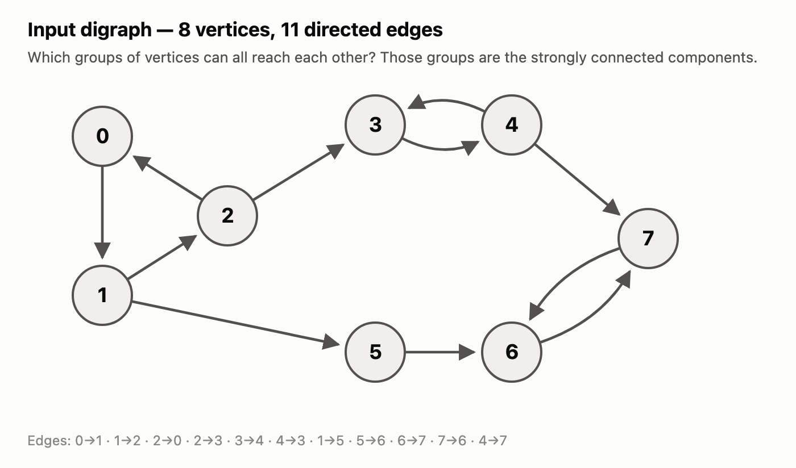
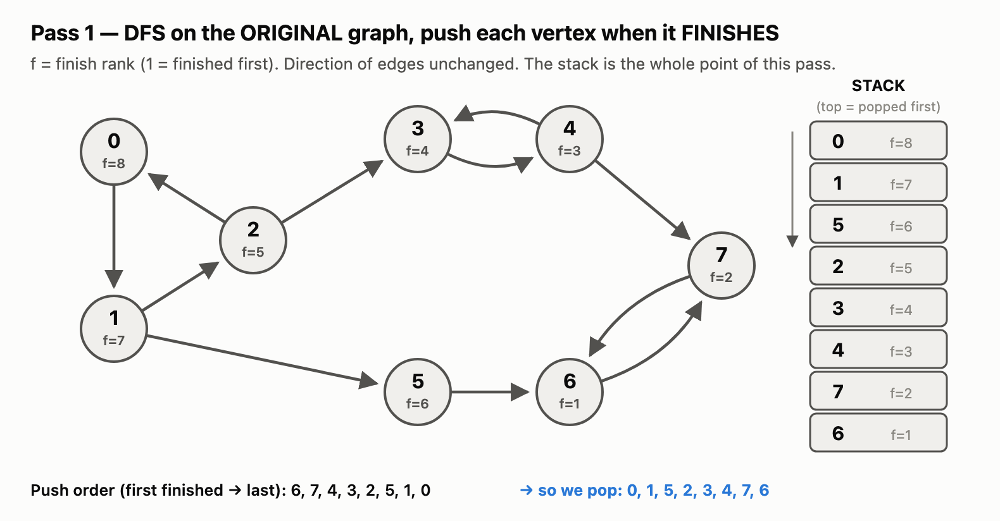
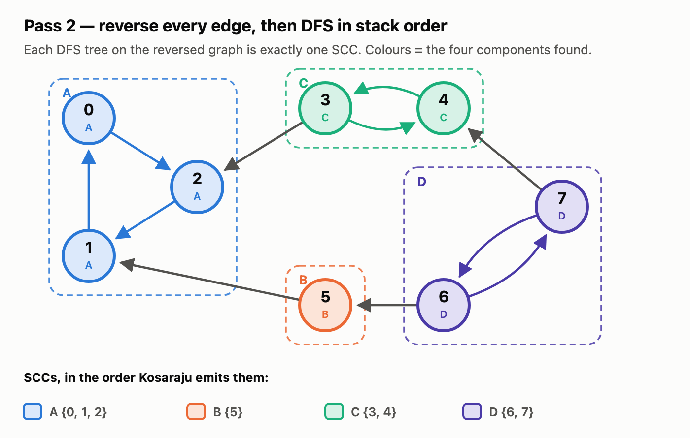
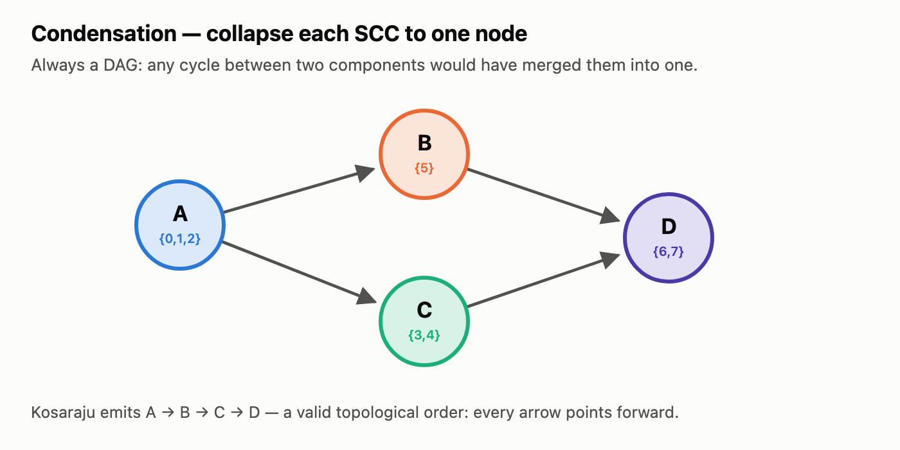

# Kosaraju's algorithm — Strongly Connected Components

Two DFS passes over a **directed** graph. Pass 1 decides an *order*; pass 2 does the actual
grouping on the reversed graph. `O(V + E)`.

> A **strongly connected component (SCC)** is a maximal set of vertices where every vertex can
> reach every other vertex. In an undirected graph this is just "connected component" — the
> whole problem only becomes interesting when edges have direction.

Companion to [`TARJANS.md`](TARJANS.md) (bridges & articulation points, undirected).
Implementation: [`_12_kosarajus_algo.java`](_12_kosarajus_algo.java).

---

## 1. The graph



```
8 vertices, 11 directed edges
0→1  1→2  2→0      a 3-cycle
2→3  3→4  4→3      a 2-cycle, entered from 2
1→5                a one-way hop
5→6  6→7  7→6      another 2-cycle
4→7                a second way into that last cycle
```

Try it by eye first: `0,1,2` clearly form a cycle. Can `3` get back to `0`? Follow the arrows —
`3→4→7→6→7…` and there is no edge leaving `{3,4,6,7}` heading back toward `0`. So `3` is
**not** in `0`'s component, even though `0` reaches `3`. **Reachability is one-way; strong
connectivity needs both directions.**

---

## 2. The whole algorithm

```
PASS 1   DFS the original graph. When a vertex FINISHES (all its descendants done), push it.
TRANSPOSE   reverse the direction of every edge.
PASS 2   pop vertices one at a time; each unvisited pop seeds a DFS on the reversed graph.
         Every vertex that DFS reaches is one SCC.
```

That is it. No `low[]` array, no bookkeeping beyond a stack — the cleverness is entirely in
*the order pass 2 visits things*.

---

## 3. Pass 1 — DFS on the original graph, push on finish

Starting at `0`, neighbours in ascending order. **A vertex is pushed when it finishes**, not
when it is discovered — that is the single most common misreading of this algorithm.

| # | Action | Stack after (bottom → top) |
|---|---|---|
| 1 | enter `0` → `1` → `2`; `2` sees `0` (already visited, ignore) | — |
| 2 | `2` → `3` → `4`; `4` sees `3` (visited, ignore) | — |
| 3 | `4` → `7` → `6`; `6` sees `7` (visited, ignore) | — |
| 4 | `6` has nothing left → **finish `6`** `f=1` | `6` |
| 5 | back at `7`, nothing left → **finish `7`** `f=2` | `6 7` |
| 6 | back at `4`, nothing left → **finish `4`** `f=3` | `6 7 4` |
| 7 | back at `3` → **finish `3`** `f=4` | `6 7 4 3` |
| 8 | back at `2` → **finish `2`** `f=5` | `6 7 4 3 2` |
| 9 | back at `1`, second neighbour `5` → enter `5`; `5` sees `6` (visited) → **finish `5`** `f=6` | `6 7 4 3 2 5` |
| 10 | back at `1`, nothing left → **finish `1`** `f=7` | `6 7 4 3 2 5 1` |
| 11 | back at `0` → **finish `0`** `f=8` | `6 7 4 3 2 5 1 0` |



**Push order:** `6, 7, 4, 3, 2, 5, 1, 0` → so the **pop order is `0, 1, 5, 2, 3, 4, 7, 6`.**

Note `5` pops third, ahead of `2`, `3` and `4`. The pop order is *not* simply reverse vertex
id — that ordering is the real output of pass 1.

---

## 4. Pass 2 — reverse every edge, DFS in pop order

Reversed adjacency:

```
0: [2]      1: [0]      2: [1]      3: [2,4]
4: [3]      5: [1]      6: [5,7]    7: [4,6]
```

Pop from the stack. If the vertex is already visited, discard it; otherwise it seeds a DFS,
and **everything that DFS reaches is exactly one SCC**.

| pop | visited? | DFS on the reversed graph | SCC found |
|---|---|---|---|
| **0** | no | `0 → 2 → 1`, then `1→0` already visited, stop | ✅ **A = {0, 1, 2}** |
| 1 | yes | — discard | |
| **5** | no | `5 → 1` already visited, stop immediately | ✅ **B = {5}** |
| 2 | yes | — discard | |
| **3** | no | `3 → 2` visited; `3 → 4`; `4 → 3` visited, stop | ✅ **C = {3, 4}** |
| 4 | yes | — discard | |
| **7** | no | `7 → 4` visited; `7 → 6`; `6 → 5` visited, `6 → 7` visited | ✅ **D = {6, 7}** |
| 6 | yes | — discard | |



**Result: `{0,1,2}`, `{5}`, `{3,4}`, `{6,7}`** — four components.

Running [`_12_kosarajus_algo.java`](_12_kosarajus_algo.java) on this input prints exactly that
(each line is one SCC, members in DFS post-order):

```
8 11              ->   [1, 2, 0]
0 1                    [5]
1 2                    [4, 3]
2 0                    [6, 7]
2 3
3 4
4 3
1 5
5 6
6 7
7 6
4 7
```

---

## 5. Why it works

Collapse each SCC to a single node. The result — the **condensation** — is always a DAG: if
two components had a cycle between them, they would reach each other, so they would have been
one component to begin with.



The argument in three steps:

1. **The vertex that finishes LAST in pass 1 lies in a SOURCE component** of the condensation
   (one with no incoming edges). Here that is `0` with `f=8`, in `A` — and `A` is indeed the
   source of the diamond.
2. **Reversing every edge turns sources into sinks.** In the transpose, `A` has no edges
   *leaving* it; `B→A` and `C→A` now point inward.
3. So a DFS from `0` on the transpose **physically cannot escape its own component** — every
   exit was reversed into an entrance. It grabs `A` exactly, no more and no less. Delete those
   vertices and the next unvisited pop is the source of what remains; repeat.

That is also why the components come out in **topological order of the condensation**
(`A → B → C → D` above): pass 2 always peels off a current source first.

**Why the finish-order stack, rather than any order?** Seed pass 2 at `6` instead and the
reversed DFS reaches `6, 5, 1, 0, 2, 7, 4, 3` — **all eight vertices**, reporting the entire
graph as one component. `6` sits in a *sink* of the condensation, which the transpose turns
into a source that drains everything. The ordering is not a nicety; it is the correctness
condition.

---

## 6. Code sketch

```java
// pass 1 — push on finish
void dfs1(int u, boolean[] vis, Deque<Integer> stack, List<List<Integer>> g) {
    vis[u] = true;
    for (int v : g.get(u))
        if (!vis[v]) dfs1(v, vis, stack, g);
    stack.push(u);                 // AFTER the loop: on finish, not on discovery
}

// pass 2 — collect one component on the reversed graph
void dfs2(int u, boolean[] vis, List<Integer> comp, List<List<Integer>> rg) {
    vis[u] = true;
    comp.add(u);
    for (int v : rg.get(u))
        if (!vis[v]) dfs2(v, vis, comp, rg);
}

List<List<Integer>> kosaraju(int n, List<List<Integer>> g, List<List<Integer>> rg) {
    boolean[] vis = new boolean[n];
    Deque<Integer> stack = new ArrayDeque<>();
    for (int i = 0; i < n; i++)            // every vertex: the graph may be disconnected
        if (!vis[i]) dfs1(i, vis, stack, g);

    vis = new boolean[n];                  // reset before pass 2
    List<List<Integer>> sccs = new ArrayList<>();
    while (!stack.isEmpty()) {
        int u = stack.pop();
        if (!vis[u]) {
            List<Integer> comp = new ArrayList<>();
            dfs2(u, vis, comp, rg);
            sccs.add(comp);
        }
    }
    return sccs;                            // in topological order of the condensation
}
```

Build `rg` while reading input — `g.get(u).add(v); rg.get(v).add(u);` — rather than
transposing afterwards.

---

## 7. Gotchas

1. **Push on finish, not on discovery.** Pushing when you first see a vertex gives a
   plain preorder and the algorithm quietly returns wrong components.
2. **Reset the `visited` array between the two passes.** Easy to forget; symptom is a single
   SCC containing everything, or empty output.
3. **Pass 1 must loop over all vertices.** A directed graph can be unreachable from vertex `0`
   even when it "looks" connected.
4. **A discarded pop is normal.** Most pops in pass 2 hit an already-visited vertex; that is
   the algorithm working, not a bug. Only unvisited pops start a new component.
5. **Self-loops and multi-edges are harmless here** — unlike the bridge code in
   [`TARJANS.md`](TARJANS.md), nothing depends on identifying the parent edge.
6. **Recursion depth.** At `V ~ 1e5` a path-shaped digraph overflows the JVM stack; use an
   explicit stack or raise the thread stack size.

---

## 8. Kosaraju vs Tarjan for SCCs

| | Kosaraju | Tarjan (SCC) |
|---|---|---|
| DFS passes | 2 | 1 |
| Extra structure | reversed graph + finish stack | `low[]` + on-stack marker |
| Needs the transpose? | **yes** (2× the edge memory) | no |
| Output order | topological order of the condensation | reverse topological order |
| Ease of recall | easier to reconstruct under pressure | fewer passes, less memory |

Both are `O(V + E)`. Kosaraju is the one to reach for in an interview when you want an
explanation you can defend; Tarjan wins when the transpose is expensive to build.
See [`_18_Tarjans.java`](_18_Tarjans.java) for the one-pass variant — it reuses the same
`low[]` idea as the bridge algorithm in [`TARJANS.md`](TARJANS.md), with `low[u] == disc[u]`
marking the root of an SCC.
