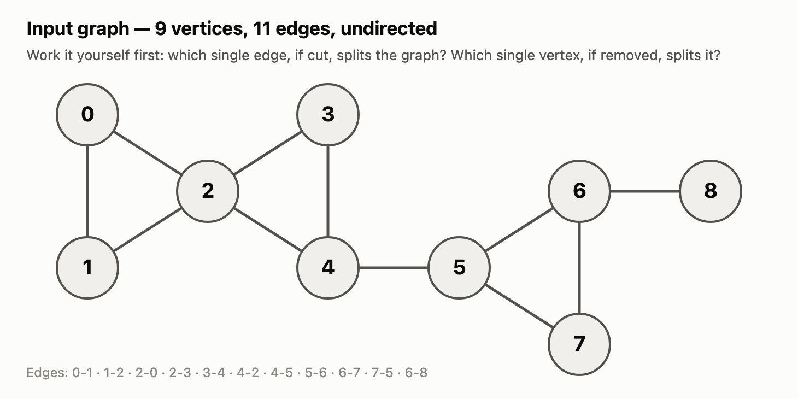
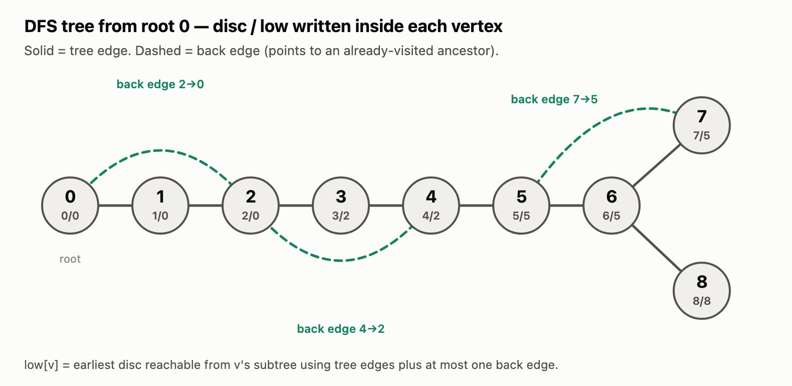
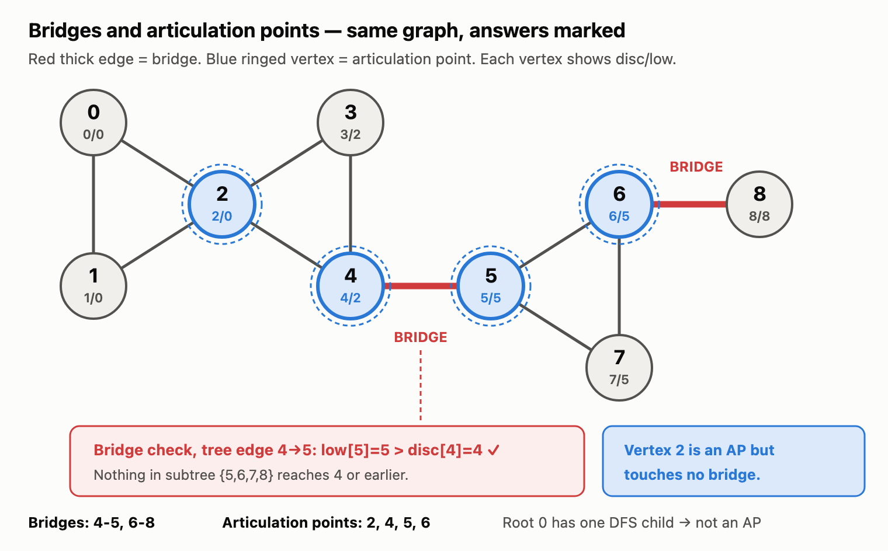
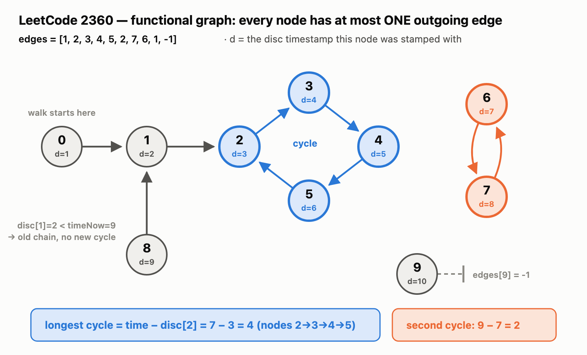

# Tarjan's low-link — Bridges & Articulation Points

One DFS pass, two integer arrays, two comparisons. Everything below is worked on a
**single graph** so you can follow bridges and articulation points from the same picture.

---

## 1. The graph



```
9 vertices, 11 edges (undirected)
0-1  1-2  2-0      triangle on the left
2-3  3-4  4-2      second triangle, sharing vertex 2   <- "bowtie"
4-5                a lone connector
5-6  6-7  7-5      triangle on the right
6-8                a dangling leaf
```

Before reading on, eyeball it: **which single edge, if cut, splits the graph? Which single
vertex, if deleted, splits it?** The answers are not the same set — that is the whole point
of this example.

---

## 2. The two arrays

| Array | Meaning |
|---|---|
| `disc[u]` | **Discovery time** — the tick at which DFS first reached `u`. Written once, never changed. |
| `low[u]`  | **Low-link** — the smallest `disc` reachable from `u`'s subtree using tree edges downward plus **at most one back edge** upward. Starts at `disc[u]`, then shrinks. |

A global `timer` starts at `0` and increments on every new vertex.

### Tree edge vs back edge

While standing at `u` and looking at neighbour `v`:

- `v` **unvisited** → `u→v` is a **tree edge**. Recurse, then pull the child's result up:
  `low[u] = min(low[u], low[v])`
- `v` **visited and is not the parent** → `u→v` is a **back edge** pointing at an ancestor.
  `low[u] = min(low[u], disc[v])`
- `v` **is the parent** → skip it (that is the edge you arrived on).

> **The single most common bug:** on a back edge use `disc[v]`, **not** `low[v]`.
> Using `low[v]` lets a value leak sideways across the tree and silently hides real bridges.

---

## 3. Dry run — building `disc` and `low`

DFS starts at `0`, neighbours visited in ascending order.

| # | Action | disc/low set | Why |
|---|---|---|---|
| 1 | visit `0` | `0/0` | root, timer 0 |
| 2 | visit `1` | `1/1` | tree edge 0→1 |
| 3 | visit `2` | `2/2` | tree edge 1→2 |
| 4 | at `2`, see `0` (visited, not parent) | `low[2] = min(2, disc[0]=0) = ` **0** | back edge 2→0 closes the left triangle |
| 5 | visit `3` | `3/3` | tree edge 2→3 |
| 6 | visit `4` | `4/4` | tree edge 3→4 |
| 7 | at `4`, see `2` (visited, not parent) | `low[4] = min(4, disc[2]=2) = ` **2** | back edge 4→2 closes the second triangle |
| 8 | visit `5` | `5/5` | tree edge 4→5 |
| 9 | visit `6` | `6/6` | tree edge 5→6 |
| 10 | visit `7` | `7/7` | tree edge 6→7 |
| 11 | at `7`, see `5` (visited, not parent) | `low[7] = min(7, disc[5]=5) = ` **5** | back edge 7→5 closes the right triangle |
| 12 | return 7→6 | `low[6] = min(6, low[7]=5) = ` **5** | child pulls parent down |
| 13 | visit `8` | `8/8` | tree edge 6→8, leaf — nothing to reach |
| 14 | return 8→6 | `low[6] = min(5, low[8]=8) = ` **5** | leaf can't lower anything |
| 15 | return 6→5 | `low[5] = min(5, low[6]=5) = ` **5** | still 5 — nothing here reaches above `5` |
| 16 | return 5→4 | `low[4] = min(2, low[5]=5) = ` **2** | `4` already had 2 from its back edge |
| 17 | return 4→3 | `low[3] = min(3, low[4]=2) = ` **2** | |
| 18 | return 3→2 | `low[2] = min(0, low[3]=2) = ` **0** | |
| 19 | return 2→1 | `low[1] = min(1, low[2]=0) = ` **0** | |
| 20 | return 1→0 | `low[0] = min(0, low[1]=0) = ` **0** | done |

### Result



| vertex | 0 | 1 | 2 | 3 | 4 | 5 | 6 | 7 | 8 |
|---|---|---|---|---|---|---|---|---|---|
| **disc** | 0 | 1 | 2 | 3 | 4 | 5 | 6 | 7 | 8 |
| **low**  | 0 | 0 | 0 | 2 | 2 | **5** | 5 | 5 | **8** |

Read the two bold entries — those are the two vertices whose subtree **could not reach back
above its parent**. They are exactly the bridges.

---

## 4. The bridge formula

For a **tree edge** `u → v` (`u` the parent):

```
low[v] > disc[u]   ⇒   edge u-v is a BRIDGE
```

**Why:** `low[v]` is the earliest vertex the whole subtree under `v` can reach. If even the
best it can do is *later* than `u`'s own discovery time, then no back edge escapes from that
subtree to `u` or above it. The only way out is the edge `u-v` itself — cut it and the subtree
falls off.

`>` is **strict**: `low[v] == disc[u]` means something in the subtree reached `u` itself by
another route, so there is a cycle through `u-v` and it is not a bridge.

### Where the check fires

Every tree edge, evaluated:

| tree edge `u→v` | `low[v]` | `disc[u]` | `low[v] > disc[u]` | bridge? |
|---|---|---|---|---|
| 0→1 | 0 | 0 | `0 > 0` false | no |
| 1→2 | 0 | 1 | `0 > 1` false | no |
| 2→3 | 2 | 2 | `2 > 2` false | no |
| 3→4 | 2 | 3 | `2 > 3` false | no |
| **4→5** | **5** | **4** | **`5 > 4` TRUE** | ✅ **BRIDGE** |
| 5→6 | 5 | 5 | `5 > 5` false | no |
| 6→7 | 5 | 6 | `5 > 6` false | no |
| **6→8** | **8** | **6** | **`8 > 6` TRUE** | ✅ **BRIDGE** |

**Edge 4-5 — the row to stare at.** Subtree of `5` is `{5,6,7,8}`. Those four have back edge
`7→5` among themselves, but nothing reaches `disc ≤ 4`. So `low[5] = 5`, and `5 > disc[4] = 4`
fires. Cut `4-5` and `{5,6,7,8}` is stranded.

Contrast with **5-6**, one step later: `low[6] = 5` because `7→5` escapes to `5`. Now
`5 > 5` is false — the triangle `5-6-7` saves it. Same shape of check, opposite verdict.



---

## 5. The articulation point formula

Two rules, and the root is genuinely a special case:

```
u is the root      ⇒  AP  iff  it has ≥ 2 children in the DFS tree
u is not the root  ⇒  AP  iff  some child v has  low[v] >= disc[u]
```

**Note the `>=`.** Bridges use `>`, articulation points use `>=`. That one character is the
whole difference. If `low[v] == disc[u]`, the subtree can climb back to `u` but **no higher** —
so the edge survives (there is a cycle through it), but deleting the *vertex* `u` still cuts
the subtree loose.

**Why the root is special:** the root has no parent, so `low[v] >= disc[u]` is trivially true
for its children and would misfire. A root only matters if it is the junction of two or more
independent subtrees — hence the child count.

| `u` (non-root) | child `v` | `low[v]` | `disc[u]` | `low[v] >= disc[u]` | AP? |
|---|---|---|---|---|---|
| 1 | 2 | 0 | 1 | `0 >= 1` false | no |
| **2** | 3 | 2 | 2 | **`2 >= 2` TRUE** | ✅ |
| 3 | 4 | 2 | 3 | `2 >= 3` false | no |
| **4** | 5 | 5 | 4 | **`5 >= 4` TRUE** | ✅ |
| **5** | 6 | 5 | 5 | **`5 >= 5` TRUE** | ✅ |
| 6 | 7 | 5 | 6 | `5 >= 6` false | no |
| **6** | 8 | 8 | 6 | **`8 >= 6` TRUE** | ✅ |
| 0 (root) | — | — | — | 1 child only | no |

---

## 6. Bridges ≠ articulation points

**Bridges: `4-5`, `6-8`  ·  Articulation points: `2`, `4`, `5`, `6`**

Three things this graph is built to show:

- **Vertex `2` is an AP but touches no bridge.** It is the waist of the bowtie. Every edge on
  it sits inside a triangle, so no *edge* is critical — but delete the *vertex* and `{0,1}`
  falls away from the rest. This is why you cannot just collect bridge endpoints.
  It is caught by `low[3] = 2 >= disc[2] = 2` — the `>=` case, which the bridge check rejects.
- **Vertex `8` is not an AP even though `6-8` is a bridge.** It is a leaf; deleting it removes
  nothing else. A bridge's *lower* endpoint is only an AP if it has children of its own.
- **Root `0` is not an AP**, despite sitting on a triangle, because it has one DFS child.
  Start the same DFS at `2` instead and `2` becomes the root with 2 children — still an AP.
  The answers never depend on where you start; only `disc`/`low` numbers do.

---

## 7. Code skeleton

```java
int timer = 0;
int[] disc, low;      // disc filled with -1 = unvisited
List<int[]> bridges = new ArrayList<>();
Set<Integer> aps = new HashSet<>();

void dfs(int u, int parent) {
    disc[u] = low[u] = timer++;
    int children = 0;

    for (int v : adj.get(u)) {
        if (v == parent) continue;          // don't walk back up the edge we came on

        if (disc[v] == -1) {                // ---- tree edge ----
            children++;
            dfs(v, u);
            low[u] = Math.min(low[u], low[v]);          // child pulls parent down

            if (low[v] > disc[u])                       // BRIDGE   (strict >)
                bridges.add(new int[]{u, v});

            if (parent != -1 && low[v] >= disc[u])       // ARTICULATION POINT  (>=)
                aps.add(u);
        } else {                            // ---- back edge ----
            low[u] = Math.min(low[u], disc[v]);         // disc[v], NOT low[v]
        }
    }

    if (parent == -1 && children > 1) aps.add(u);        // root rule
}

// disconnected graphs: kick off from every unvisited vertex
for (int i = 0; i < n; i++)
    if (disc[i] == -1) dfs(i, -1);
```

Runs in **O(V + E)** time, **O(V)** extra space (plus the recursion stack).

---

## 8. Gotchas

1. **`disc[v]` on back edges, `low[v]` on tree edges.** Mixing these up is the classic bug.
2. **`>` for bridges, `>=` for articulation points.** Do not copy-paste one into the other.
3. **The root needs its own rule** for APs. Bridges need no root special case at all.
4. **Skipping the parent by vertex id breaks with parallel edges.** With a duplicate `u-v`
   edge, `v == parent` skips both copies and reports a bridge that isn't one. Skip by **edge
   id** instead if the input can contain multi-edges.
5. **Loop over all vertices** if the graph may be disconnected — a single `dfs(0, -1)` only
   covers one component.
6. **Recursion depth.** At `V ≈ 10^5` a path-shaped graph will blow the JVM stack; either bump
   the thread stack size or convert to an explicit stack.

---

## 9. Applied — LeetCode 2360, *Longest Cycle in a Graph*

A problem where you need **`disc[]` but not `low[]`**. Everything above pairs the two arrays;
this one shows what the timestamp alone can do once the graph's shape is constrained enough.
(It is a *directed* graph, unlike the bridge/AP material above — the timestamp idea carries
over, the low-link machinery does not.)

### Reading the input

There is no edge list here. **The array *is* the graph:** `edges[i]` is the single node that
`i` points to, or `-1` if `i` points nowhere. Index = source, value = destination,
`n = edges.length`.

```
edges = [1, 2, 3, 4, 5, 2, 7, 6, 1, -1]
         ↑                          ↑
         edges[0] = 1               edges[9] = -1
         node 0 points to node 1    node 9 points nowhere
```

The constraint that makes the problem special: **every node has at most ONE outgoing edge.**
That is a **functional graph**. Return the length of the longest cycle, or `-1` if there is none.



### Why no `low[]` is needed

`low[]` exists to answer *"can this subtree escape upward by some other route?"* — a question
that only arises when a vertex has **several** ways out. Here out-degree is at most 1, so from
any node there is exactly one way forward and the walk is **deterministic**: it must eventually
either hit `-1` or revisit a node it has already stamped. Every piece of the graph is a
**rho (ρ)** shape — a tail feeding into at most one cycle. With no branching there is nothing
for `low[]` to minimise over, and a plain timestamp is enough.

### The approach — one global clock

```java
int time = 1;                       // start at 1 so disc[i] == 0 can mean "unvisited"
for (int i = 0; i < n; i++) {
    int curr = i;
    int timeNow = time;             // clock reading at the START of this walk

    while (curr != -1 && disc[curr] == 0)   // walk forward, stamping as we go
        { disc[curr] = time++; curr = edges[curr]; }

    if (curr != -1 && disc[curr] >= timeNow)   // stopped on a node THIS walk stamped
        longest = Math.max(longest, time - disc[curr]);
}
```

A walk stops for exactly two reasons, and one comparison separates the interesting cases:

| stop reason | test | meaning |
|---|---|---|
| `curr == -1` | — | ran off a dead end. No cycle. |
| `disc[curr] >= timeNow` | **true** | that node was stamped *during this same walk* → **we closed a loop on ourselves** |
| `disc[curr] < timeNow` | false | that node was stamped by an *earlier* walk → we merged into someone else's chain; whatever cycle lies down there was already counted |

**`timeNow` is the whole trick.** It is a watermark: *"any stamp at or above this number is
mine."* Without it you cannot tell *"I found my own tail"* from *"I bumped into old
territory"* — and the second case must not count, or a long tail feeding an
already-counted cycle would be reported as a cycle itself.

**Why the length is `time - disc[curr]`:** `time` is the clock right after stamping the last
node of the walk, and `disc[curr]` is the stamp on the node we looped back to. Every stamp
handed out between those two went to a node on the cycle, so the difference counts them exactly.

### Dry run on `[1, 2, 3, 4, 5, 2, 7, 6, 1, -1]`

| start `i` | `timeNow` | nodes stamped | stops at | test | result |
|---|---|---|---|---|---|
| **0** | 1 | `0,1,2,3,4,5` → `d=1..6` | `2` | `disc[2]=3 >= 1` ✅ | **cycle `7-3` = 4** |
| 1–5 | 7 | none, already stamped | itself | `disc < 7` | skip |
| **6** | 7 | `6,7` → `d=7,8` | `6` | `disc[6]=7 >= 7` ✅ | **cycle `9-7` = 2** |
| 7 | 9 | none | itself | `disc[7]=8 < 9` | skip |
| **8** | 9 | `8` → `d=9` | `1` | `disc[1]=2 < 9` ❌ | no cycle — ran into walk 0's chain |
| **9** | 10 | `9` → `d=10` | `-1` | `curr == -1` | no cycle — dead end |

**Answer: 4.** Rows `8` and `9` are the two ways a walk ends *without* a cycle, and between
them they are why both the `-1` check and the `timeNow` watermark have to be there.

`O(n)` time — every node is stamped exactly once across all walks, and an outer-loop index that
was already stamped exits the `while` immediately. `O(n)` space for `disc[]`.

### Two notes on the solution

**`boolean visited[]` is dead code.** It is declared and read (`if (visited[i]) continue;`) but
never assigned, so that branch never fires and the array can be deleted. It is harmless: when
`i` is already stamped the `while` exits at once and `disc[i] >= timeNow` is false (its stamp
predates this walk), so no phantom cycle is reported. `disc[]` already does the visited
tracking — which is exactly why `time` starts at `1` rather than `0`.

**It is correct.** Fuzzed against brute force on 30,000 random functional graphs: zero
mismatches, including self-loops (`[0]` → `1`) and all-dead-end inputs (`[-1,-1]` → `-1`).

> Related: in a functional graph every SCC is either a lone node or exactly one cycle, so this
> answer is also *"the size of the largest SCC with more than one node."* Running Kosaraju
> would work — see [`KOSARAJU.md`](KOSARAJU.md) — but the rho structure makes the single
> forward walk strictly simpler.

---

## Related files in this folder

- [`_17_Bridges.java`](_17_Bridges.java) — bridge finding
- [`_16_Articulation_Point.java`](_16_Articulation_Point.java) — articulation points
- [`_18_Tarjans.java`](_18_Tarjans.java) — the same low-link idea applied to **SCCs** in a
  *directed* graph (there, `low[u] == disc[u]` marks the root of an SCC)

Diagram sources are the `.svg` files in [`assets/`](assets); the `.png` files are rendered from them.
