# Backtracking

Classic "choose → explore → un-choose" recursion: build a partial candidate,
recurse, then undo the choice before trying the next one so sibling branches
never see leftover state.

```java
void rec(/* state */) {
    if (/* base case */) { record(); return; }
    for (/* each choice */) {
        choose(x);
        rec(/* advanced state */);
        unchoose(x);           // <- backtrack: restore state for the next sibling
    }
}
```

## Files

| File | Problem | Duplicates in input? |
|---|---|---|
| `_1_Subset1.java` | All subsets (power set) | No |
| `_2_Subset2.java` | All **unique** subsets | **Yes** |
| `_3_Permutation1.java` | All permutations | No |
| `_4_Permutation2.java` | All **unique** permutations | **Yes** |
| `_5_CombinationSum1.java` | Combinations summing to target, unlimited reuse | No |
| `_6_CombinationSum2.java` | Combinations summing to target, each element used once, **unique** combos | **Yes** |
| `_7_Combination.java` | All k-size combinations of `1..n` | No |

The "1" variants pick/skip or swap freely. The "2" variants (plus
`CombinationSum2`) additionally have to **prune duplicate branches** so the
same output isn't produced twice — that's the pattern below.

## Duplicate pruning — the general rule

When the input array has repeated values, a plain backtracking template
produces the *same* output multiset multiple times, once per distinct index
path that happens to land on equal values. The fix is always two steps:

1. **Sort the input first.** Sorting makes equal values adjacent, which is
   what makes step 2's `arr[i] == arr[i - 1]` check meaningful.
2. **Within a run of equal values, only ever consume them left-to-right as a
   contiguous prefix.** Never "skip the first copy, then take a later
   identical copy" — that always duplicates a result reachable by taking the
   earlier copy instead. Concretely: only take `arr[i]` if `arr[i - 1]`
   (when equal) has already been taken *on this path*, or if `arr[i]` is the
   first index being considered at this branching point.

That single rule shows up as two idiomatic shapes in this repo, depending on
whether the recursion loops over remaining indices or does a binary
pick/skip DFS.

### Pattern A — for-loop over `i..n-1`, skip repeats at the same level

Used in `_2_Subset2.java` (`rec`):

```java
for (int i = idx; i < arr.length; i++) {
    if (i != idx && arr[i] == arr[i - 1]) continue; // only the first copy starts a new branch here
    t.add(arr[i]);
    rec(arr, i + 1, t);
    t.remove(t.size() - 1);
}
```

At a given recursion level, the loop itself *is* "start a fresh branch from
index i". Any `arr[i]` equal to `arr[i - 1]` other than the very first one in
the loop (`i == idx`) would just re-derive a branch already produced by
`i - 1`, so it's skipped outright.

### Watching it happen — `Subset2`'s recursion tree

The diagram below runs the exact `rec` code above top to bottom on
`nums = [1,1,1]` and `nums = [1,1,1,2,2,3]`. Solid edges are loop
iterations that took a value and recursed; dashed **red** edges are the
iterations `i != idx && arr[i] == arr[i - 1]` prunes — the loop skips them
outright, so no call, no subtree, no duplicate leaves. Bracket labels mark
terminal subsets; every node above a leaf is also a valid emitted subset,
readable by tracing the edge values from the root down to it.



### Pattern B — pick/skip (or used[]) DFS, prune with `!used[i - 1]`

Used in `_2_Subset2.java` (`rec2`), `_4_Permutation2.java`, and
`_6_CombinationSum2.java`:

```java
if (i > 0 && arr[i] == arr[i - 1] && !used[i - 1]) continue; // or `return` for skip/take DFS
```

Here the recursion doesn't restart a fresh loop per level, so "was the
earlier copy already taken on this path?" has to be tracked explicitly:

- `!used[i - 1]` true means the previous identical value was **not** taken
  on this path (it was skipped, or hasn't been visited yet at this branch) —
  taking `arr[i]` now would produce a result identical to one where
  `arr[i - 1]` gets taken instead, so it's pruned.
- Once `arr[i - 1]` *has* been used on the current path, `arr[i]` is free to
  be taken too — that's how `[2,2]`-style subsets/combinations with repeated
  values still get generated.

`Permutation2` needs this exact check because at every output position it
scans *all* currently-unused indices (not just `i..n-1`), so without the
`used[]` guard the two physical copies of a duplicate value could be placed
in swapped order and register as "different" permutations even though the
resulting list looks identical.

### Common footgun

Forgetting `Arrays.sort(nums)` before either pattern silently breaks the
pruning — `arr[i] == arr[i - 1]` only finds duplicates when equal values are
adjacent, so an unsorted array lets duplicate outputs leak straight into the
result.
