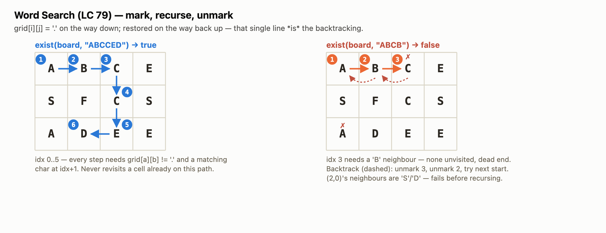
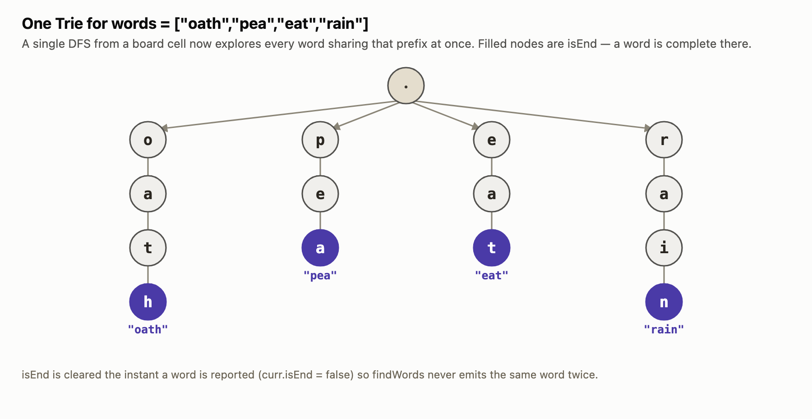
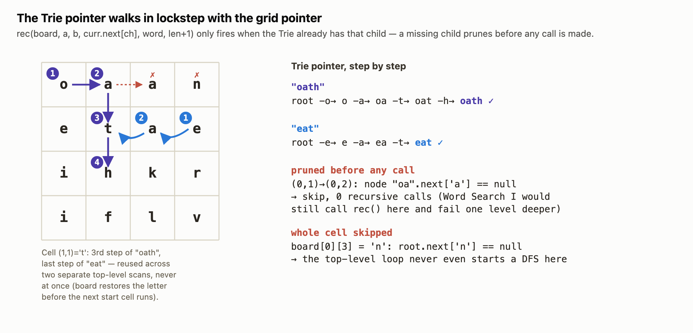
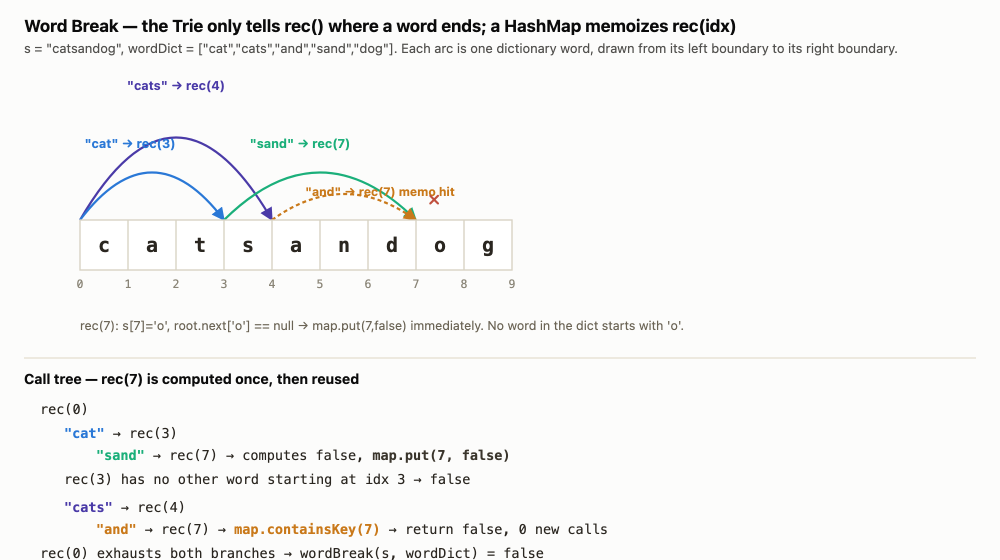
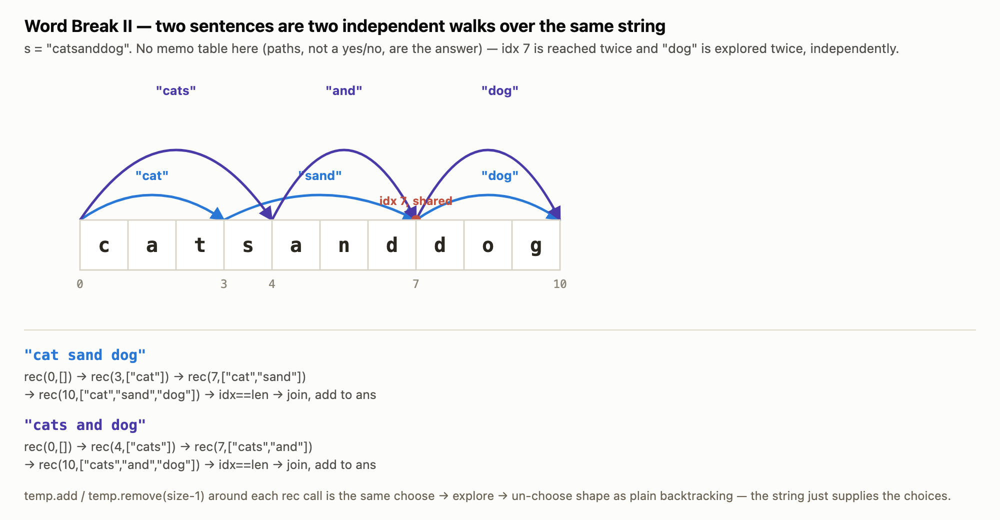
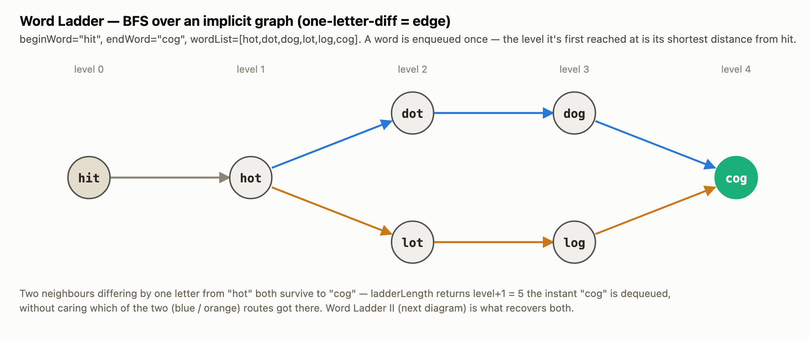
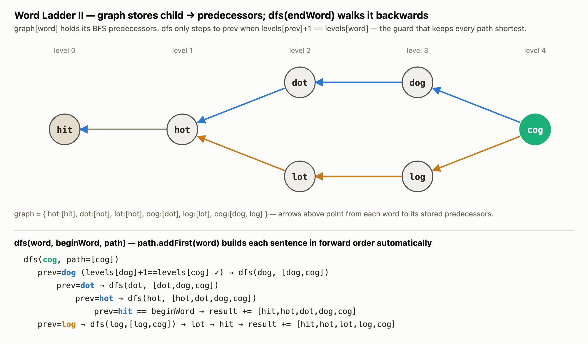

# Graphs on Strings

Six problems that all boil down to the same trick: treat **strings as graph nodes** and
reuse a graph traversal to answer a question about words. A grid cell is a node in Word
Search; a dictionary word is a node in Word Break; every word in a list is a node in Word
Ladder, connected to any other word one letter away. Once you see the graph, the rest is
just picking BFS, DFS, or backtracking — and, when there's more than one target word,
folding all of them into a single **Trie** so one traversal answers every word at once.

| File | Problem | Traversal |
|---|---|---|
| `_1_Word_Search.java` | Does *one* word exist in the grid? | Backtracking DFS |
| `_2_Word_Search_II.java` | Which of *many* words exist in the grid? | Backtracking DFS + Trie |
| `_3_Word_Break.java` | Can the string be fully segmented? (yes/no) | DFS + memo + Trie |
| `_4_Word_Break_II.java` | *Which* segmentations work? (all of them) | Backtracking DFS + Trie |
| `_5_Word_Ladder.java` | Shortest transformation length | BFS |
| `_6_Word_Ladder_II.java` | *Every* shortest transformation | BFS + DFS reconstruction |

Word Search (79) is the odd one out — no Trie, no memo, just the plain
mark-recurse-unmark backtracking template everything else in this folder builds on. It
gets one short section. The other three problems each get a full walkthrough with
diagrams, because each hides a real "aha": a Trie prunes a dead branch *before* a call is
ever made; a HashMap turns exponential re-exploration into linear; and swapping "does a
path exist" for "find every path" turns a BFS queue into a DFS over a predecessor graph.

---

## 1. Word Search — mark, recurse, unmark

`exist(board, word)` tries every cell as a starting point and DFSes outward, matching one
character of `word` per step. The entire trick is one line in each direction:

```java
grid[i][j] = '.';           // mark this cell used, so the DFS can't step back onto it
... recurse into neighbours ...
grid[i][j] = ch;            // restore it before returning, so a sibling branch can reuse it
```

That's it — no visited array, no Trie, nothing else. `word.length() > n * m` is a cheap
early-exit (the word can't possibly fit), and the four-direction offsets `{1,0},{-1,0},
{0,1},{0,-1}` are the "edges" of the implicit grid graph.



The right panel is the interesting half: `"ABCB"` fails because after `A → B → C`, no
unvisited neighbour of `C` is a `'B'`. The dashed red arrows are the unmark step running
in reverse — `C` and then `B` get their letters restored before the search tries the next
starting cell. Notice the *next* start, `(2,0)`, fails on the very first character
comparison — no recursion happens at all, because `rec()`'s first line
(`word.charAt(idx) != grid[i][j]`) rejects it immediately.

---

## 2. Word Search II — one Trie, many words at once

Running Word Search once per word is `O(words · m · n · 4^L)` — every word re-explores
the board from scratch. `findWords` instead inserts every word into one Trie, then does a
**single** DFS from each cell. The Trie pointer and the grid pointer move together, one
step at a time:

```java
if (curr.next[ch - 'a'] != null)
    rec(board, a, b, curr.next[ch - 'a'], word, length + 1);
```

That `if` is the whole optimization: the DFS only steps to a neighbour if the Trie
already has a matching child. A neighbour that doesn't continue *any* remaining word is
never visited — not "visited and rejected," never called at all.



Four words collapse into one tree. `isEnd` nodes (filled) are where `findWords` can emit
a result — and the code clears `isEnd` the moment it does, so a word already found by one
starting cell can't be reported again by another.



Two things to read off this one:

- **Same cell, two searches.** `(1,1)='t'` is the 3rd letter of `"oath"` and the last
  letter of `"eat"`. Both DFS runs use it — never at the same time, since `board[i][j]` is
  restored to its real letter before the *next* top-level starting cell begins.
- **Pruning is free.** At `(0,1)`, the Trie node for `"oa"` has no child `'a'`, so the DFS
  never steps to `(0,2)` even though it's a perfectly valid, unvisited neighbour. Compare
  this to plain Word Search, which *would* call `rec()` there and pay for a failed
  comparison one level deeper. Multiply that saved call across every shared prefix in a
  large dictionary and the Trie's payoff becomes obvious.

---

## 3. Word Break — the same Trie idea, now with a memo

`wordBreak(s, wordDict)` asks a yes/no question: can `s` be fully cut into dictionary
words? The Trie again exists so `rec()` can tell, character by character, "is there a
word ending exactly here?" — but this time the graph being searched is **positions in the
string** (`idx = 0..s.length()`), and revisiting the same `idx` from two different
branches is common enough that it needs memoization to stay fast.



Read the arcs as "which dictionary word gets us from this boundary to that one." `"cat"`
and `"cats"` both start at `idx 0`; `"sand"` continues from `idx 3`, `"and"` from `idx 4`
— and both of those land on the **same** `idx 7`. The call tree underneath shows why that
matters: `rec(7)` is computed once (it fails — no word starts with `'o'`) and cached in
the `HashMap<Integer,Boolean>`. When the `"and"` branch reaches `idx 7` a moment later, it
gets the cached `false` back immediately instead of re-deriving it. Without the memo, the
number of times a shared suffix like this gets recomputed can blow up exponentially on
adversarial input (a chain of overlapping matches with no valid full segmentation is the
classic bad case) — the memo turns that into "compute each `idx` once."

## 4. Word Break II — no memo, because paths don't merge

`wordBreak` returning `List<String>` (LC 140) looks like the same problem, but a memo
doesn't help the same way: two different sentences that happen to pass through the same
`idx` still need to be enumerated *separately*, because they're different outputs, not
the same yes/no answer. So this version is plain backtracking — `temp.add(word)`, recurse,
`temp.remove(...)` — with the Trie only there to tell `rec()` where a word boundary is.



`"cat sand dog"` (blue) and `"cats and dog"` (purple) are two independent walks that
happen to both pass through `idx 7` — and both then explore `"dog"` from there,
*independently*. There's no caching this time: if ten different prefixes all reached
`idx 7`, `"dog"` would be re-explored ten times. That's fine for a 10-character string; it's
exactly why LC 140's adversarial inputs (long strings built from many overlapping short
dictionary words with no valid full segmentation) are a classic time-limit-exceeded trap.

---

## 5. Word Ladder — BFS on a graph that's never built

`ladderLength` never constructs an adjacency list. Instead, from each word it generates
*every* one-letter variant (25 alternatives × word length) and checks dictionary
membership on the fly — that generate-and-check *is* "find this node's neighbours."
Unweighted shortest path is just BFS, counting queue levels:



`hit → hot` is forced (only one neighbour). From `hot`, both `dot` and `lot` are valid
one-letter changes, so both get enqueued at level 2 — `ladderLength` doesn't care that
there are two routes, it just returns `level + 1` the instant `"cog"` is dequeued at level
4, giving `5`. The `set.remove(w)` right after enqueuing is doing double duty: it's the
visited check *and* the guarantee that a word's first-discovered level is its shortest
distance from `beginWord` (BFS invariant — every queued word at level *L* is unreachable
in fewer than *L* steps, since anything reachable in fewer steps would already have been
dequeued and removed from the set).

## 6. Word Ladder II — same BFS, plus a predecessor graph to walk back

Finding *every* shortest path needs more than a level count. The BFS pass now records, for
every word, `graph[word]` = the list of words that reached it on a shortest path — a
predecessor graph, built as a side effect of the same traversal as before. A second pass,
`dfs(endWord, ...)`, walks that graph **backwards** from `cog` to `hit`, collecting every
route:



The guard `levels.get(prev) + 1 == levels.get(word)` is what keeps this correct: `graph`
can end up holding a candidate predecessor that *isn't* on a shortest path in denser word
lists, so the DFS re-checks the level relationship before following each edge rather than
trusting `graph` alone. `path.addFirst(word)` is the other quiet trick — because the DFS
walks backward (`cog → dog → dot → hot → hit`) but keeps *prepending*, the collected
`path` list ends up in forward reading order (`hit → hot → dot → dog → cog`) with no
explicit reversal step at the end.
