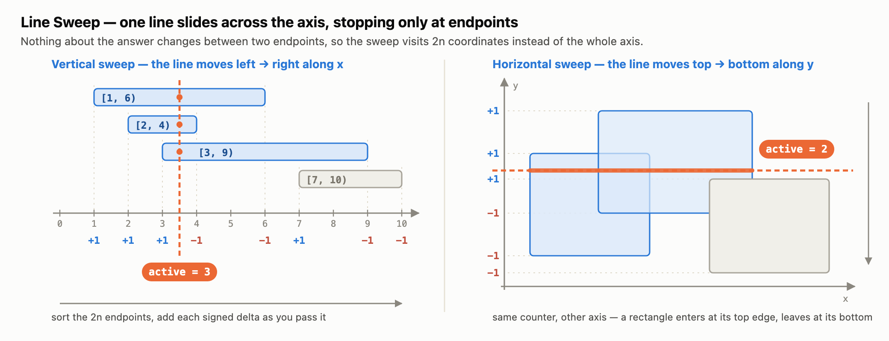

# Line Sweep

Throw away the intervals and keep only their endpoints as signed events (`+1` at a start,
`-1` at an end), sort them along one axis, then walk them left to right holding a single
running counter — its value at any point is how many intervals cover that point.

The axis is the only thing that changes between the two: a **vertical** line sweeping along
`x` over intervals, a **horizontal** line sweeping along `y` over rectangles. The counter,
the sort, and the `+1 / -1` bookkeeping are identical.

| File | Problem |
|---|---|
| `_1_Maximum_Population_Year.java` | LeetCode 1854 — Maximum Population Year |
