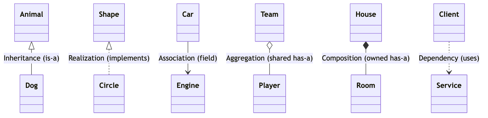

# _0 — UML Class Relationships (read this first)

Every pattern diagram in the sibling folders is drawn with the same handful of
arrows. Learn these six once and the rest of the diagrams read themselves.

## The six relationships

| Relationship  | Mermaid arrow | UML notation      | Meaning ("A —▷ B")                                  | Lifetime coupling |
|---------------|---------------|-------------------|-----------------------------------------------------|-------------------|
| Inheritance   | `B <|-- A`    | solid line, hollow triangle | A **is-a** B (extends a class)            | —                 |
| Realization   | `B <|.. A`    | dashed line, hollow triangle | A **implements** interface B             | —                 |
| Association   | `A --> B`     | solid line, open arrow | A **uses / refers to** B (a field)             | independent       |
| Aggregation   | `A o-- B`     | solid line, hollow diamond | A **has-a** B, but B can outlive A ("has")  | weak (shared)     |
| Composition   | `A *-- B`     | solid line, filled diamond | A **owns** B; B dies with A ("owns")        | strong (exclusive)|
| Dependency    | `A ..> B`     | dashed line, open arrow | A **temporarily uses** B (param / return / local) | transient    |

Read the diamond/triangle end as "the whole" or "the parent"; the plain end is
"the part" or "the child".

## ASCII cheat sheet

```
Inheritance / Realization        Association / Aggregation / Composition
                                  
   Animal                          Car ----------> Engine     (association: field)
     ▲                             Team  o-------- Player      (aggregation: shared)
     |                             House *-------- Room        (composition: owned)
     |  (hollow triangle)          Client ......> Service      (dependency: uses)
    Dog
```

## All six at a glance



## Aggregation vs. Composition — the one that trips people up

Both mean "A has a B". The question is **ownership**:

- **Aggregation (o--):** A holds a reference to a B that was created elsewhere
  and can be shared or reused. Kill A and B keeps living.
  *Example:* a `Team` aggregates `Player`s — delete the team, the players remain.

- **Composition (\*--):** A creates and exclusively owns its B. Kill A and B is
  gone too. *Example:* a `House` composes `Room`s — no house, no rooms.

In code the tell is usually **who calls `new`**: if the whole `new`s the part in
its own constructor and never leaks it out, it's composition; if the part is
passed in (dependency-injected), it's aggregation/association.

## How the pattern folders use this

Each pattern's `README.md` has two diagrams:

1. **Standard (GoF) diagram** — the canonical roles (e.g. `Factory`, `Product`,
   `ConcreteProduct`).
2. **This repo's example** — the same shape with the actual class names used in
   the code, so you can trace the abstract role to a real file.

Start here, then walk the folders in order (`_1` … `_11`).
