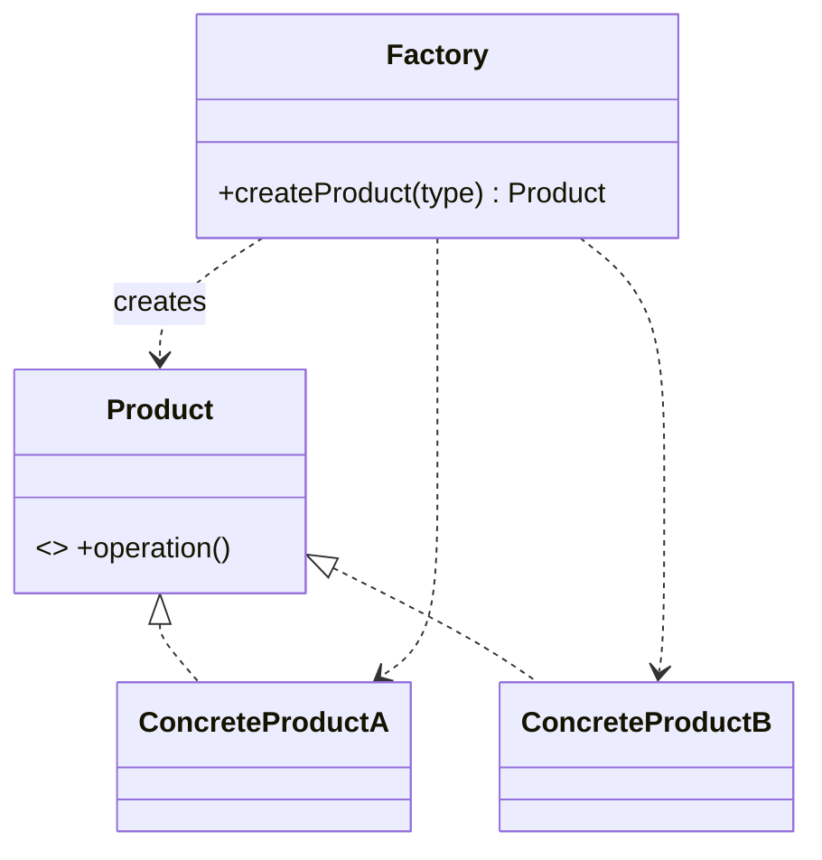
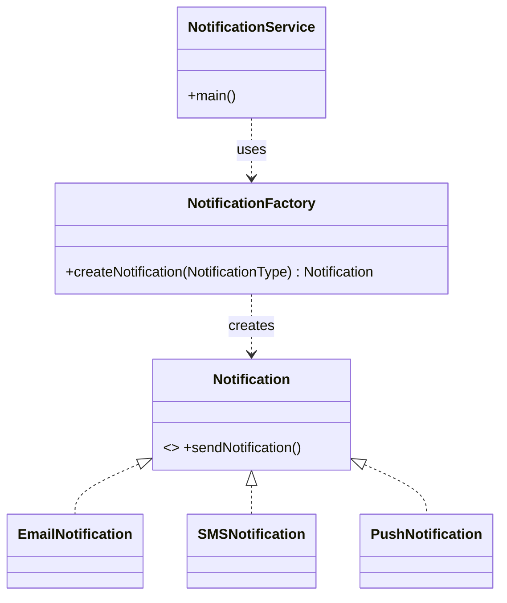

# _1 — Factory Method

**Type:** Creational
**Intent:** Move object creation behind a single method so callers ask for a
product *by type* instead of `new`-ing concrete classes themselves.

## Standard diagram



## This repo's example

A `NotificationFactory` returns the right `Notification` for a
`NotificationType` enum, and the client only ever talks to the interface.



**Roles:** `Notification` = Product · `EmailNotification`/`SMSNotification`/`PushNotification`
= ConcreteProducts · `NotificationFactory` = Factory · `NotificationService` = Client.

## Run

```
java MachineCoding_LLD.DesignPatterns._01_FactoryDesignPattern.NotificationService
```
