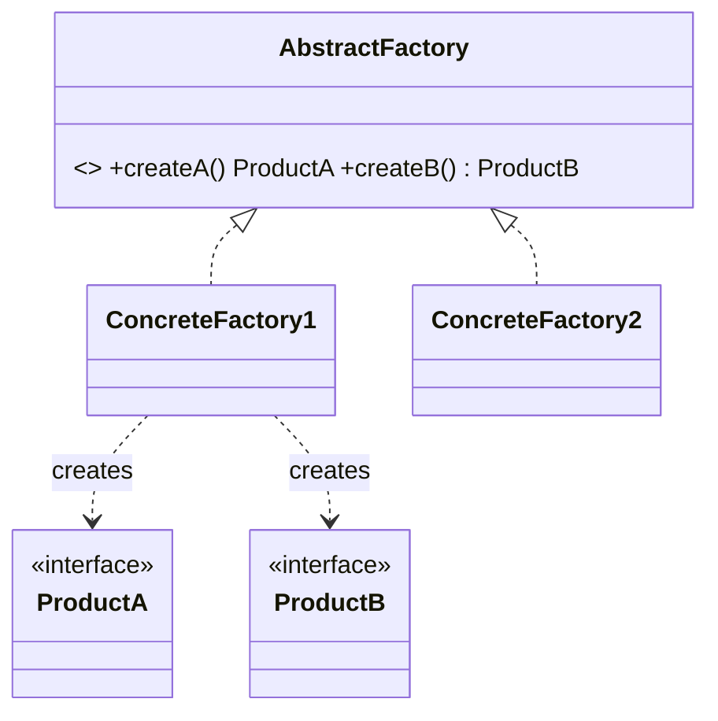
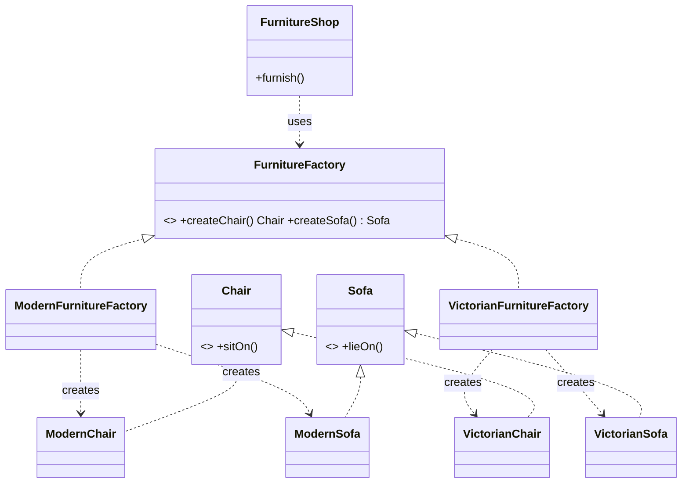

# _2 — Abstract Factory

**Type:** Creational
**Intent:** Create **families of related products** through one factory
interface, guaranteeing the products you get belong to the same variant.
(Factory Method makes one product; Abstract Factory makes a matching set.)

## Standard diagram



## This repo's example

`FurnitureFactory` produces a `Chair` **and** a `Sofa`; picking
`ModernFurnitureFactory` vs `VictorianFurnitureFactory` swaps the whole style
consistently.



**Roles:** `FurnitureFactory` = AbstractFactory · `Modern*`/`Victorian*Factory`
= ConcreteFactories · `Chair`,`Sofa` = AbstractProducts · `FurnitureShop` = Client.

## Run

```
java MachineCoding_LLD.DesignPatterns._02_AbstractFactoryDesignPattern.FurnitureShop
```
