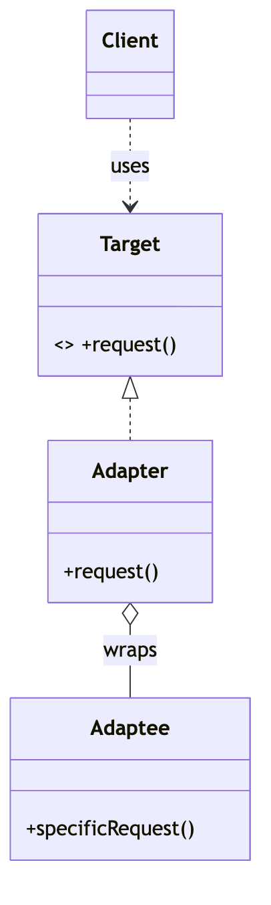
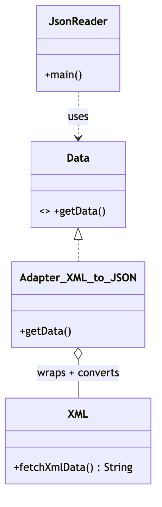

# _4 — Adapter

**Type:** Structural
**Intent:** Wrap an existing class so its **incompatible** interface looks like
the one the client expects. The "power plug in a foreign socket" pattern.

## Standard diagram



The Adapter **implements** the Target and **holds** the Adaptee, translating
`request()` into `specificRequest()`.

## This repo's example

The client wants the `Data` interface, but the source (`XML`) only exposes
`fetchXmlData()` returning XML. `Adapter_XML_to_JSON` bridges the two.



**Roles:** `Data` = Target · `Adapter_XML_to_JSON` = Adapter · `XML` = Adaptee
(incompatible method name/return type) · `JsonReader` = Client.

## Run

```
java MachineCoding_LLD.DesignPatterns._04_Adapter.JsonReader
```
