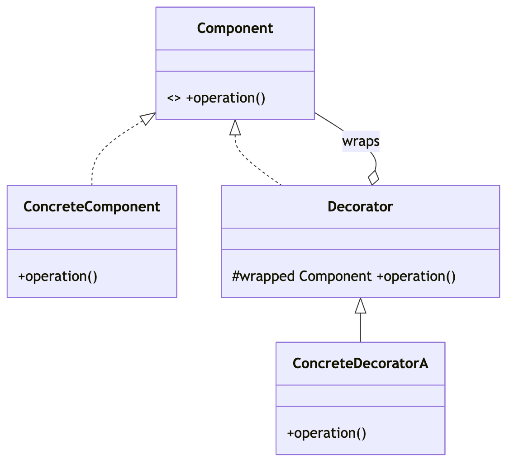
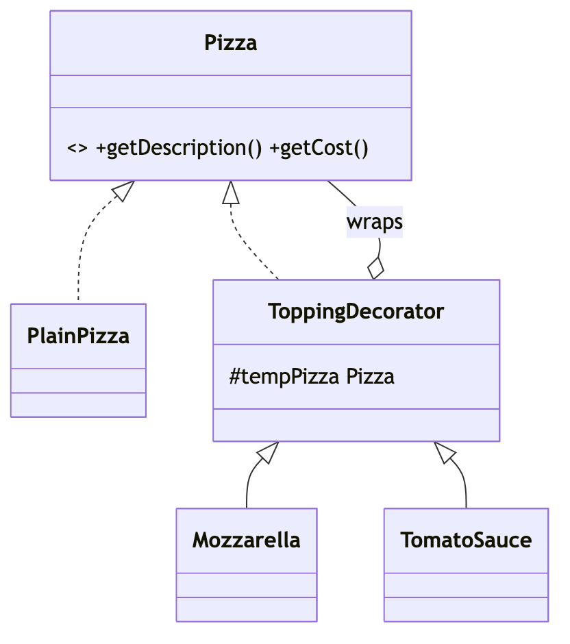

# _5 — Decorator

**Type:** Structural
**Intent:** Attach responsibilities to an object **at runtime** by wrapping it in
layers that share its interface — a flexible alternative to subclass explosion.

## Standard diagram



Key trick: the Decorator both **implements** Component *and* **holds** one, so
decorators nest recursively (`A(B(C(base)))`).

## This repo's example

Toppings wrap a `Pizza`; each layer adds to `getDescription()`/`getCost()` and
delegates the rest to the pizza it wraps.



Built as `new TomatoSauce(new Mozzarella(new PlainPizza()))`.

**Roles:** `Pizza` = Component · `PlainPizza` = ConcreteComponent ·
`ToppingDecorator` = base Decorator · `Mozzarella`/`TomatoSauce` = ConcreteDecorators.

## Run

```
java MachineCoding_LLD.DesignPatterns._05_Decorator.PizzaMaker
```
