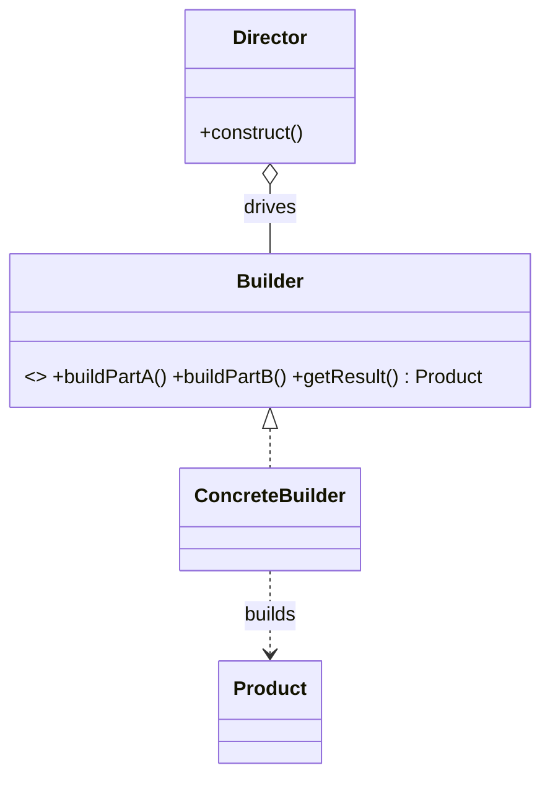
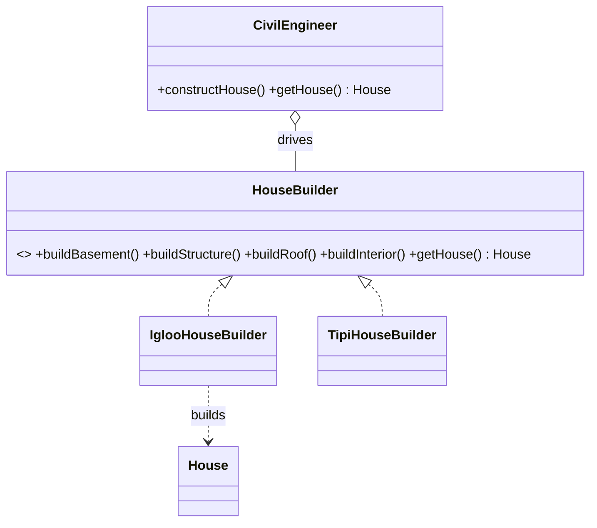

# _6 — Builder

**Type:** Creational
**Intent:** Construct a complex object step by step, letting the same
construction process produce different representations. Great for objects with
many parts / optional fields.

## Standard diagram



The **Director** knows the *order* of steps; the **ConcreteBuilder** knows *how*
to do each step and assembles the Product.

## This repo's example

`CivilEngineer` (Director) drives a `HouseBuilder` to assemble a `House`;
swapping `IglooHouseBuilder` for `TipiHouseBuilder` changes the result without
touching the construction sequence.



**Roles:** `HouseBuilder` = Builder · `Igloo`/`TipiHouseBuilder` = ConcreteBuilders
· `CivilEngineer` = Director · `House` = Product.

## The interview-style "fluent" Builder

What most people picture when they hear "Builder pattern" — one class,
chained setters, ending in `.build()`:

```java
FluentHouse house = new FluentHouse.Builder()
        .basement("Concrete")
        .structure("Brick")
        .roof("Shingles")
        .build();
```

The trick behind the chaining is a **fluent interface**: every setter returns
`this` instead of `void`, so the next call lands directly on the result
instead of you reassigning a variable each step:

```java
Builder basement(String basement) {
    this.basement = basement;
    return this;          // <-- this line is the entire technique
}
```

This is a simplified cousin of the classic Director/Builder form above, not a
different pattern — same intent (assemble a complex object step by step), one
fewer moving part (no separate Director), at a real cost:

| | Classic (Director + Builder) | Fluent (chained setters) |
|---|---|---|
| Classes involved | Director + Builder interface + ConcreteBuilder(s) + Product | One Builder class (often nested in the Product) |
| Step order | **Fixed** — the Director enforces the sequence | Caller's choice — any order, any subset |
| Optional fields | Director must know which steps to skip | Natural — just don't call that setter |
| Swappable "recipes" | Yes — swap `IglooHouseBuilder` for `TipiHouseBuilder`, Director unchanged | No — one Builder, one recipe |
| Best for | Several interchangeable construction recipes | One product, many optional/combinable fields |

**Don't confuse this with a Pipeline.** `.filter(...).map(...).collect(...)`
(Java Streams) *looks* like the same chaining, but it's transforming a
*sequence of data* through independent stages, not assembling *one object's*
fields — each stage returns a new lazy wrapper around the previous one rather
than mutating `this`. Same fluent-interface mechanism, different intent.

See [`FluentHouseBuilderDemo.java`](./FluentHouseBuilderDemo.java) — note it
sets fields out of declaration order and skips `interior` entirely, which the
Director-driven form above can't do without the Director itself changing.

## Run

```
java MachineCoding_LLD.DesignPatterns._06_Builder.Builder
java MachineCoding_LLD.DesignPatterns._06_Builder.FluentHouseBuilderDemo
```
