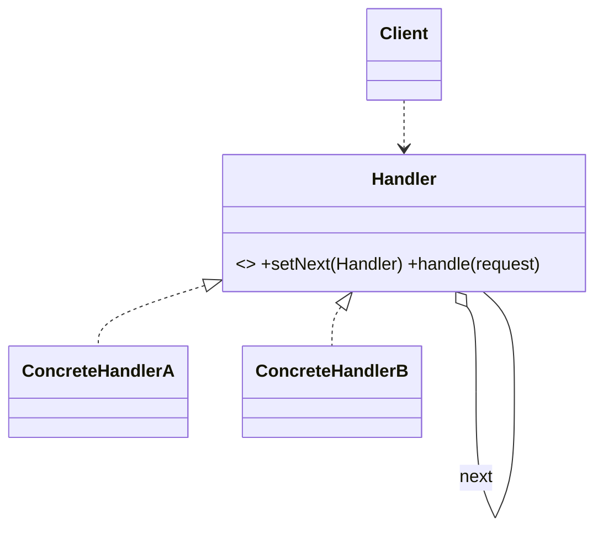
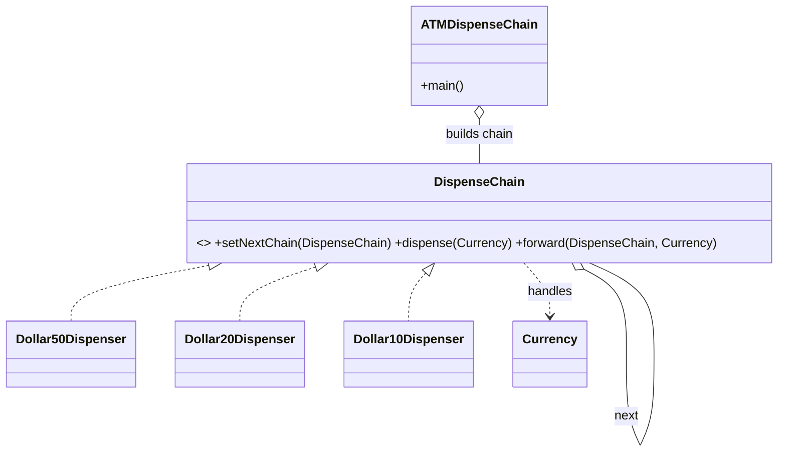

# _7 — Chain of Responsibility

**Type:** Behavioral
**Intent:** Pass a request along a chain of handlers; each handler either
processes it or forwards it to the next, so the sender is decoupled from who
ultimately handles it.

## Standard diagram



The self-aggregation (`Handler` holds a `next Handler`) is what forms the chain.

## This repo's example

An ATM dispenses the largest notes first: the `$50` handler takes what it can,
passes the remainder to `$20`, then `$10`.



**Roles:** `DispenseChain` = Handler · `Dollar50/20/10Dispenser` = ConcreteHandlers
· `ATMDispenseChain` = Client (wires `$50 -> $20 -> $10`) · `Currency` = request.

## Handling the end of the chain

Every handler used to forward with a bare `this.chain.dispense(cur)`. That's fine for
`$50`/`$20`, but `$10` is the *last* link — `ATMDispenseChain` never calls
`setNextChain` on it, so its `chain` field is `null`. The old code still tried to call
`.dispense()` on that `null`, which only avoided crashing because the caller happened to
validate "amount is a multiple of 10" beforehand, making the dangerous branch
unreachable in practice — not because the chain actually handled running off its end.

The fix is a shared `default void forward(DispenseChain next, Currency cur)` on
`DispenseChain` that every dispenser calls instead of forwarding directly: if `next` is
`null`, it reports "can't dispense the remainder" instead of throwing. **A terminal
handler in Chain of Responsibility must actually terminate the chain — not silently
assume there's always a next link.**

## Run

```
java MachineCoding_LLD.DesignPatterns._07_ChainOfResponsibility.ATMDispenseChain
# enter an amount that's a multiple of 10, or -1 to quit
```
