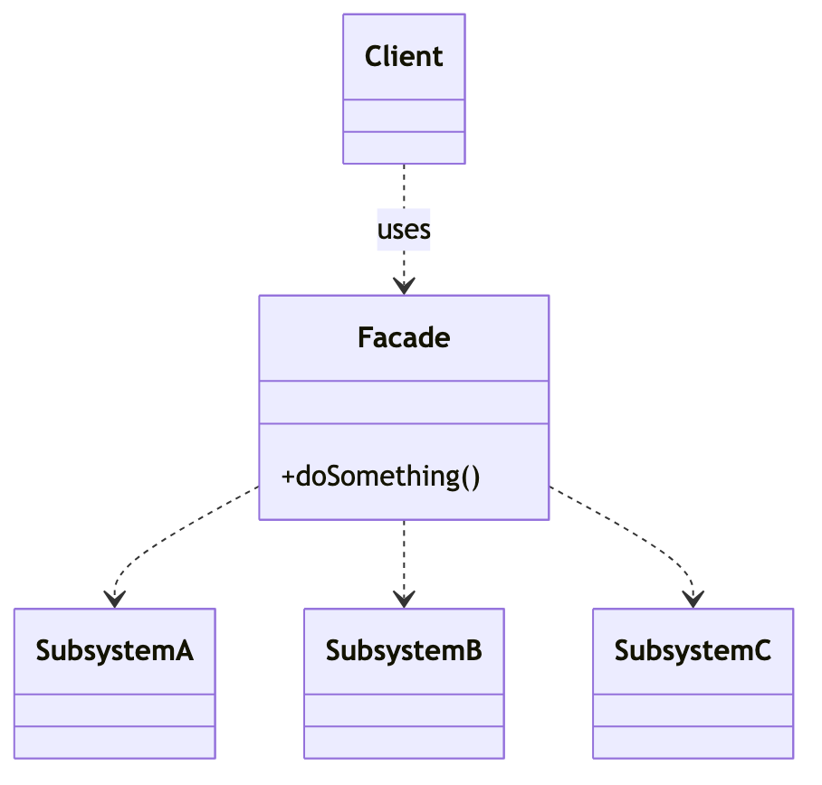
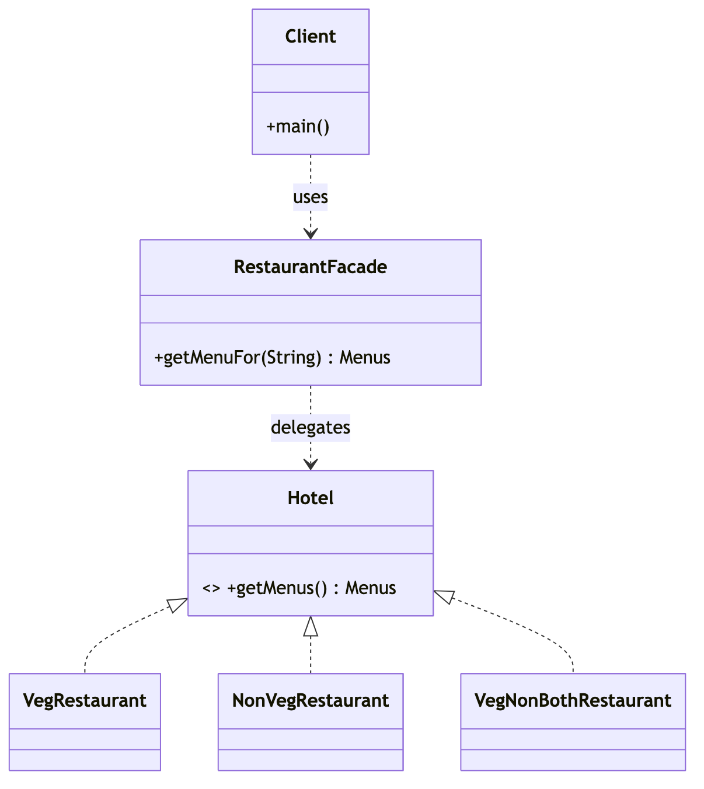

# _8 — Facade

**Type:** Structural
**Intent:** Provide one simplified entry point over a complicated subsystem, so
clients don't have to understand or wire up all the moving parts.

## Standard diagram



The Facade **depends on** the subsystems and hides them; the Client depends only
on the Facade.

## This repo's example

`RestaurantFacade.getMenuFor(preference)` hides the choice between the veg,
non-veg, and mixed restaurants behind one call.



**Roles:** `RestaurantFacade` = Facade · `VegRestaurant`/`NonVegRestaurant`/
`VegNonBothRestaurant` (behind `Hotel`) = Subsystem · `Client` = Client.

## Run

```
java MachineCoding_LLD.DesignPatterns._08_Facade.Client
```
