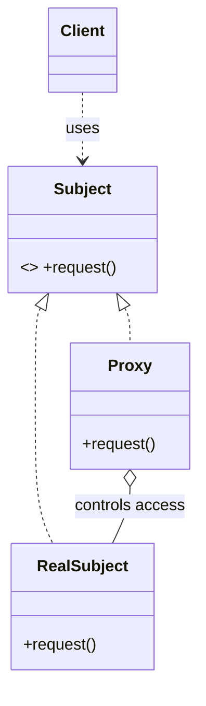
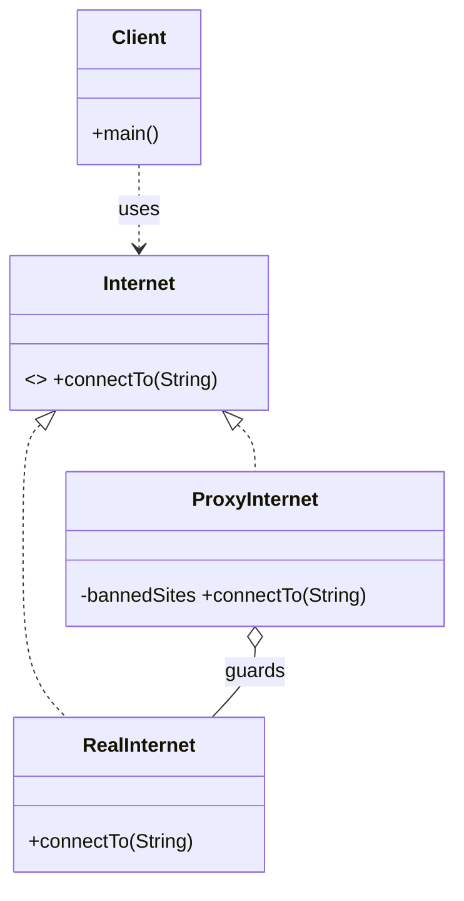

# _9 — Proxy

**Type:** Structural
**Intent:** Provide a stand-in for another object to control access to it —
add a check, lazy-load it, cache, or log — while sharing its interface so the
client can't tell the difference.

## Standard diagram



Proxy and RealSubject share the `Subject` interface; the Proxy **holds** the
real object and gates calls to it.

## This repo's example

`ProxyInternet` implements the same `Internet` interface as `RealInternet` but
blocks banned hosts before delegating (a **protection proxy**).



**Roles:** `Internet` = Subject · `RealInternet` = RealSubject · `ProxyInternet`
= Proxy (access control) · `Client` = Client.

Common proxy flavors: **protection** (this example), **virtual** (lazy/expensive
init), **remote** (network stub), **caching**.

## Run

```
java MachineCoding_LLD.DesignPatterns._09_Proxy.Client
```
