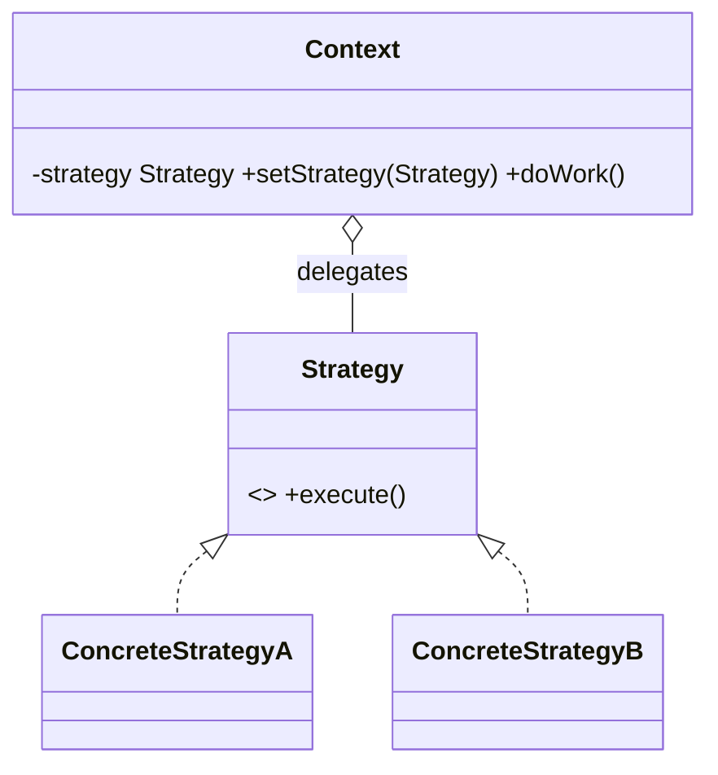
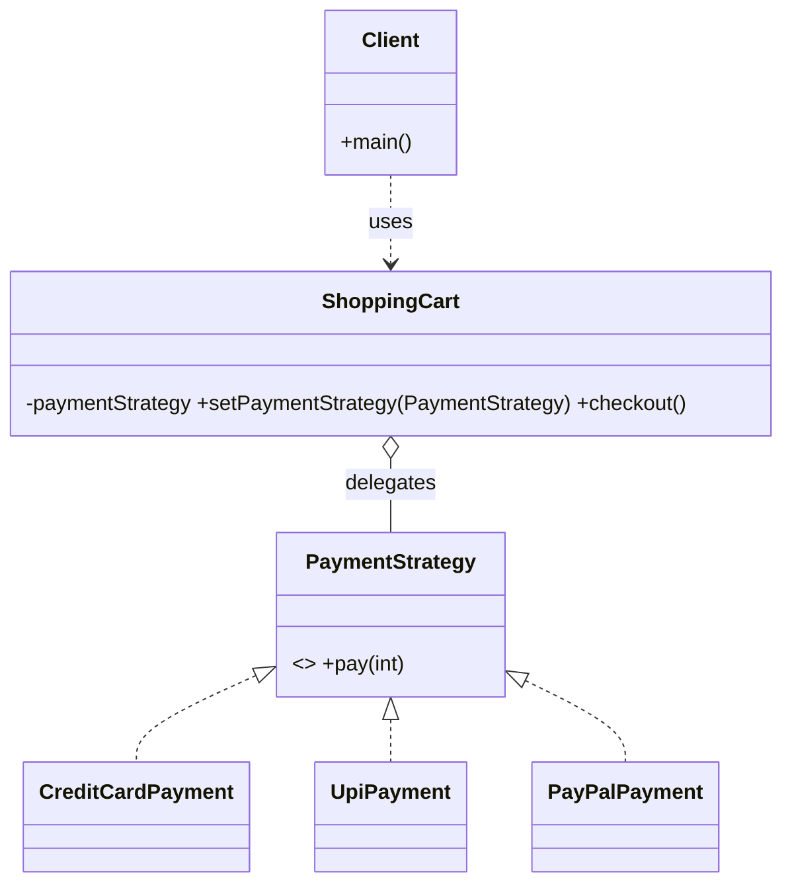

# _10 — Strategy

**Type:** Behavioral
**Intent:** Define a family of interchangeable algorithms, encapsulate each one,
and let the client pick/swap them **at runtime**. Replaces sprawling
`if/else`/`switch` over behavior.

## Standard diagram



The Context **holds** a Strategy and delegates the varying step to it, instead
of hard-coding the algorithm.

## This repo's example

A `ShoppingCart` delegates checkout to whichever `PaymentStrategy` is set, so the
payment method can change per checkout without touching the cart.



**Roles:** `PaymentStrategy` = Strategy · `CreditCard`/`Upi`/`PayPalPayment`
= ConcreteStrategies · `ShoppingCart` = Context · `Client` = configures it.

## Run

```
java MachineCoding_LLD.DesignPatterns._10_StrategyDesignPattern.Client
```
