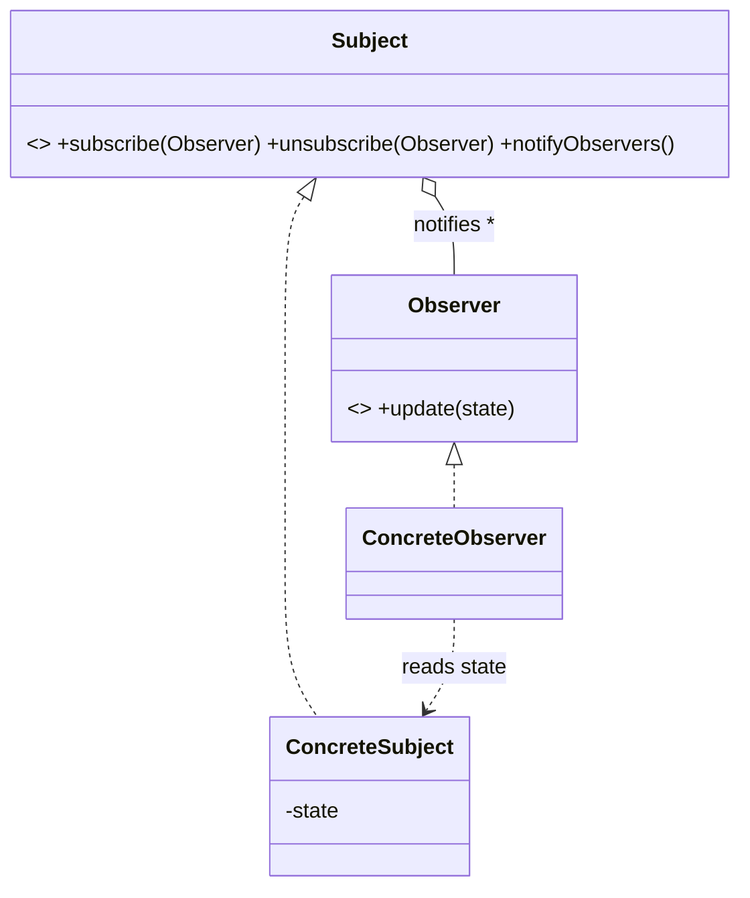
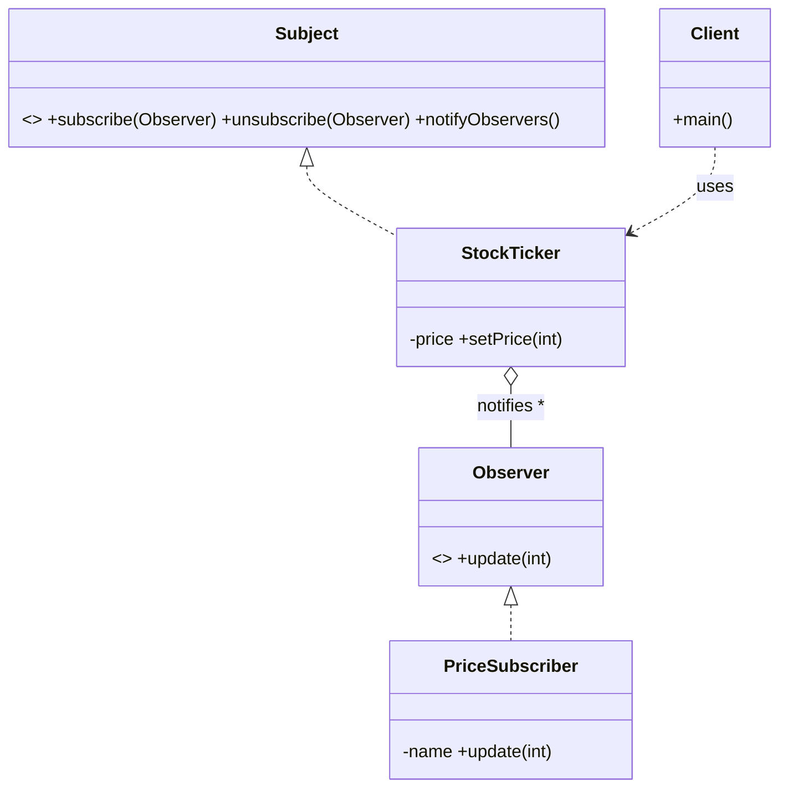

# _11 — Observer

**Type:** Behavioral
**Intent:** Define a one-to-many dependency so that when one object (the
subject) changes state, all its dependents (observers) are notified
automatically. The "publish/subscribe" pattern.

## Standard diagram



The Subject **holds a list of** Observers and calls `update()` on each when its
state changes — it doesn't know or care what the concrete observers do.

## This repo's example

A `StockTicker` notifies every subscribed `PriceSubscriber` whenever the price
changes; unsubscribing stops the updates.



**Roles:** `Subject` = Subject interface · `StockTicker` = ConcreteSubject ·
`Observer` = Observer interface · `PriceSubscriber` = ConcreteObserver ·
`Client` = wires subscriptions.

## Run

```
java MachineCoding_LLD.DesignPatterns._11_ObserverDesignPattern.Client
```
