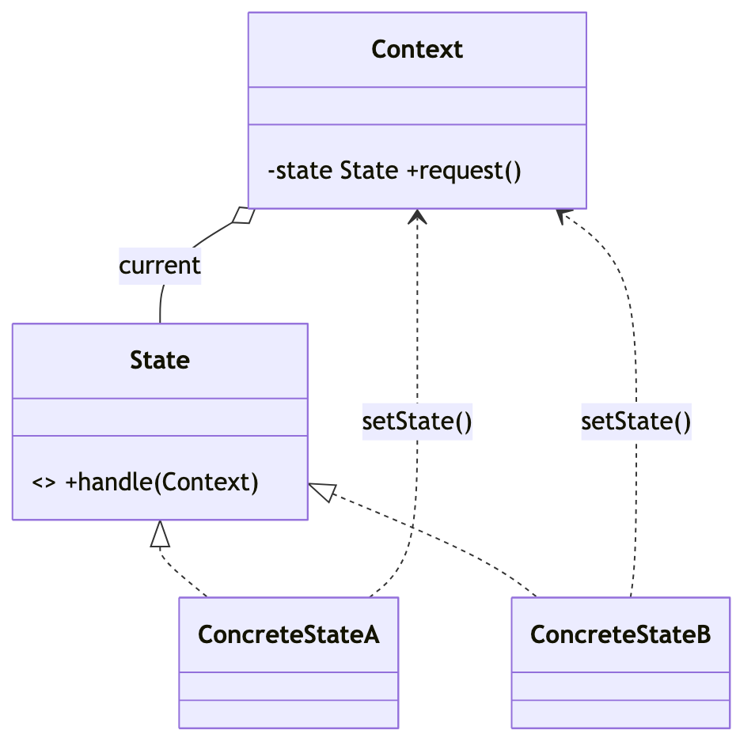
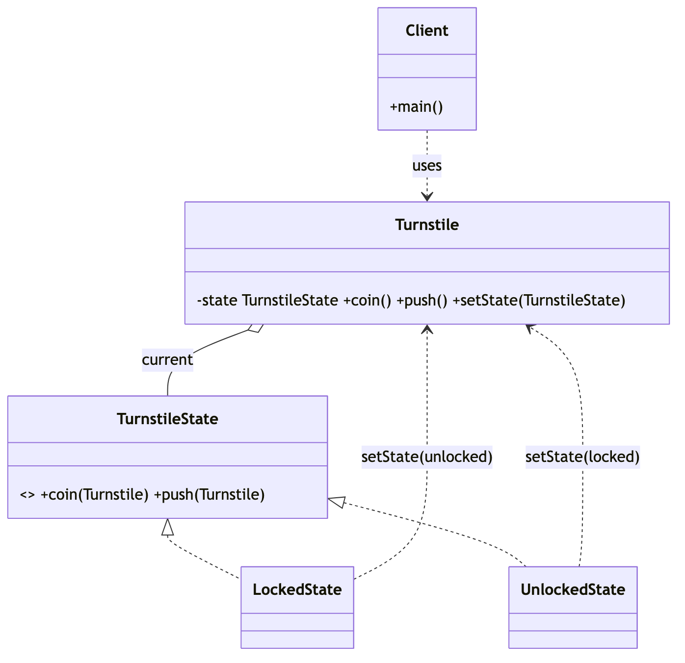

# _12 — State

**Type:** Behavioral
**Intent:** Let an object alter its behavior when its internal state changes —
the object appears to change its class. Each state becomes its own class, so the
context delegates instead of running a big `switch` on a state field.

## Standard diagram



The Context forwards each request to its current State object; the State handles
it and may **transition** the Context to a different State.

## This repo's example

A `Turnstile` responds to `coin` and `push`. The same two events behave
differently in each state, and each state flips the turnstile to the other:
`LockedState` + coin → unlocked; `UnlockedState` + push → locked.



**Roles:** `TurnstileState` = State interface · `LockedState`/`UnlockedState`
= ConcreteStates · `Turnstile` = Context · `Client` = drives events.

## State vs. Strategy

They look identical on a class diagram — both delegate to a swappable object.
The difference is intent:

- **Strategy**: the client *picks* one algorithm and it usually stays put.
- **State**: the states *pick each other* — transitions are baked into the
  states, and the object cycles through them over its lifetime.

## Applied in this repo

The [Vending Machine](../../LLD_Interview_Problems/_02_Easy_VendingMachine/SOLUTION.md)
LLD problem is a full-scale State machine (`Idle → HasMoney → Dispensing`).

## Run

```
java MachineCoding_LLD.DesignPatterns._12_State.Client
```
