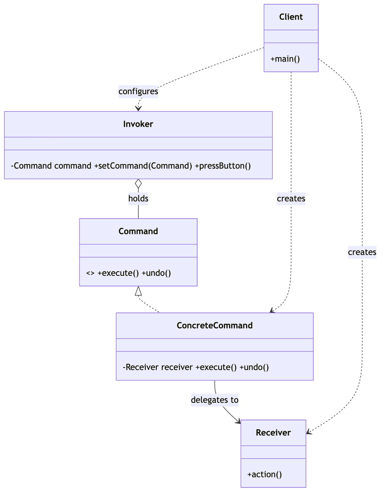
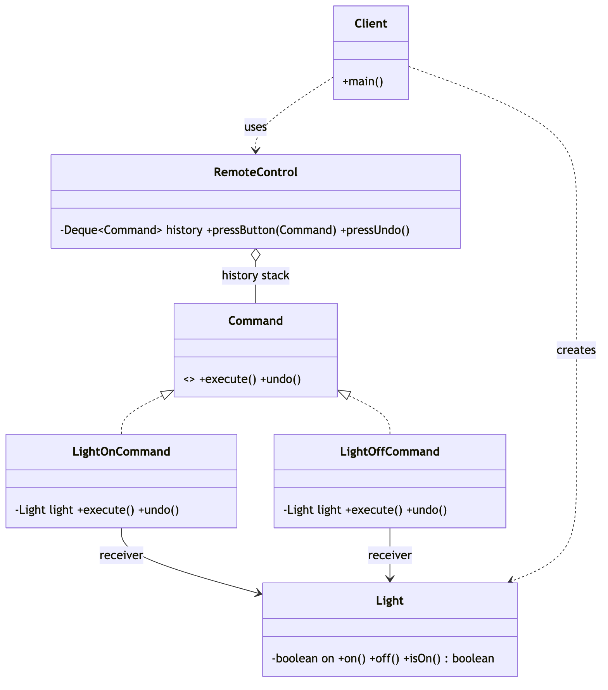

# _13 — Command

**Type:** Behavioral
**Intent:** Encapsulate a request as an object, so the invoker can trigger it without
knowing the receiver or the action — and so requests can be queued, logged, or undone.

## Standard diagram



The Invoker only ever calls `execute()` on whatever `Command` it's holding. The
ConcreteCommand is the only thing that knows the Receiver and which method to call on it.

## This repo's example

A `RemoteControl` (Invoker) fires `LightOnCommand` / `LightOffCommand` (ConcreteCommands)
against a `Light` (Receiver), and keeps a history stack so `pressUndo()` can reverse the
last action — a queued, replayable request is exactly what Command buys you.



**Roles:** `Command` = Command interface · `LightOnCommand`/`LightOffCommand` =
ConcreteCommands · `Light` = Receiver · `RemoteControl` = Invoker (adds a history stack
for undo) · `Client` = wires receiver + commands + invoker.

## Command vs. Strategy

Both wrap a call behind one interface, but the *point* differs:

- **Strategy** swaps *how* one ongoing operation is carried out (the algorithm); the
  client picks one and it stays put for that call.
- **Command** turns *a single request* — receiver, method, and arguments — into an
  object, so it can be **handed off, queued, logged, or undone** independently of when
  it was created. The receiver is baked into the command, not passed in per call.

## Applied in this repo

The [Elevator System](../../LLD_Interview_Problems/_06_Medium_ElevatorSystem/SOLUTION.md)
LLD problem queues every hall/car call as a `VisitFloorCommand`: the dispatcher builds it
and the elevator's own control-loop thread `execute()`s it later, off a
`PriorityBlockingQueue` — the same decoupling of "who asked" from "who acts, and when"
shown here, minus undo.

## Run

```
java MachineCoding_LLD.DesignPatterns._13_Command.Client
```
