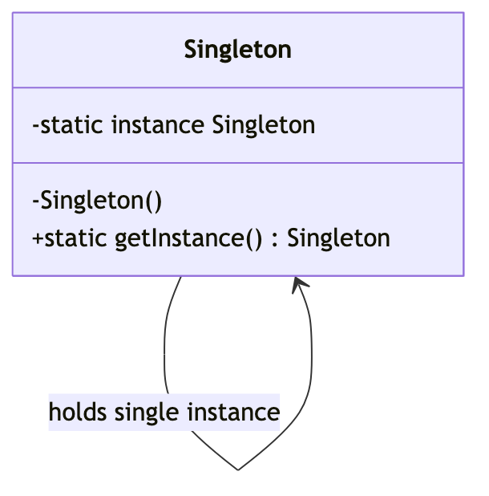
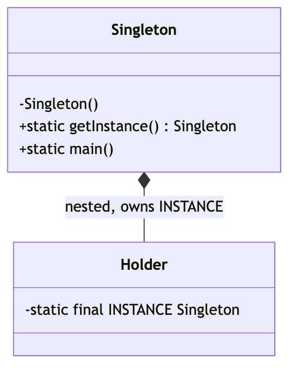

# _3 — Singleton

**Type:** Creational
**Intent:** Guarantee a class has exactly **one** instance and give a global
access point to it.

## Standard diagram



The self-association (a private static field of its own type) plus a **private
constructor** is the whole pattern.

## This repo's example

Uses the **initialization-on-demand holder** idiom: the nested `Holder` class
isn't loaded until `getInstance()` is first called, and the JVM guarantees
class initialization is thread-safe — so it's lazy *and* safe with no locking.



Alternatives you should be able to name in an interview: eager `static final`
field, double-checked locking with `volatile`, or a single-element `enum`
(the most concise thread-safe option).

## Run

```
java MachineCoding_LLD.DesignPatterns._3_SingletonDesignPattern.Singleton
```
