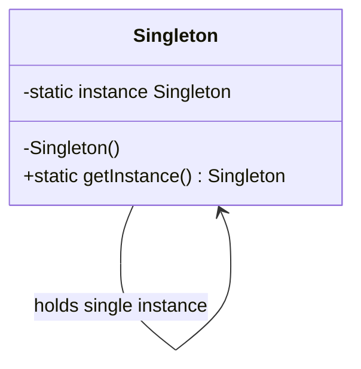
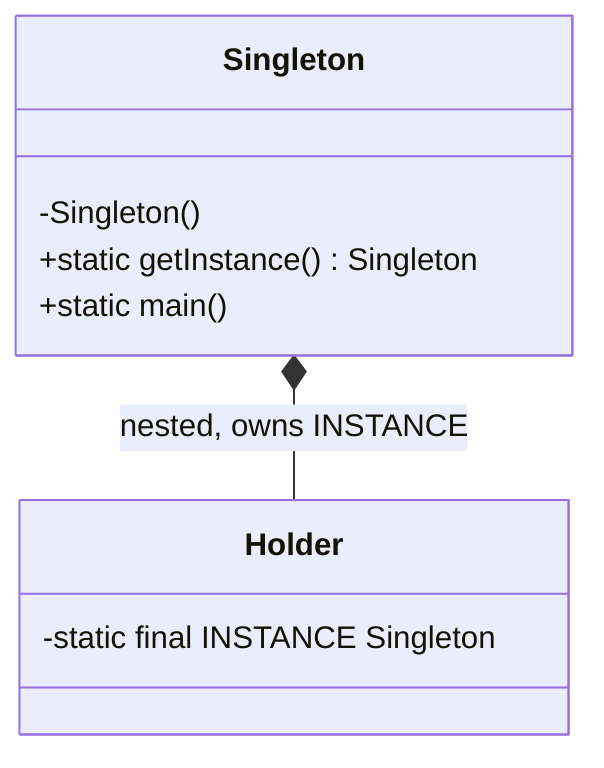
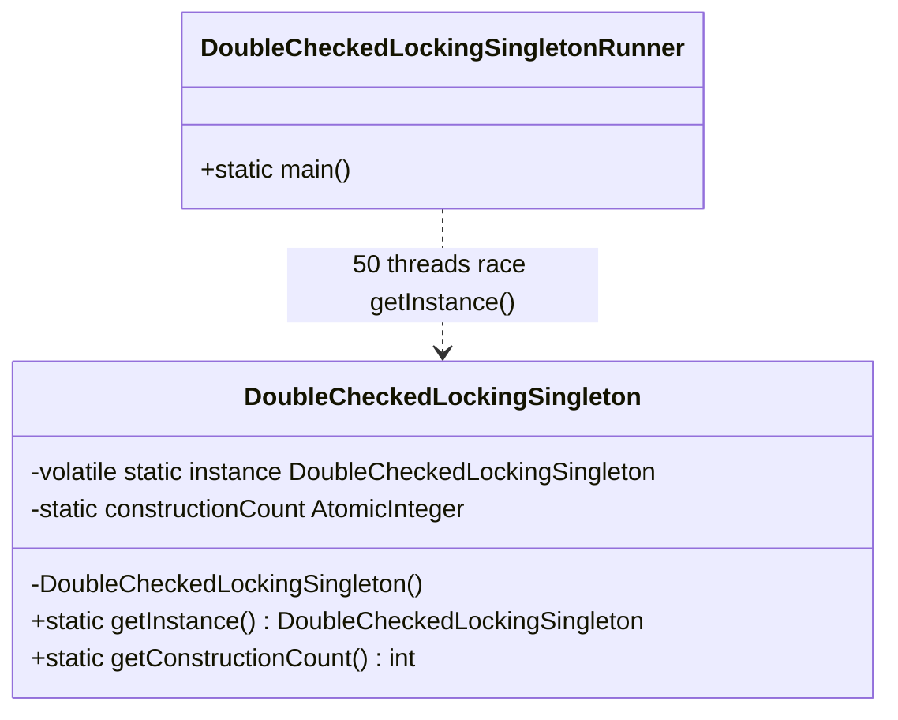

# _3 — Singleton

**Type:** Creational
**Intent:** Guarantee a class has exactly **one** instance and give a global
access point to it.

## Standard diagram



The self-association (a private static field of its own type) plus a **private
constructor** is the whole pattern.

## This repo's example

Uses the **initialization-on-demand holder** idiom: the nested `Holder` class
isn't loaded until `getInstance()` is first called, and the JVM guarantees
class initialization is thread-safe — so it's lazy *and* safe with no locking.



Alternatives you should be able to name in an interview: eager `static final`
field, double-checked locking with `volatile`, or a single-element `enum`
(the most concise thread-safe option).

## Multithreaded example: double-checked locking

`DoubleCheckedLockingSingleton` is the classic thread-safe singleton every
interview expects you to be able to write from scratch. The outer null-check
skips the `synchronized` block once the instance exists (cheap fast path); the
inner null-check — taken with the lock held — stops two threads that both
passed the outer check from both constructing an instance; `volatile` stops a
thread from observing a partially-constructed object due to reordering.

`DoubleCheckedLockingSingletonRunner` proves it holds under real contention:
it starts 50 threads, blocks them on a `CountDownLatch` so they're released in
the same instant, and has every one call `getInstance()`. It then asserts all
50 futures returned the *same* reference and that the constructor ran exactly
once — the race the single-threaded `Singleton.main` never exercises.



## Run

```
java MachineCoding_LLD.DesignPatterns._3_SingletonDesignPattern.Singleton
java MachineCoding_LLD.DesignPatterns._3_SingletonDesignPattern.DoubleCheckedLockingSingletonRunner
```
