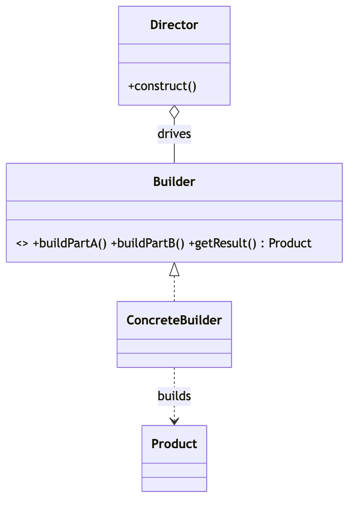
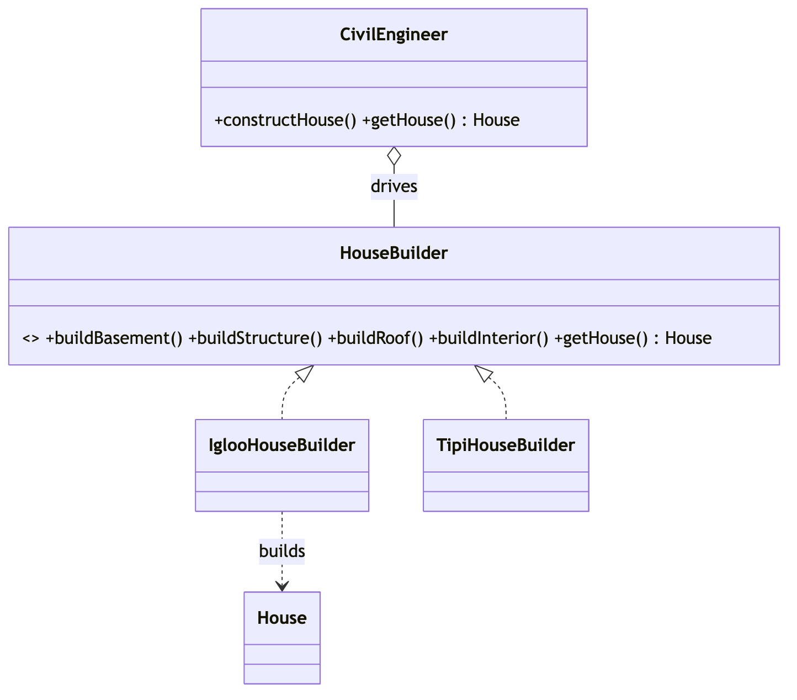

# _6 — Builder

**Type:** Creational
**Intent:** Construct a complex object step by step, letting the same
construction process produce different representations. Great for objects with
many parts / optional fields.

## Standard diagram



The **Director** knows the *order* of steps; the **ConcreteBuilder** knows *how*
to do each step and assembles the Product.

## This repo's example

`CivilEngineer` (Director) drives a `HouseBuilder` to assemble a `House`;
swapping `IglooHouseBuilder` for `TipiHouseBuilder` changes the result without
touching the construction sequence.



**Roles:** `HouseBuilder` = Builder · `Igloo`/`TipiHouseBuilder` = ConcreteBuilders
· `CivilEngineer` = Director · `House` = Product.

> Note: interview-style "fluent Builder" (chained `.setX().build()`) is a
> simplified cousin of this classic Director/Builder form.

## Run

```
java MachineCoding_LLD.DesignPatterns._6_Builder.Builder
```
