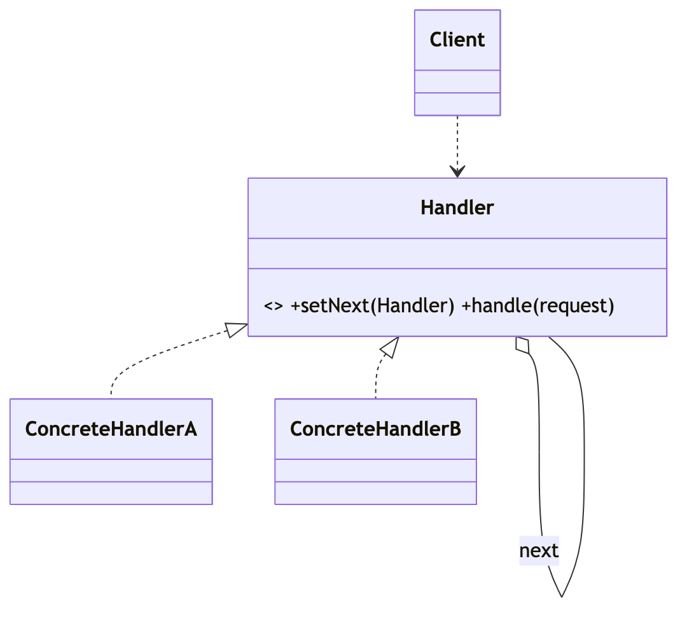
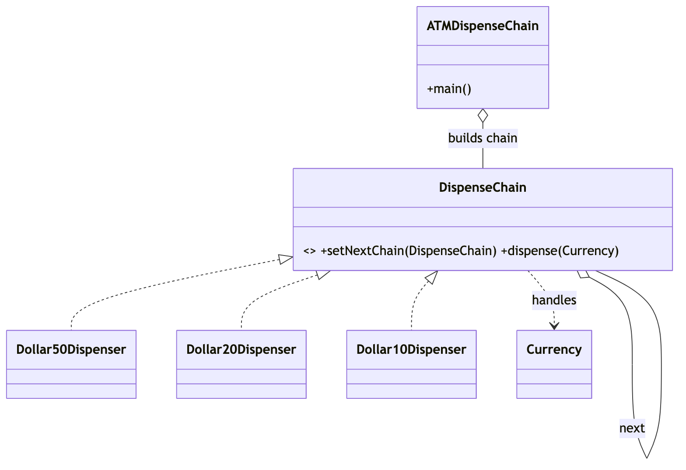

# _7 — Chain of Responsibility

**Type:** Behavioral
**Intent:** Pass a request along a chain of handlers; each handler either
processes it or forwards it to the next, so the sender is decoupled from who
ultimately handles it.

## Standard diagram



The self-aggregation (`Handler` holds a `next Handler`) is what forms the chain.

## This repo's example

An ATM dispenses the largest notes first: the `$50` handler takes what it can,
passes the remainder to `$20`, then `$10`.



**Roles:** `DispenseChain` = Handler · `Dollar50/20/10Dispenser` = ConcreteHandlers
· `ATMDispenseChain` = Client (wires `$50 -> $20 -> $10`) · `Currency` = request.

## Run

```
java MachineCoding_LLD.DesignPatterns._7_ChainOfResponsibility.ATMDispenseChain
# enter an amount that's a multiple of 10, or -1 to quit
```
