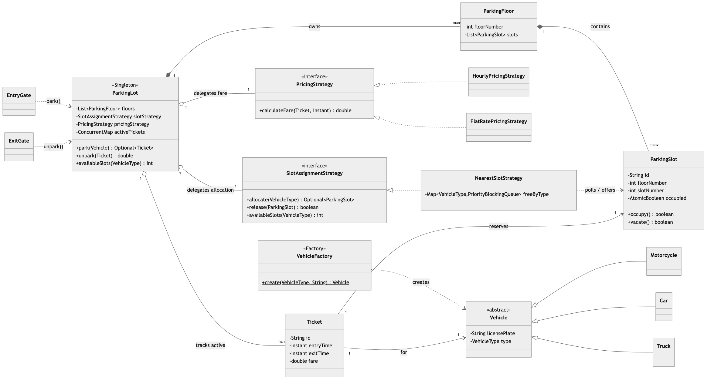
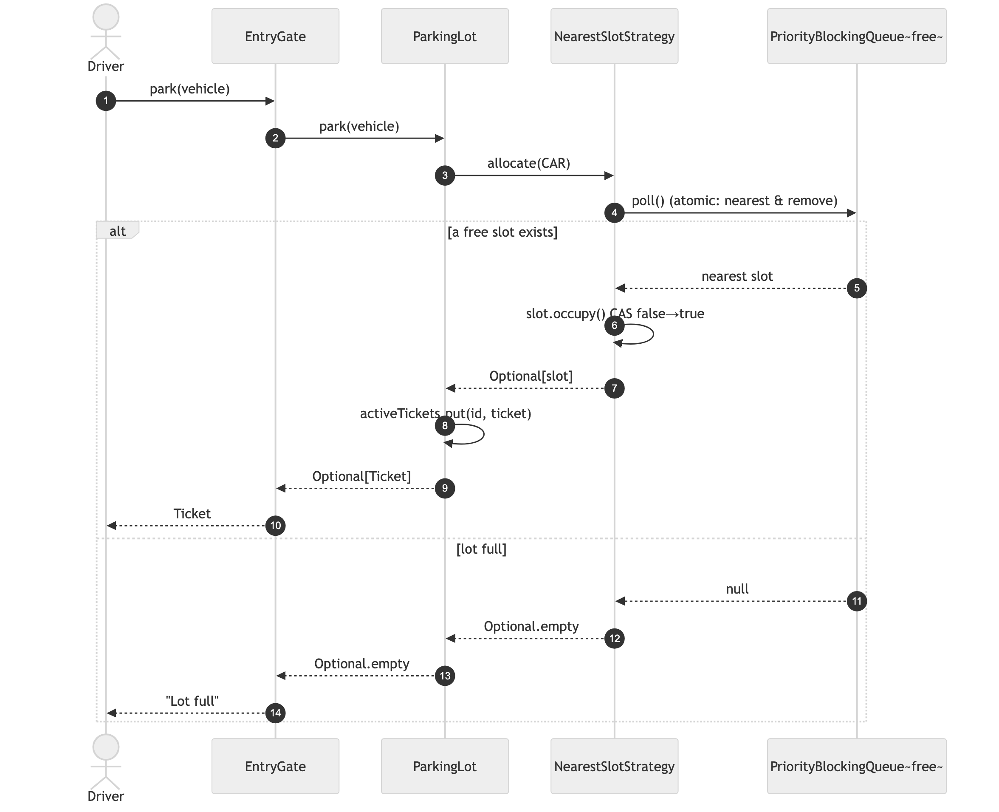
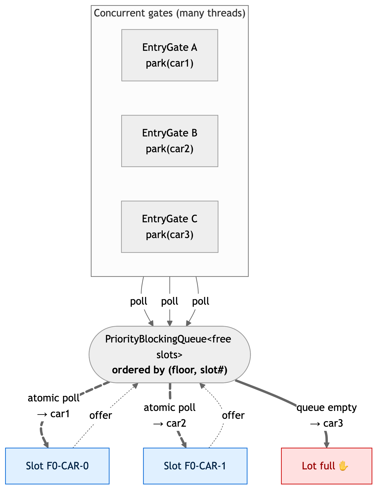

# Parking Lot System — Solution

A multi-floor, multi-vehicle-type parking lot that parks at the **nearest** free slot,
unparks with a computed fare, and stays correct under **concurrent gates**. Built around
three GoF patterns (Singleton, Strategy, Factory) with the concurrency isolated into a
single data structure.

> Code lives in this folder under package
> `MachineCoding_LLD.LLD_Interview_Problems._01_Easy_ParkingLotSystem` (subpackages
> [`model`](./model), [`strategy`](./strategy), [`factory`](./factory), [`gate`](./gate)).
> Run instructions are at the bottom.

---

## 1. Class model



**Reading the arrows:** ◆ filled diamond = **composition** (the lot *owns* its floors, a
floor *owns* its slots — they don't outlive it). ◇ hollow diamond = **aggregation** (the lot
*holds* strategies and *tracks* tickets, but those are injected/independent). ▷ hollow
triangle = **inheritance / interface realization**. Dashed = **dependency / uses**.

| Role | Class | Responsibility |
|------|-------|----------------|
| Facade + **Singleton** | `ParkingLot` | The one entry point gates call: `park` / `unpark` / `availableSlots`. |
| **Strategy** (allocation) | `SlotAssignmentStrategy` → `NearestSlotStrategy` | *Which* free slot to hand out — **and owns the free-slot bookkeeping**. |
| **Strategy** (pricing) | `PricingStrategy` → `HourlyPricingStrategy`, `FlatRatePricingStrategy` | *How much* to charge. |
| **Factory** | `VehicleFactory` | Turns a `VehicleType` into the right `Vehicle` subtype. |
| Entities | `ParkingFloor`, `ParkingSlot`, `Vehicle`(+subtypes), `Ticket` | Plain data + a tiny bit of atomic slot state. |
| Actors | `EntryGate`, `ExitGate` | Thin adapters over the lot — the reason concurrency matters. |

---

## 2. The happy path — `park()`



The lot delegates the *pick* to the strategy, which does a single atomic `poll()` on the
free-slot queue. A present slot becomes a `Ticket`; an empty queue becomes
`Optional.empty()` (a full lot — an expected result, **not** an exception). Fare and ticket
work happen *outside* the atomic step.

---

## 3. Concurrency — the core of this problem

**The race:** two cars arrive at two different gates at the same instant. Both ask for the
nearest car slot. A naïve "find first free slot, then mark it" has a window between *find*
and *mark* where both threads pick the **same** slot → double allocation.

**The fix:** keep the free slots for each `VehicleType` in a single
`PriorityBlockingQueue<ParkingSlot>` ordered by `(floorNumber, slotNumber)`. Then
allocation is *one* atomic operation:



- **`poll()`** atomically *removes-and-returns the head* — the globally nearest free slot.
  Two threads can never receive the same slot, with **no explicit lock**.
- The queue's ordering gives **nearest-first across all floors** for free.
- Empty queue → `null` → `Optional.empty()` → clean "lot full".
- **Release** is `offer()` back into the queue, which re-inserts in nearest order.

**Defence in depth:** each `ParkingSlot` also has an `AtomicBoolean occupied`. `occupy()`
(CAS false→true) can only win once; `vacate()` (CAS true→false) only succeeds for a truly
occupied slot — so a **double-unpark can't re-add a slot to the free pool twice**. The
ticket lifecycle adds a third guard: `ConcurrentHashMap.remove()` on exit returns the ticket
to exactly one caller, so a replayed/forged ticket is rejected.

> **Critical section = just the `poll`/`offer`.** Fare calculation, ticket creation, and
> map updates are all outside it — exactly what the problem statement asks for.

---

## 4. Design choices & trade-offs

| Decision | Why | Trade-off / alternative |
|----------|-----|-------------------------|
| **`PriorityBlockingQueue` per type** for free slots | One structure gives atomic hand-out **and** nearest-first ordering. | `allocate`/`release` are `O(log n)`. A plain `ConcurrentLinkedQueue` is `O(1)` but loses nearest-ordering on release. |
| Strategy **owns** the free-slot data | Concentrates *all* race-prone code in one class — "thread-safe parking" = "thread-safe strategy". | Strategy is slightly fatter than a pure "pick" function. |
| `park` returns **`Optional<Ticket>`** | A full lot is an expected outcome, not exceptional. | Callers must handle empty (which is the point). |
| Singleton with **package-private constructor** | Keeps the single production instance *and* lets tests build isolated lots. | Not a "pure" private-ctor singleton; documented deliberately. |
| Pricing split from allocation | Pricing changes far more often than the physical model (OCP). | Two interfaces instead of one. |
| One slot serves **one** vehicle type | Keeps the model simple and matches the brief. | No "car fits in a truck slot" fallback — noted as an extension. |

---

## 5. Complexity

| Operation | Cost |
|-----------|------|
| `park` (allocate nearest) | `O(log n)` on the per-type free queue |
| `unpark` (release + fare) | `O(log n)` release + `O(1)` fare |
| `availableSlots(type)` | `O(1)` |

`n` = free slots of that type. All operations are lock-free at the application level (the
only synchronization is inside the concurrent collections).

---

## 6. How to run

```bash
# from the repo's src/ directory (the single source root)
PKG=MachineCoding_LLD/LLD_Interview_Problems/_01_Easy_ParkingLotSystem
javac -d out $(find $PKG -name '*.java')

BASE=MachineCoding_LLD.LLD_Interview_Problems._01_Easy_ParkingLotSystem
java -cp out $BASE.Main           # end-to-end walkthrough across two gates
java -cp out $BASE.ParkingLotTest # correctness + 800-thread stress test
```

The test harness (no JUnit — plain `main`, matching this repo) exits non-zero on any
failure. It covers: nearest-slot ordering across floors, full-lot handling, double-unpark
rejection, hourly-fare rounding, and the headline **concurrency stress test** — 800 threads
racing for 200 slots, asserting exactly 200 succeed, **no slot is assigned twice**, and
capacity is fully restored after everyone exits.

---

## 7. Extensions an interviewer might ask for

- **Slot-size fallback** — let a smaller vehicle take a larger free slot (order types by size,
  try progressively larger queues in `allocate`).
- **Per-gate nearest** — key the priority order off each entrance's coordinates instead of a
  global `(floor, slot#)`.
- **Persistence / multi-JVM** — move the free-slot set to Redis (atomic `LPOP`/`ZPOPMIN`) or a
  DB row-lock; the `SlotAssignmentStrategy` seam means `ParkingLot` doesn't change.
- **Pricing tiers** — day/night rates, free first 15 minutes: new `PricingStrategy`, nothing else.
