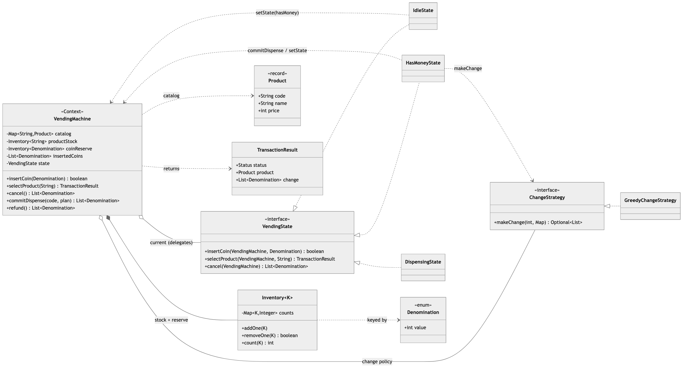
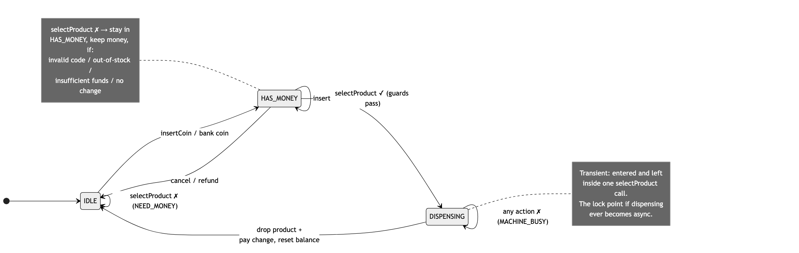
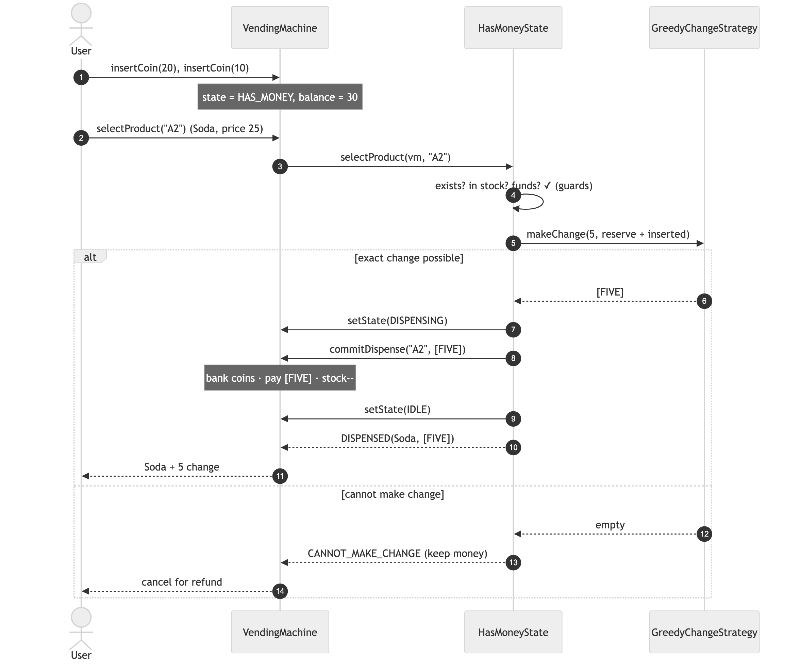

# Vending Machine — Solution

A vending machine modeled as a **State machine**: it accepts coins, dispenses a product with
correct change, refunds on cancel, and rejects every illegal action (dispensing without
payment, buying out-of-stock, etc.). The star of the show is the **State pattern**; change-making
is a swappable **Strategy**.

> Code is in this folder under `MachineCoding_LLD.LLD_Interview_Problems._02_Easy_VendingMachine`
> (subpackages [`model`](./model), [`state`](./state), [`strategy`](./strategy)). Run steps at the bottom.

---

## 1. Class model



**Arrows:** ▷ dashed = interface realization · ◇ = aggregation (the machine *holds* a state and a
change strategy) · ◆ = composition (it *owns* its inventories) · dashed → = dependency/uses.

| Role | Class | Responsibility |
|------|-------|----------------|
| **Context** | `VendingMachine` | Public API (`insertCoin`/`selectProduct`/`cancel`) delegates to the current state; owns money + stock and the mutation helpers. |
| **State** | `VendingState` → `IdleState`, `HasMoneyState`, `DispensingState` | Same action, different behavior per mode; each drives the transition. |
| **Strategy** | `ChangeStrategy` → `GreedyChangeStrategy` | The change-making algorithm, pulled out so it can be swapped. |
| Money/stock | `Inventory<K>`, `Denomination`, `Product` | Plain counting + reference data. |
| Result | `TransactionResult` | Typed outcome (`DISPENSED`, `INSUFFICIENT_FUNDS`, …) instead of exceptions. |

---

## 2. The State machine (the core)



The machine's *behavior for the same action* depends on its mode — that's exactly what the
State pattern captures, replacing a sprawl of `if (mode == …)` checks:

| Action | `IDLE` | `HAS_MONEY` | `DISPENSING` |
|--------|--------|-------------|--------------|
| `insertCoin` | bank it → `HAS_MONEY` | add to balance | rejected (busy) |
| `selectProduct` | ✗ `NEED_MONEY` | run guards → dispense or reject | rejected (busy) |
| `cancel` | nothing | refund → `IDLE` | rejected (busy) |

`DispensingState` is **transient** — entered and left inside one `selectProduct` call since our
dispense is synchronous. It's modeled explicitly anyway: it's the one place the "no
double-dispense" rule lives, and the single point you'd guard with a lock if dispensing ever
became asynchronous (motor delay, card auth). See §5 on concurrency.

---

## 3. Buying + making change



`HasMoneyState.selectProduct` runs four guards **in order**, and only commits if all pass:

1. **exists?** → `INVALID_SELECTION`
2. **in stock?** → `OUT_OF_STOCK`
3. **enough money?** → `INSUFFICIENT_FUNDS`
4. **can we make exact change?** → `CANNOT_MAKE_CHANGE`

The change check is a **dry run** against the reserve **plus the just-inserted coins** — a real
machine banks your coins before paying out, so those coins are available as change. Only after
all four pass does `commitDispense` mutate anything (bank coins → pay change plan → drop stock).
That means a rejected purchase never leaves the machine in a half-updated state, and the user's
money is retained so they can pick another item or cancel for a refund.

---

## 4. Design choices & trade-offs

| Decision | Why | Alternative |
|----------|-----|-------------|
| **State pattern** for modes | Per-mode behavior + transitions in cohesive classes; no `switch` on a mode flag. | An enum-`switch` machine — fine for 2 states, rots as states grow. |
| **Strategy** for change-making | The algorithm is the volatile part; greedy today, DP tomorrow, no machine edits. | Hard-code greedy — locks you in. |
| **Typed `TransactionResult`** | "Out of stock" / "insufficient" are *expected* outcomes, not exceptions. | Throwing — abuses exceptions for control flow. |
| **No Factory / Singleton** | `Product` is a data record (no polymorphism to build); one machine object needs no global access point. | Forcing them to tick boxes — the prompt lists them, but they'd be ceremony here. |
| **No threads** | A vending machine is inherently one user at a time. | See §5 — a single lock *if* asked. |
| Out-of-stock is a **guard, not a state** | The machine's mode doesn't change — you can still pick another product. | A dedicated `OutOfStockState` — over-models a transient rejection. |

### Change-making: greedy vs. DP
`GreedyChangeStrategy` (largest-coin-first) is optimal for a **canonical** coin set (1,2,5,10,…)
and reports failure rather than mispaying. It is **not** optimal for arbitrary denominations
(coins {1,3,4}, amount 6 → greedy 4+1+1, optimal 3+3). Because it's a Strategy, a DP-based maker
drops in with zero changes to the state machine — a great thing to say out loud.

---

## 5. Concurrency (only if asked)

> The interviewer usually wants a clean State pattern here, **not** thread-safety — so this is
> single-threaded by design.

If pushed to make it concurrent, the whole transaction (state check → guards → commit) is one
critical section. The minimal fix: guard `insertCoin`/`selectProduct`/`cancel` with a single
lock so two users can't both drive the machine into `DISPENSING`. `DispensingState` already
marks the exact window to protect. No lock-striping is warranted — there's one machine, one
hopper; contention is a person waiting, not a hot path.

---

## 6. Complexity

| Operation | Cost |
|-----------|------|
| `insertCoin` | `O(1)` |
| `selectProduct` (+ greedy change) | `O(d)`, `d` = number of denominations |
| `cancel` / `refund` | `O(k)`, `k` = coins inserted |

---

## 7. How to run

```bash
# from the repo's src/ directory (the single source root)
PKG=MachineCoding_LLD/LLD_Interview_Problems/_02_Easy_VendingMachine
javac -d out $(find $PKG -name '*.java')

BASE=MachineCoding_LLD.LLD_Interview_Problems._02_Easy_VendingMachine
java -cp out $BASE.Main               # happy-path walkthrough
java -cp out $BASE.VendingMachineTest # 22 assertions across every path
```

The harness (plain `main`, no JUnit) exits non-zero on failure and covers: select-before-pay,
correct change, exact money, insufficient funds, invalid code, out-of-stock, cancel/refund,
can't-make-change (money retained), and change funded from just-inserted coins.

---

## 8. Extensions an interviewer might ask for

- **Card payment** — a `PaymentStrategy` alongside cash; `HasMoneyState` becomes payment-agnostic.
- **DP change-maker** — new `ChangeStrategy` for non-canonical denominations.
- **Admin/maintenance state** — a `ServiceState` for restocking that locks out purchases.
- **Concurrency** — one lock around the transaction (see §5).

> Pattern reference: this is the applied version of
> [DesignPatterns/_12_State](../../DesignPatterns/_12_State/README.md).
