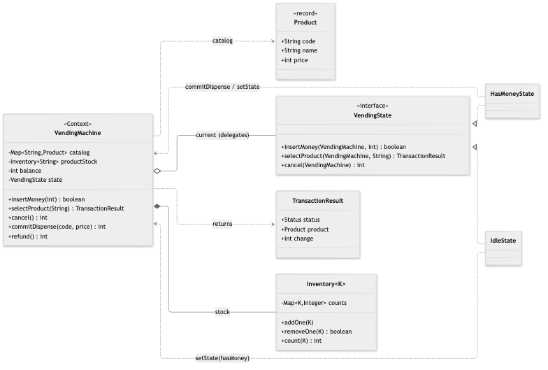
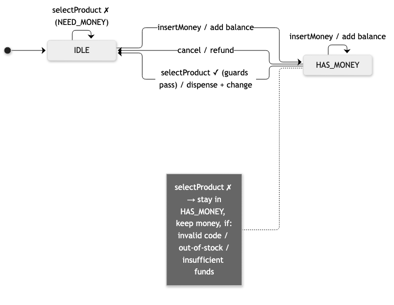

# Vending Machine — Solution

A vending machine modeled as a **State machine**: it accepts money, dispenses a product with
correct change, refunds on cancel, and rejects every illegal action (dispensing without
payment, buying out-of-stock, etc.). The **State pattern** is the entire point of this
exercise — everything else is kept deliberately thin so it doesn't compete for attention.

> Code is in this folder under `MachineCoding_LLD.LLD_Interview_Problems._02_Easy_VendingMachine`
> (subpackages [`model`](./model), [`state`](./state)). Run steps at the bottom.

---

## 1. Class model



**Arrows:** ▷ dashed = interface realization · ◇ = aggregation (the machine *holds* a state) ·
◆ = composition (it *owns* its stock) · dashed → = dependency/uses.

| Role | Class | Responsibility |
|------|-------|----------------|
| **Context** | `VendingMachine` | Public API (`insertMoney`/`selectProduct`/`cancel`) delegates to the current state; owns the balance + stock and the mutation helpers. |
| **State** | `VendingState` → `IdleState`, `HasMoneyState` | Same action, different behavior per mode; each drives the transition. |
| Stock | `Inventory<K>`, `Product` | Plain counting + reference data. |
| Result | `TransactionResult` | Typed outcome (`DISPENSED`, `INSUFFICIENT_FUNDS`, …) instead of exceptions. |

---

## 2. The State machine (the core)



The machine's *behavior for the same action* depends on its mode — that's exactly what the
State pattern captures, replacing a sprawl of `if (mode == …)` checks:

| Action | `IDLE` | `HAS_MONEY` |
|--------|--------|-------------|
| `insertMoney` | bank it → `HAS_MONEY` | add to balance |
| `selectProduct` | ✗ `NEED_MONEY` | run guards → dispense or reject |
| `cancel` | nothing | refund → `IDLE` |

Only two states exist. A `DISPENSING` state was considered and deliberately cut — see §4.

---

## 3. Buying + making change

`HasMoneyState.selectProduct` runs three guards **in order**, and only commits if all pass:

1. **exists?** → `INVALID_SELECTION`
2. **in stock?** → `OUT_OF_STOCK`
3. **enough money?** → `INSUFFICIENT_FUNDS`

Only after all three pass does `commitDispense` mutate anything (charge the price, drop
stock, return `balance - price` as change). A rejected purchase never leaves the machine in a
half-updated state, and the user's money is retained so they can pick another item or cancel
for a refund.

---

## 4. Design choices & trade-offs

| Decision | Why | Alternative |
|----------|-----|-------------|
| **State pattern** for modes | Per-mode behavior + transitions in cohesive classes; no `switch` on a mode flag. | An enum-`switch` machine — fine for 2 states, rots as states grow. |
| Money as a plain **`int` balance** | The lesson here is the state machine, not coin-counting. Change is just `balance - price`. | Model exact denominations + a change-making algorithm — real, but it's a second problem bolted onto this one (see extensions). |
| **No `DispensingState`** | Our dispense is synchronous — it completes inside one `selectProduct` call, so no caller can ever observe the machine mid-dispense. A state nothing can ever be caught in isn't modeling anything real; it's ceremony. | Keep it "for when dispensing becomes async" — solving a problem that doesn't exist yet. If dispensing ever *does* become async (motor delay, card auth), add the state back then, at the call site that needs it. |
| **Typed `TransactionResult`** | "Out of stock" / "insufficient" are *expected* outcomes, not exceptions. | Throwing — abuses exceptions for control flow. |
| **No Factory / Singleton / Strategy** | `Product` is a data record (no polymorphism to build); one machine object needs no global access point; change is arithmetic, not a swappable algorithm. | Forcing them in because a checklist mentions them — ceremony with no payoff here. |
| **No threads** | A vending machine is inherently one user at a time. | See §5 — a single lock *if* asked. |
| Out-of-stock is a **guard, not a state** | The machine's mode doesn't change — you can still pick another product. | A dedicated `OutOfStockState` — over-models a transient rejection. |

### Exact change: a real feature, not a free one
A real vending machine tracks coin denominations and can run out of the right combination to
make change. That's legitimate complexity — but it's a **second, separable problem**
(a change-making algorithm) layered on top of the state machine, not part of it. If an
interviewer asks for it, it drops in cleanly as a `ChangeStrategy` the `HasMoneyState` calls
before committing, without touching the state machine itself. Building it in from the start
would have meant learning two things at once instead of one.

---

## 5. Concurrency (only if asked)

> The interviewer usually wants a clean State pattern here, **not** thread-safety — so this is
> single-threaded by design.

If pushed to make it concurrent, the whole transaction (state check → guards → commit) is one
critical section. The minimal fix: guard `insertMoney`/`selectProduct`/`cancel` with a single
lock so two users can't interleave and both dispense against the same balance. No
lock-striping is warranted — there's one machine, one hopper; contention is a person waiting,
not a hot path.

---

## 6. Complexity

| Operation | Cost |
|-----------|------|
| `insertMoney` | `O(1)` |
| `selectProduct` | `O(1)` |
| `cancel` / `refund` | `O(1)` |

---

## 7. How to run

```bash
# from the repo's src/ directory (the single source root)
PKG=MachineCoding_LLD/LLD_Interview_Problems/_02_Easy_VendingMachine
javac -d out $(find $PKG -name '*.java')

BASE=MachineCoding_LLD.LLD_Interview_Problems._02_Easy_VendingMachine
java -cp out $BASE.Main               # happy-path walkthrough
java -cp out $BASE.VendingMachineTest # assertions across every path
```

The harness (plain `main`, no JUnit) exits non-zero on failure and covers: select-before-pay,
correct change, exact money, insufficient funds, invalid code, out-of-stock, and cancel/refund.

---

## 8. Extensions an interviewer might ask for

- **Exact-denomination change** — introduce `Denomination` + a `ChangeStrategy` (greedy, then
  DP for non-canonical coin sets) that `HasMoneyState` consults before committing; a
  `CANNOT_MAKE_CHANGE` result when the reserve can't form the exact amount.
- **Card payment** — a `PaymentStrategy` alongside cash; `HasMoneyState` becomes payment-agnostic.
- **Admin/maintenance state** — a `ServiceState` for restocking that locks out purchases.
- **Async dispensing** — if a real motor/actuator is in play, this is where `DispensingState`
  earns its place: it now protects a real window between "guards passed" and "product
  actually dropped."
- **Concurrency** — one lock around the transaction (see §5).

> Pattern reference: this is the applied version of
> [DesignPatterns/_12_State](../../DesignPatterns/_12_State/README.md).
