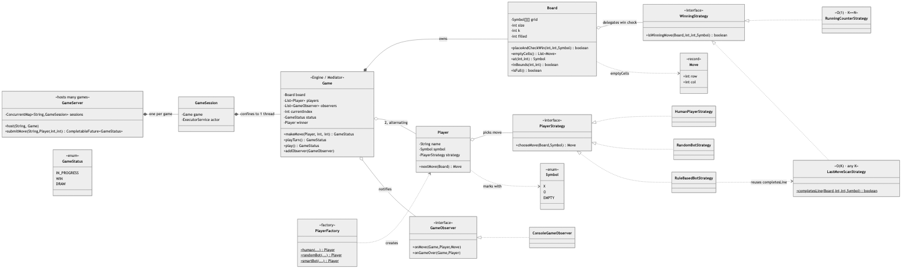
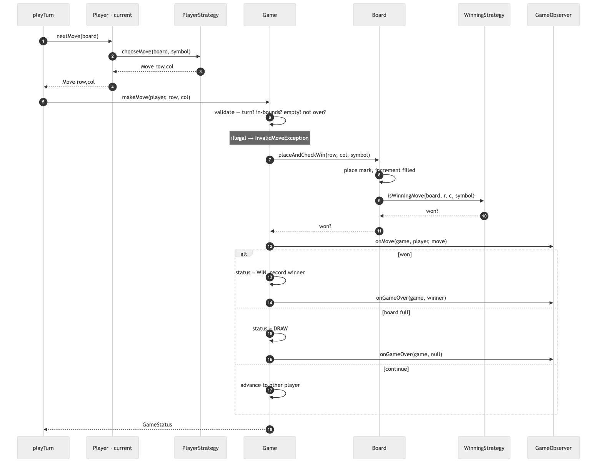
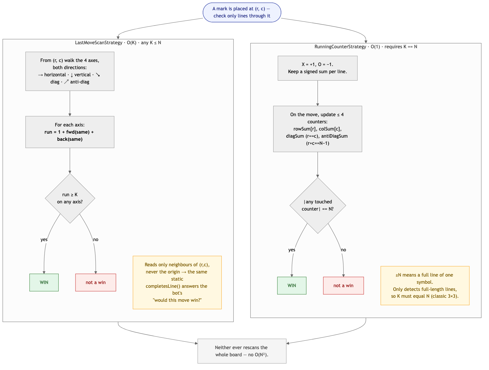
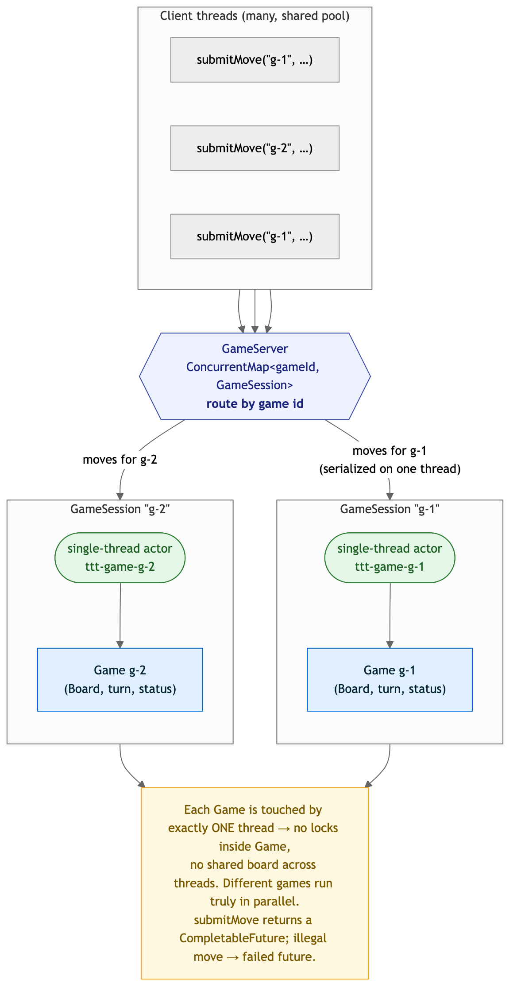

# Tic-Tac-Toe — Solution

A generic **N×N, K-in-a-row** tic-tac-toe engine: two players (human or bot) alternate, the
engine rejects every illegal move, and it detects a win **without ever rescanning the board**.
The design is deliberately restrained — three patterns that earn their place (**Strategy**,
**Factory**, **Observer**) and a pointed decision *not* to use **State** — plus a separate,
tested answer for where concurrency actually belongs.

> Code lives in this folder under package
> `MachineCoding_LLD.LLD_Interview_Problems._03_Easy_TicTacToe` (subpackages
> [`model`](./model), [`strategy`](./strategy), [`observer`](./observer), [`factory`](./factory),
> [`server`](./server)). Run instructions are at the bottom.

---

## 1. Class model



**Reading the arrows:** ◆ filled diamond = **composition** (the game *owns* its board; a session
*owns* its game). ◇ hollow diamond = **aggregation** (the game *holds* players and observers, a
player *holds* a strategy — all injected). ▷ hollow triangle = **interface realization**. Dashed =
**dependency / uses**.

| Role | Class | Responsibility |
|------|-------|----------------|
| **Engine / Mediator** | `Game` | The one write path: validate a move, place it, ask if it won, transition to WIN/DRAW/next-turn, notify observers. No `println`, no UI. |
| Board | `Board` | Owns the N×N grid; `placeAndCheckWin` is the single mutating step and delegates the "did it win?" question. |
| **Strategy** (win check) | `WinningStrategy` → `RunningCounterStrategy`, `LastMoveScanStrategy` | *How* to detect a win — O(1) counters vs O(K) scan (see §3). |
| **Strategy** (move pick) | `PlayerStrategy` → `HumanPlayerStrategy`, `RandomBotStrategy`, `RuleBasedBotStrategy` | *How* a player chooses — the seam that makes human/bot interchangeable. |
| **Factory** | `PlayerFactory` | Builds a `Player` wired to the right strategy (`human` / `randomBot` / `smartBot`). |
| **Observer** | `GameObserver` → `ConsoleGameObserver` | Reacts to moves / game-over without the engine knowing who's listening. |
| Concurrency | `GameServer`, `GameSession` | Hosts **many** games, each confined to its own thread (see §5). |
| Value objects | `Player`, `Move`, `Symbol`, `GameStatus` | Plain data. |

---

## 2. The one write path — `makeMove`



Every move — whether typed by a human or chosen by a bot — funnels through
`Game.makeMove(player, row, col)`. It runs four guards **before** touching the board (game not
over → correct player's turn → in bounds → cell empty), places the mark via
`Board.placeAndCheckWin`, then transitions:

- **won** → `status = WIN`, record winner, fire `onGameOver(winner)`
- **board full** → `status = DRAW`, fire `onGameOver(null)`
- **otherwise** → hand the turn to the other player

`playTurn()` (ask the current player's strategy, then apply) and `play()` (loop to the end) sit on
top, but both go through `makeMove`, so there is exactly **one** place that mutates game state and
exactly **one** place the rules live.

---

## 3. Win detection — the core of this problem

The naïve check rescans rows/cols/diagonals after each move: **O(N²)**. We never do that. A
completed line *must pass through the cell just played*, so we only look there — and there are two
good ways to do it, so it's a **Strategy**:



### `RunningCounterStrategy` — O(1), requires K == N (classic 3×3)
Encode **X = +1, O = −1** and keep a signed sum per line: `rowSum[r]`, `colSum[c]`, `diagSum`
(cells where `r == c`), `antiDiagSum` (`r + c == N−1`). A move touches **at most four** counters;
a line is full of one symbol exactly when its counter hits **±N**. This is the LeetCode-348 trick.
The catch: it only recognises *full-length* lines, so it's correct **only when K == N** — the
strategy throws if you point it at a `K < N` board rather than silently miss wins. It's also
**stateful** (the counters mirror one board's history), so an instance belongs to one game.

### `LastMoveScanStrategy` — O(K), any K ≤ N (Gomoku-style)
From the placed cell, walk the four axes (→ ↓ ↘ ↗) **both ways**, counting the same symbol:
`run = 1 + forward + backward`; win if `run ≥ K` on any axis. Correct for **any** K, **stateless**
(shareable across games), O(K) per move. Its core `completesLine(board, r, c, symbol)` reads only
*neighbours* of the cell — never the origin — so it doubles as the bot's "**would** this move
win?" look-ahead without mutating anything.

> A test (`counter and scan agree over 500 games`) replays 500 random games through **both**
> strategies and asserts they always declare the same result — the O(1) trick is a genuine
> optimisation of the general scan for the K == N case, not a different rulebook.

---

## 4. Design choices & trade-offs

| Decision | Why | Alternative |
|----------|-----|-------------|
| **Strategy** for the win check | The rule genuinely varies (K == N vs K < N) and each has a different optimal algorithm. | One `if (k == n)` branch — mixes two algorithms in one method, can't be tested in isolation. |
| **Strategy** for move choice | Makes human / random / smart the *same* `Game` with different objects — swap difficulty in one line. | `if (player.isBot())` branches through the engine. |
| **Factory** for players | Callers say *what kind* of player, not how to wire the strategy; new bot = one method + one class. | Constructing strategies at every call site. |
| **Observer** for output | Keeps the engine UI-free; console / GUI / network / move-log all attach identically. | `println` inside `Game` — untestable, single-UI. |
| **No State pattern** | The status only goes `IN_PROGRESS → {WIN, DRAW}` then freezes — a plain enum. State classes would be pure ceremony here. | An `InProgressState`/`WonState` hierarchy — the vending machine *needs* State (per-mode behaviour); tic-tac-toe doesn't. Forcing it is the anti-pattern the rubric warns about. |
| **O(1) incremental** win check for 3×3 | Exactly what the prompt asks for; no rescans. | O(N²) per move. |
| **Typed guards throw** `InvalidMoveException` | Out-of-turn / occupied / OOB are contract violations with a clear, UI-surfaceable message. | Returning a boolean loses the reason; silent no-ops hide bugs. |
| **Single game is single-threaded** | A match is turn-based — concurrent moves are nonsensical. Concurrency is pushed to the server tier (§5). | Locking every cell of a board only one player touches. |

---

## 5. Concurrency — where it *actually* belongs

> A single game is turn-based, so it's single-threaded **by design**. But "host many games on a
> server" is a real concurrency question — and the clean answer is **not** to lock the game.



`GameServer` shards by game id and gives **each game its own single-thread executor**
(`GameSession`) — the **actor model**. Moves for a game are routed onto that game's thread, so:

- each `Game`/`Board` is touched by **exactly one thread** → **no locks inside the engine**, no
  shared mutable board across threads;
- **different games run truly in parallel** across the pool of per-game threads;
- the only cross-thread shared state is the `ConcurrentHashMap` of sessions — a lookup table,
  concurrent by construction;
- `submitMove` is non-blocking, returning a `CompletableFuture<GameStatus>`; an illegal move
  surfaces as a **failed future** (the same `InvalidMoveException`), never a corrupted board.

This is the "make each game single-threaded via an actor/queue" answer the brief hints at — it
scales to thousands of concurrent games without turning the engine into a lock salad. The test
`concurrent results match single-threaded reference` hosts 300 games, drives them all at once
through the server, and asserts every result equals its single-threaded playout.

---

## 6. Complexity

| Operation | `RunningCounterStrategy` (K==N) | `LastMoveScanStrategy` (any K) |
|-----------|-------------------------------|-------------------------------|
| `makeMove` win check | **O(1)** | **O(K)** |
| Smart-bot move (`RuleBasedBotStrategy`) | — | O(E·K), E = empty cells (win/block look-ahead) |
| Space | O(N) counters | O(1) |

No operation is ever O(N²) — nothing rescans the whole board.

---

## 7. How to run

```bash
# from the repo's src/ directory (the single source root)
PKG=MachineCoding_LLD/LLD_Interview_Problems/_03_Easy_TicTacToe
javac -d out $(find $PKG -name '*.java')

BASE=MachineCoding_LLD.LLD_Interview_Problems._03_Easy_TicTacToe
java -cp out $BASE.Main           # 3 walkthroughs: 3×3 human win, bot-vs-bot draw, 5×5 K=4
java -cp out $BASE.TicTacToeTest  # 22 assertions incl. the concurrency test
```

The harness (plain `main`, no JUnit — matching this repo) exits non-zero on failure and covers:
win on every axis (both strategies), draw, all four illegal-move rejections, **counter-vs-scan
agreement over 500 random games**, a K<N non-line diagonal win, the smart bot's win-over-block
priority and blocking, and **300 games driven concurrently through the `GameServer`** matching
their single-threaded reference.

---

## 8. Extensions an interviewer might ask for

- **Unbeatable bot** — a `MinimaxStrategy` (with alpha-beta) as a new `PlayerStrategy`; nothing
  else changes. The current `RuleBasedBotStrategy` only guarantees "never miss a win or an
  immediate block".
- **Interactive CLI** — back `HumanPlayerStrategy` with a `Scanner` instead of a scripted queue;
  the `Game` contract is unchanged.
- **Undo / replay** — the move list is all you need; the Observer already sees every move.
- **> 2 players / 3-D board** — the scan strategy generalises (more axes); the counter trick's
  ±N encoding is the part that's specific to two players.

> Pattern references: [DesignPatterns/_10_StrategyDesignPattern](../../DesignPatterns/_10_StrategyDesignPattern),
> [_01_FactoryDesignPattern](../../DesignPatterns/_01_FactoryDesignPattern),
> [_11_ObserverDesignPattern](../../DesignPatterns/_11_ObserverDesignPattern). And the deliberate
> *non-use* of [_12_State](../../DesignPatterns/_12_State) — see §4.
