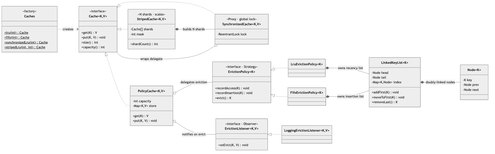
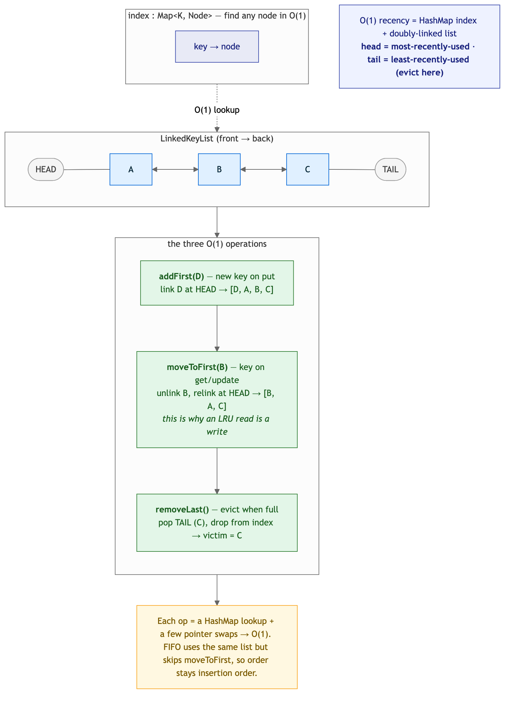
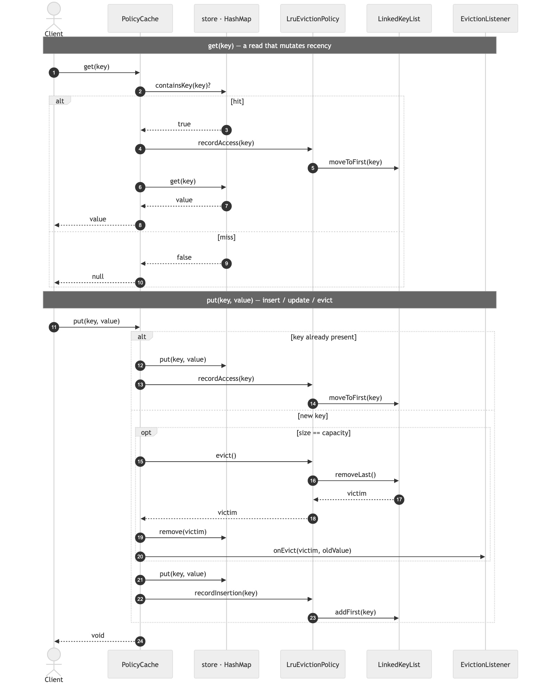
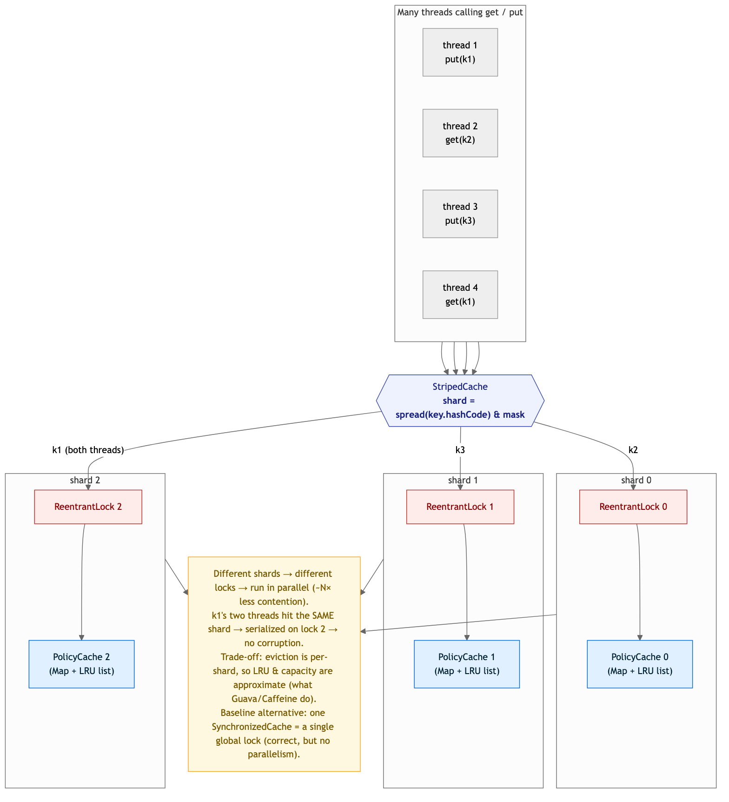

# LRU Cache — Solution

A fixed-capacity cache with **O(1) `get`/`put`** and least-recently-used eviction, then made
**thread-safe** — first with a global lock, then with **lock striping** that actually scales. The
data structure (HashMap + doubly-linked list) is the star; eviction is a swappable **Strategy**,
thread-safety is **composed on** (a Proxy and a sharded composite), and evictions are published via
an **Observer**.

> Code lives in this folder under package
> `MachineCoding_LLD.LLD_Interview_Problems._04_Easy_LRUCache` (subpackages
> [`policy`](./policy), [`concurrent`](./concurrent), [`observer`](./observer)). Run instructions
> are at the bottom.

---

## 1. Class model



**Reading the arrows:** ▷ hollow triangle = **interface realization**. ◇ hollow diamond =
**aggregation** (held but injected/independent — the policy, the listener, the wrapped delegate).
◆ filled diamond = **composition** (built and owned for its lifetime — a striped cache *builds* its
shards, a policy *owns* its list, a list *owns* its nodes). Dashed = **dependency / creates**.

| Role | Class | Responsibility |
|------|-------|----------------|
| Abstraction | `Cache<K,V>` | The single interface everything implements — so thread-safety can wrap/shard a plain cache instead of being baked in. |
| **Engine** | `PolicyCache<K,V>` | `HashMap` storage + an `EvictionPolicy`; amortized O(1) `get`/`put`. Single-threaded. |
| **Strategy** | `EvictionPolicy<K>` → `LruEvictionPolicy`, `FifoEvictionPolicy` | *Which key to drop.* Owns the ordering bookkeeping (keys only, never values). |
| O(1) core | `LinkedKeyList<K>` (+ `Node`) | Doubly-linked list + `key→node` index — the machinery behind O(1) recency. |
| **Proxy** | `SynchronizedCache<K,V>` | Wrap any cache in one lock — the correct-but-coarse baseline. |
| Composite | `StripedCache<K,V>` | N shards, each its own lock → concurrency scales ~N×. |
| **Observer** | `EvictionListener<K,V>` → `LoggingEvictionListener` | Fired on eviction (metrics, write-back) without the cache knowing who listens. |
| Factory | `Caches` | `lru` / `fifo` / `synchronizedLru` / `stripedLru` — hides the wiring. |

---

## 2. The O(1) core — HashMap + doubly-linked list



The trick to O(1) recency: a **`HashMap<K,Node>` index** to find any node instantly, plus a
**doubly-linked list** to reorder in constant time. Head = most-recently-used; tail = the eviction
end. Three operations, each a map lookup plus a few pointer swaps:

- **`addFirst`** — a new key links at the head (on `put` of a new key).
- **`moveToFirst`** — an accessed key is unlinked and relinked at the head. *This is why an LRU
  read is really a write* — `get` mutates the list.
- **`removeLast`** — eviction pops the tail (the least-recently-used key).

`LruEvictionPolicy` and `FifoEvictionPolicy` share this exact list; the *only* difference is that
FIFO's `recordAccess` is a **no-op**, so a key never moves and the tail stays the oldest insertion.
That one-line difference is the whole payoff of the Strategy seam.

---

## 3. The operations — `get` / `put`



- **`get`** — miss → return `null`, *don't* touch recency. Hit → `recordAccess` (moveToFirst),
  then return the value. Null values are unsupported so `containsKey` cleanly distinguishes
  miss from a stored `null`.
- **`put`** — three cases: **update** an existing key (overwrite + count as a use), or **insert**
  a new key, first **evicting** the LRU (`policy.evict()` → `removeLast`) if we're at capacity,
  and notifying the `EvictionListener`. Eviction happens *before* the insert, so size never
  exceeds capacity even for an instant.

Everything on these paths is O(1): `HashMap` get/put/remove plus constant-time list surgery.

---

## 4. Concurrency — the whole point in senior interviews

The hard part is that **`get` mutates the list**, so even reads are writes — a plain
`ReadWriteLock` buys almost nothing.



**Baseline (`SynchronizedCache`):** one `ReentrantLock` around every operation. Correct, but it
serializes *all* access — throughput doesn't scale with cores. It's the honest "make it correct
first" answer, and it's also the per-shard building block.

**Scalable (`StripedCache`):** partition the keyspace into N shards, each an independent
`SynchronizedCache` over its own `PolicyCache` with its own lock. A key always maps to the same
shard (`spread(key.hashCode()) & mask`), so:

- operations on **different shards run in parallel** → contention drops ~N× (this is exactly what
  `ConcurrentHashMap`, Guava and Caffeine do);
- two threads on the **same key hit the same shard** and serialize on that one lock → no torn
  reads, no dangling links, no lost eviction;
- each shard gets its **own** policy instance (via a `Supplier`) — sharing one recency list across
  threads would corrupt it.

**Two honest trade-offs to say out loud:** eviction is **per-shard**, so both the LRU order and
the capacity are *approximate* (a hot shard can evict while another has room) — the standard price
real caches pay to scale. The stress test (`testConcurrentStripedNoCorruption`) hammers a
64-entry / 8-shard cache with 32 threads × 20k ops, a watcher thread asserting `size ≤ capacity`
throughout, and proves the cache still works afterwards — for both the striped and the global-lock
variants.

---

## 5. Design choices & trade-offs

| Decision | Why | Alternative |
|----------|-----|-------------|
| **HashMap + DLL** | The only way to get O(1) for *both* lookup and recency reorder. | `LinkedHashMap(accessOrder=true)` — one line, but hides the mechanics the interview is testing. |
| **Strategy** for eviction | LRU/FIFO/LFU differ only in access/insert reaction; policy owns ordering, cache owns values. | Hard-coded LRU — no swap; or subclassing (inheritance over composition). |
| Thread-safety **composed**, not built-in | `SynchronizedCache` (Proxy) and `StripedCache` wrap a plain `Cache`, so the core stays lock-free and simple. | Locks smeared through `PolicyCache` — couples storage to a concurrency policy. |
| **Lock striping** as the headline | Scales with cores; matches how real caches are built. | Global lock (no scaling) or lock-free CAS DLL (correct but usually out of scope — mention it). |
| Approximate per-shard LRU/capacity | The pragmatic cost of striping; near-LRU with a good hash. | Global LRU under one lock — exact, but back to no parallelism. |
| **Observer** for eviction | Idiomatic (Guava `removalListener`); metrics/write-back attach without touching the cache. | Return evicted entries from `put` — clutters the API. |
| Reject `null` keys/values | They collide with the "miss" sentinel; matches Guava/Caffeine. | `containsKey` gymnastics to store `null`. |

### On adding a *new* design pattern
I looked for a pattern worth adding to `DesignPatterns/` for this problem and deliberately **did
not** add one — because every pattern this solution needs is **already in the catalog**, and
forcing a novel one would violate the same "right pattern for the right reason" rule these
solutions live by:

- **Strategy** (`_10`) — eviction policy. **Proxy** (`_09`) — `SynchronizedCache` is a textbook
  synchronization proxy. **Observer** (`_11`) — the eviction listener. **Factory** (`_01`) —
  `Caches`.
- Candidates I considered and rejected: **Template Method** (an abstract cache skeleton with an
  abstract "reorder" step) — loses to Strategy's composition-over-inheritance; **Decorator** (`_05`)
  — a stats/logging wrapper is a valid *extension*, but not needed for the core. LRU turns out to be
  a **greatest-hits of patterns you already have**, which is itself the honest thing to say in an
  interview.

---

## 6. Complexity

| Operation | Cost |
|-----------|------|
| `get` (hit or miss) | **O(1)** — map lookup + `moveToFirst` |
| `put` (insert / update / evict) | **O(1)** — map op + `addFirst` / `removeLast` |
| `StripedCache.size()` | O(shards) — sum of shard sizes |
| Space | O(capacity) — one map entry + one node per key |

---

## 7. How to run

```bash
# from the repo's src/ directory (the single source root)
PKG=MachineCoding_LLD/LLD_Interview_Problems/_04_Easy_LRUCache
javac -d out $(find $PKG -name '*.java')

BASE=MachineCoding_LLD.LLD_Interview_Problems._04_Easy_LRUCache
java -cp out $BASE.Main          # LRU eviction order, LRU-vs-FIFO, striped smoke test
java -cp out $BASE.LRUCacheTest  # 17 assertions incl. two concurrency stress tests
```

The harness (plain `main`, no JUnit — matching this repo) exits non-zero on failure and covers:
LRU eviction order, read-refreshes-recency, update-counts-as-use, FIFO ignoring access, the
capacity bound, miss/null handling, the eviction Observer, striped effective-capacity, and the
**concurrency stress test** (32 threads × 20k ops with a live capacity-invariant watcher) for both
the striped and global-lock caches.

---

## 8. Extensions an interviewer might ask for

- **LFU policy** — a new `EvictionPolicy` with frequency buckets + a `minFreq` pointer for O(1);
  drops in with no cache change.
- **TTL / expiry** — store an insert timestamp; evict on read or via a `ScheduledExecutorService`
  maintenance pass (Caffeine-style).
- **Stats (hit/miss ratio)** — a `Decorator` over `Cache` (`_05`), no core change.
- **True lock-free** — a CAS-based DLL or Caffeine's ring-buffer + maintenance-thread design that
  keeps recency *off* the hot path; mention the complexity trade-off.

> Pattern references: [DesignPatterns/_10_StrategyDesignPattern](../../DesignPatterns/_10_StrategyDesignPattern),
> [_09_Proxy](../../DesignPatterns/_09_Proxy),
> [_11_ObserverDesignPattern](../../DesignPatterns/_11_ObserverDesignPattern),
> [_01_FactoryDesignPattern](../../DesignPatterns/_01_FactoryDesignPattern).
