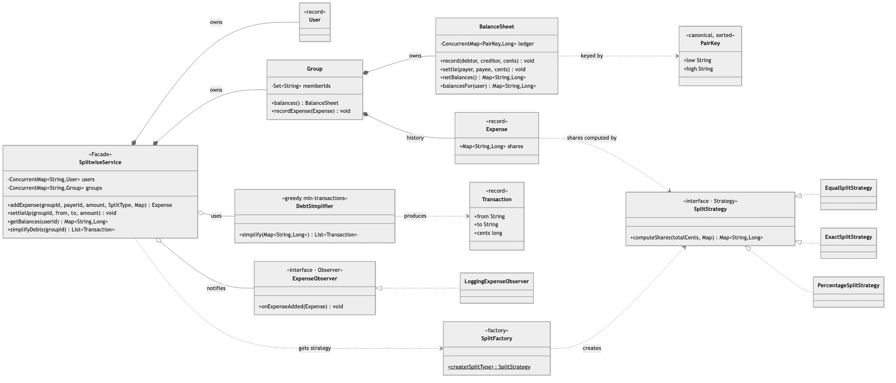
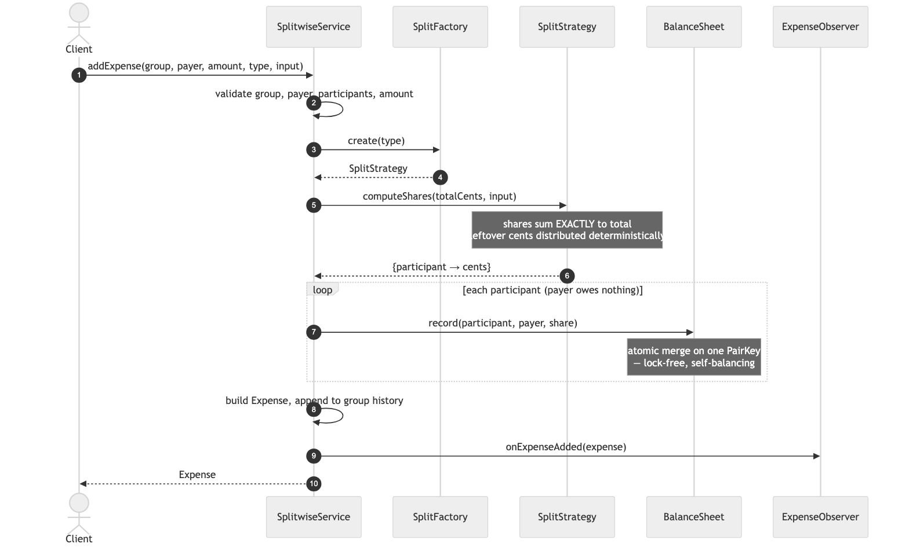
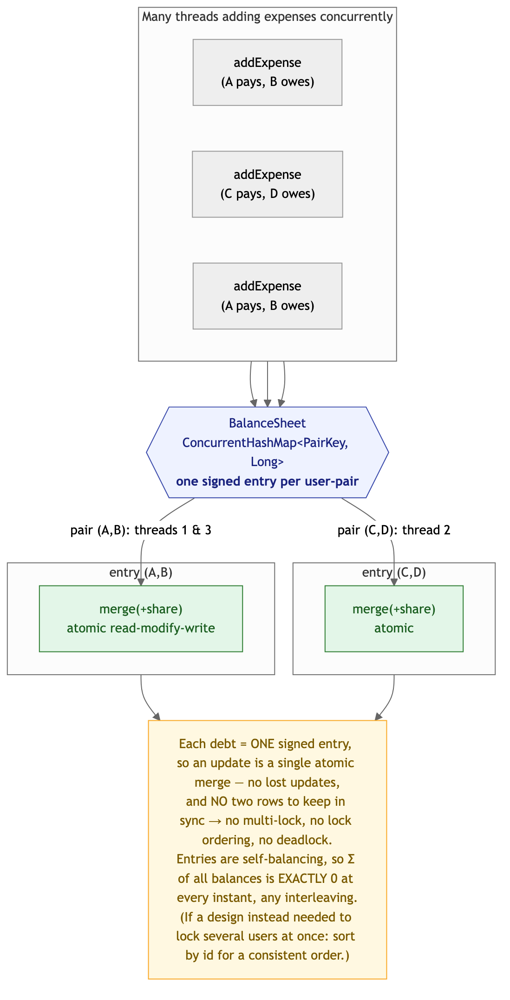
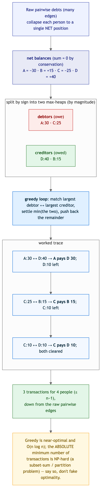

# Splitwise / Expense Sharing — Solution

An expense-sharing app: users in groups add expenses split **equally / exactly / by percentage**,
the system tracks who owes whom, you can **settle up**, and — the headline — **simplify debts** to
the fewest payments. Splits are a **Strategy** (built by a **Factory**), notifications an
**Observer**, and `SplitwiseService` a **Facade**. Money is **`long` cents** throughout, and the
balance sheet is **lock-free and conserves to exactly zero** under concurrent writes.

> Code lives in this folder under package
> `MachineCoding_LLD.LLD_Interview_Problems._05_Medium_Splitwise` (subpackages
> [`model`](./model), [`strategy`](./strategy), [`factory`](./factory), [`balance`](./balance),
> [`observer`](./observer)). Run instructions are at the bottom.

---

## 1. Class model



**Reading the arrows:** ◆ filled diamond = **composition** (the service *owns* users/groups; a group
*owns* its balance sheet + history). ◇ hollow diamond = **aggregation** (the service *holds* a
simplifier and observers). ▷ hollow triangle = **realization**. Dashed = **dependency / creates**.

| Role | Class | Responsibility |
|------|-------|----------------|
| **Facade** | `SplitwiseService` | The API: add users/groups/expenses, settle, query balances, simplify. Holds no math. |
| Container | `Group` | Members + its own `BalanceSheet` + expense history. |
| **Balance ledger** | `BalanceSheet` (+ `PairKey`) | Who owes whom, one signed `long` per canonical user-pair; lock-free updates. |
| **Balance algorithm** | `DebtSimplifier` → `Transaction` | Greedy min-transaction settlement. |
| **Strategy** | `SplitStrategy` → `Equal`, `Exact`, `Percentage` | Divide a total into per-participant cents that sum *exactly*. |
| **Factory** | `SplitFactory` | `SplitType` → strategy. |
| **Observer** | `ExpenseObserver` → `LoggingExpenseObserver` | React to new expenses. |
| Money | `Money`, `Expense`, `User` | `long` cents + immutable records. |

---

## 2. Adding an expense (and getting rounding right)



`addExpense` validates, asks the `SplitFactory` for the right strategy, computes shares, then makes
each participant owe the payer their share (the payer owes themselves nothing). The strategies
guarantee shares **sum to exactly the total** — no lost or phantom cents:

- **Equal** — `total / n` each; the leftover `total % n` cents go one apiece to the first
  participants in sorted-id order (1000¢/3 → 334, 333, 333).
- **Exact** — participants state amounts; rejected unless they sum to the total.
- **Percentage** — **largest-remainder method**: floor everyone, then hand the few leftover cents to
  the largest fractional parts. Fair *and* exact (plain rounding would drift).

---

## 3. The balance sheet — conservation under concurrency



The whole ledger is a `ConcurrentHashMap<PairKey, Long>` where **`PairKey` is canonical** (sorted),
so the debt between two users is a **single signed number** — for key `(low, high)`, the value is
"how much `low` owes `high`". That one design choice is what makes concurrency easy:

- Every update is a **single atomic `merge`** on one entry — a race-free read-modify-write — so two
  expenses on the same pair can't lose an update, and different pairs never contend.
- Because a debt lives in **one** entry (not two rows to keep in sync), there is **no multi-key
  update to coordinate → no lock ordering, no deadlock**. (If a design *did* need to lock several
  users at once, the fix is a consistent order — sort by id — which we simply avoid needing.)
- Entries are **self-balancing**, so the sum of all balances is **exactly zero at every instant**,
  for any interleaving — the conservation invariant. The stress test fires **32 threads × 200**
  concurrent `addExpense` calls and asserts exact per-pair totals (no lost updates), `Σ balances = 0`,
  and that every expense was recorded.

`double` money would break this: float drift means balances stop netting to a clean zero. Hence
**`long` cents** everywhere.

---

## 4. Debt simplification — the balance algorithm



A chain of debts ("A→B→C→D, $10 each") shouldn't need three payments. Collapse everyone to a single
**net** position, then move money only from net **debtors** to net **creditors**:

1. Split users into two max-heaps by magnitude — debtors (net &lt; 0) and creditors (net &gt; 0).
2. Repeatedly match the largest debtor with the largest creditor, settle `min(their amounts)` in one
   transaction, and push back the remainder.
3. They empty together (total debt = total credit, because balances conserve to zero).

This yields **at most n − 1** transactions — the chain above collapses to a single `A pays D $10`.
It's greedy: **near-optimal and O(n log n)**, but the *absolute* minimum number of transactions is
**NP-hard** (a subset-sum / partition problem) — worth saying out loud rather than claiming greedy is
provably optimal. A test also verifies that applying the simplified transactions zeroes every
balance.

---

## 5. Design choices & trade-offs

| Decision | Why | Alternative |
|----------|-----|-------------|
| **`long` cents** everywhere | Exact arithmetic; balances net to a clean zero; cheap atomics. | `double` — float drift breaks conservation; `BigDecimal` — precise but heavier. |
| **Strategy** for splits | Equal/Exact/Percentage swap behind one method; a new split type is one class. | `switch (type)` in the service — violates OCP. |
| **Canonical `PairKey`** (one signed entry per pair) | Turns every balance change into a single atomic `merge` → lock-free, deadlock-free, self-conserving. | Two directed rows per pair — must be updated together (needs a lock + ordering). |
| **Largest-remainder rounding** | Fair distribution of leftover cents, sum stays exact. | Round each share — drifts a cent off the total. |
| **Greedy** debt simplification | Near-optimal, simple, O(n log n). | Optimal min-transactions is NP-hard; not worth it for real group sizes. |
| Per-group `BalanceSheet` | Debts are naturally group-scoped; overall view aggregates. | One global sheet — muddles group boundaries. |
| **Observer** for expenses | Notifications/audit attach without touching the service. | Inline notification code — couples the service to delivery. |

### On design patterns
Every pattern this problem calls for is already in the catalog, so — consistent with the LRU and
rate-limiter solutions — **no new pattern was added**: **Strategy** (`_10`, splits), **Factory**
(`_01`, `SplitFactory`), **Observer** (`_11`, expense events), **Facade** (`_08`,
`SplitwiseService`). The debt simplifier and the lock-free ledger are *algorithms/techniques*, not
GoF patterns; inventing one here would be the over-engineering these solutions avoid.

---

## 6. Complexity

| Operation | Cost |
|-----------|------|
| `addExpense` | O(p) for p participants — a split computation + p atomic merges |
| `settleUp` | O(1) — one atomic merge |
| `getBalances(user)` | O(edges touching the user) |
| `simplifyDebts` | O(n log n) for n users with a nonzero net |
| Space | O(active user-pairs) |

---

## 7. How to run

```bash
# from the repo's src/ directory (the single source root)
PKG=MachineCoding_LLD/LLD_Interview_Problems/_05_Medium_Splitwise
javac -d out $(find $PKG -name '*.java')

BASE=MachineCoding_LLD.LLD_Interview_Problems._05_Medium_Splitwise
java -cp out $BASE.Main            # splits, balances, settle-up, debt simplification
java -cp out $BASE.SplitwiseTest   # 13 assertions incl. concurrent-conservation tests
```

The harness (plain `main`, no JUnit — matching this repo) exits non-zero on failure and covers: all
three splits with exact-to-the-cent rounding, balance queries, settle-up, debt simplification
(fewer transactions + settles to zero), input validation, and the **concurrent conservation**
tests — many threads adding expenses at once with no lost/double updates and `Σ balances = 0`.

---

## 8. Extensions an interviewer might ask for

- **Multi-currency** — store currency per expense; keep a `BalanceSheet` per currency (don't sum
  across rates), or convert at a pinned rate. The `long` minor-unit rule generalizes.
- **Shares split** (e.g. 2:1:1) — a new `SplitStrategy`; largest-remainder rounding carries over.
- **Distributed** — move the ledger to a store with atomic per-key increment (Redis `HINCRBY`, or a
  DB row per pair); `PairKey` is already the shard key.
- **Settle-up suggestions** — `simplifyDebts` already returns the minimal payment plan; surface it in
  the UI.

> Pattern references: [DesignPatterns/_10_StrategyDesignPattern](../../DesignPatterns/_10_StrategyDesignPattern),
> [_01_FactoryDesignPattern](../../DesignPatterns/_01_FactoryDesignPattern),
> [_11_ObserverDesignPattern](../../DesignPatterns/_11_ObserverDesignPattern),
> [_08_Facade](../../DesignPatterns/_08_Facade).
