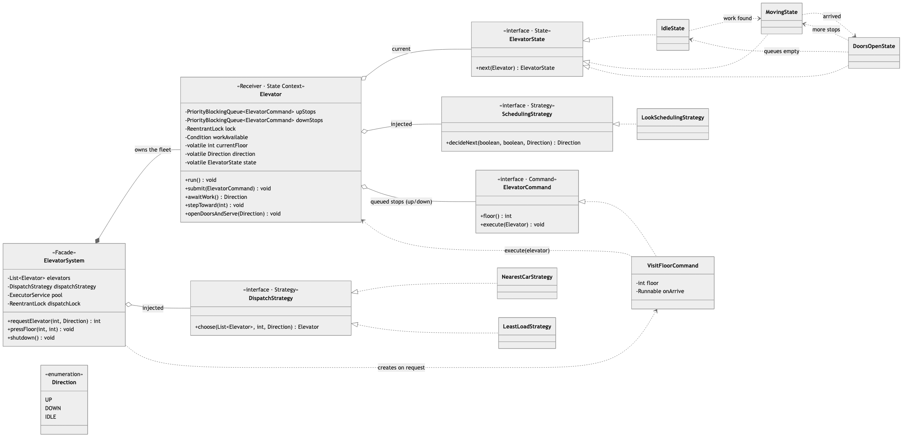
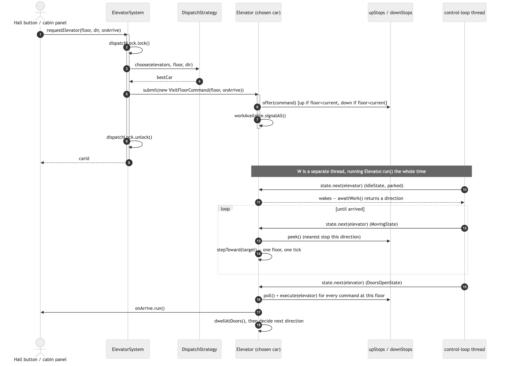
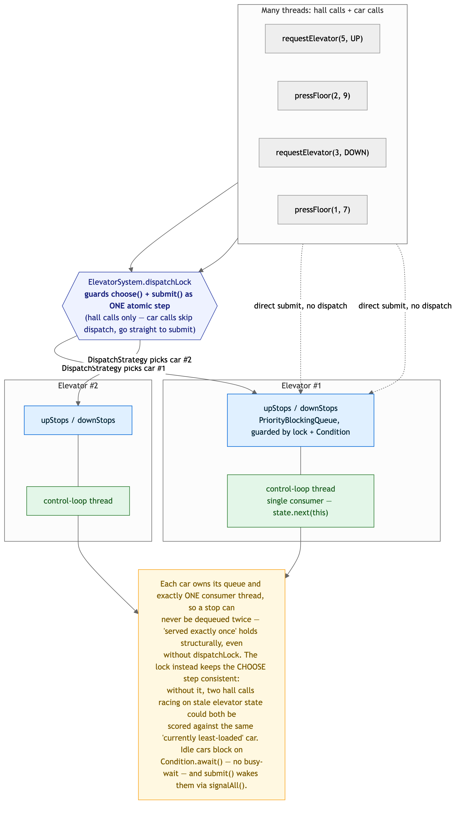
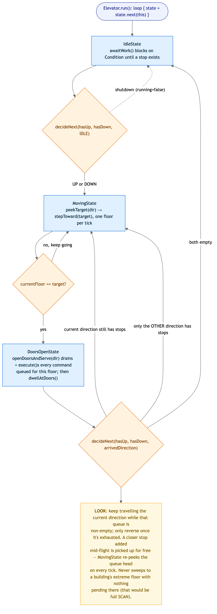

# Elevator System — Solution

A building's elevator control system: hall buttons make **external requests** (floor +
direction), cabin panels make **internal requests** (destination floor), a **dispatcher**
picks the best car for each hall call, and each car serves its stops in **LOOK/SCAN**
order instead of naive FIFO. Car behaviour is a **State** machine, dispatch and scheduling
are pluggable **Strategies**, and — the headline — every stop is a queued **Command**
consumed by that car's own **producer/consumer** control-loop thread.

> Code lives in this folder under package
> `MachineCoding_LLD.LLD_Interview_Problems._06_Medium_ElevatorSystem` (subpackages
> [`command`](./command), [`state`](./state), [`strategy`](./strategy)). Run instructions
> are at the bottom.

---

## 1. Class model



**Reading the arrows:** ◆ filled diamond = **composition** (`ElevatorSystem` *owns* its
fleet). ◇ hollow diamond = **aggregation** (an `Elevator` *holds* its current state, its
scheduling strategy, and its queued commands; the system *holds* a dispatch strategy).
▷ hollow triangle = **realization**. Dashed = **dependency / creates / transitions to**.

| Role | Class | Responsibility |
|------|-------|----------------|
| **Facade** | `ElevatorSystem` | `requestElevator` / `pressFloor`; owns the fleet, the `ExecutorService`, and the dispatch lock. |
| **Receiver + State Context** | `Elevator` | One car: two priority queues of stops, a `run()` control loop, and the mutable state a `Command` acts on. |
| **State** | `ElevatorState` → `IdleState`, `MovingState`, `DoorsOpenState` | One control-loop step each; decides what the car does next and returns the state to transition to. |
| **Command** | `ElevatorCommand` → `VisitFloorCommand` | A stop request turned into an object — created by the dispatcher (or a cabin panel), `execute()`d far later by the car's own thread. |
| **Strategy (dispatch)** | `DispatchStrategy` → `NearestCarStrategy`, `LeastLoadStrategy` | Scores candidate cars for a hall call. |
| **Strategy (scheduling)** | `SchedulingStrategy` → `LookSchedulingStrategy` | The LOOK policy: which direction to travel next given pending stops. |

---

## 2. Dispatching a hall call



`requestElevator` does **choose-then-enqueue** under `dispatchLock`, then returns
immediately — the caller never blocks on the ride itself. From there, the chosen car's
**own thread** (running `Elevator.run()` the entire lifetime of the system) does all the
work: it wakes from `IdleState`, steps one floor at a time in `MovingState` re-peeking the
queue head every tick, and on arrival `DoorsOpenState` drains and `execute()`s every
`ElevatorCommand` queued for that exact floor — which is where `onArrive.run()` fires, the
caller-supplied hook a test or UI can hang a callback off without `Elevator` knowing it
exists. `pressFloor` (a car call) skips the dispatcher entirely and calls `submit()`
directly on the named car.

---

## 3. Concurrency — producer/consumer, one queue and one thread per car



- **Every car is its own producer/consumer pipeline.** `submit()` (called by any caller
  thread) offers into `upStops` or `downStops` under `Elevator`'s own `ReentrantLock` and
  signals a `Condition`; the car's **single** worker thread blocks on that condition when
  idle and wakes the instant work arrives — no busy-wait, no lost signal.
- **"Served exactly once" is structural, not a locking result.** Each request becomes
  exactly one `ElevatorCommand`, handed to exactly one car's queues, drained by that car's
  one consumer thread — there is no way for two threads to dequeue the same command.
- **`dispatchLock` guards a different problem: dispatch consistency.** `DispatchStrategy`
  scores cars by reading their live floor/direction/pending-count; without the lock, two
  hall calls arriving at once could both read a stale "car #2 is least loaded" snapshot and
  both pile onto car #2. The lock makes *choose-then-enqueue* one atomic step, so the fleet
  stays load-balanced under real concurrency. The stress test fires **300 requests from 32
  threads** at a 4-car fleet and asserts every one is served exactly once with zero
  duplicate deliveries.
- **LOOK's re-peek is what makes it live**, not just correct: `MovingState` calls
  `peekTarget` on every single-floor tick, so a stop submitted while a car is mid-flight is
  picked up automatically if it's closer — no separate re-scheduling pass needed.

---

## 4. The control loop — State drives LOOK



`Elevator.run()` is just `while (running) { state = state.next(this); }` — no
`switch (status)` anywhere. Each state does one unit of work and hands off:

| State | Does | Transitions to |
|-------|------|-----------------|
| `IdleState` | Blocks on `awaitWork()` until a stop exists (or shutdown). | `MovingState` in whichever direction `SchedulingStrategy` picks. |
| `MovingState` | `peekTarget(dir)`, then `stepToward` one floor per tick. | Itself while travelling; `DoorsOpenState` on arrival. |
| `DoorsOpenState` | `openDoorsAndServe` (drain + execute every command at this floor), then dwell. | `MovingState` (same or reversed direction) or `IdleState`, per `SchedulingStrategy`. |

`LookSchedulingStrategy.decideNext` is the entire LOOK policy in five lines: keep the
current direction while that queue is non-empty; only reverse once it's exhausted; park
if both are empty. It never sweeps to a building's extreme floor with nothing pending
there — that would be full SCAN, a strictly worse default for a real building.

---

## 5. Design choices & trade-offs

| Decision | Why | Alternative |
|----------|-----|--------------|
| **Two priority queues** (`upStops` ascending, `downStops` descending) per car | "Nearest stop in the current direction" is always the queue head — LOOK falls out of the data structure itself. | One queue with a direction-aware comparator — has to be re-sorted (or rewritten) every time the car reverses. |
| **Command** for every stop | Decouples *who asked* (dispatcher or cabin panel, any thread) from *who acts, and when* (the car's own thread, much later); `onArrive` lets a caller attach behavior with zero coupling to `Elevator`. | Elevator exposes an `addStop(floor)` method the dispatcher calls directly — works, but callers can't attach per-request behavior, and queuing becomes implicit rather than a first-class object. |
| **State** for the control loop | Each phase (parked / travelling / boarding) owns its own logic and decides its own transition; `Elevator` stays free of a status `switch`. | A `status` enum field + `if/else` chains scattered through `run()` — the classic motivating case for State. |
| **Strategy** split into *dispatch* vs *scheduling* | Two independent axes: dispatch is a one-shot decision (which car), scheduling is ongoing (which way now) — conflating them would force every dispatch policy to also reimplement LOOK. | One monolithic policy object — couples fleet-level and per-car decisions. |
| **`dispatchLock`** scoped to choose+enqueue only | Smallest critical section that keeps dispatch decisions consistent; never held while a car moves or serves a floor. | Lock the whole `ElevatorSystem` per request — serializes unrelated car calls for no reason. |
| Real worker threads + small `Thread.sleep` per floor | Matches the problem's own framing (producer/consumer, one thread per car) and lets `Main`/tests observe real interleavings, not a simulated clock. | A step-driven/virtual-time simulation — simpler to test deterministically, but sidesteps the concurrency this problem is actually about. |

### On design patterns
Two of the three patterns this problem needs were already in the catalog — **State**
(`_12`) and **Strategy** (`_10`, used twice, for dispatch and scheduling). **Command**
was not, so it was added as **[`_13_Command`](../../DesignPatterns/_13_Command)**:
`ElevatorCommand`/`VisitFloorCommand` is a textbook use — a request built by one thread and
executed by a completely different one off a queue, which the catalog's Strategy/Observer
examples don't demonstrate. Unlike the LRU cache, rate limiter, and Splitwise solutions,
which reused the existing catalog end to end, this is the first LLD problem here where a
new pattern earns its place rather than being force-fit.

---

## 6. Complexity

| Operation | Cost |
|-----------|------|
| `requestElevator` | O(cars) to score + O(log stops) to enqueue, under the dispatch lock |
| `pressFloor` | O(log stops) — one `PriorityBlockingQueue.offer` |
| One control-loop step (`state.next`) | O(1) amortized — a peek/poll plus O(1) scheduling decision |
| Space | O(total pending stops across all cars) |

---

## 7. How to run

```bash
# from the repo's src/ directory (the single source root)
PKG=MachineCoding_LLD/LLD_Interview_Problems/_06_Medium_ElevatorSystem
javac -d out $(find $PKG -name '*.java')

BASE=MachineCoding_LLD.LLD_Interview_Problems._06_Medium_ElevatorSystem
java -cp out $BASE.Main            # hall dispatch, mid-flight pickup, LOOK sweep-then-reverse
java -cp out $BASE.ElevatorTest    # PASS/FAIL harness incl. the 300-request concurrency stress test
```

The harness (plain `main`, no JUnit — matching this repo) exits non-zero on failure and
covers: hall-call dispatch, LOOK ordering (a closer same-direction stop overtaking a
farther one; finishing a sweep before reversing), duplicate-floor coalescing into one
door-open, least-load balancing, invalid input, and the **concurrent burst** test — 300
hall + car calls fired from 32 threads at a 4-car fleet, asserting every request is served
exactly once with no duplicate delivery.

---

## 8. Extensions an interviewer might ask for

- **Capacity limits** — reject or defer a car call once a weight/headcount threshold is
  hit; `Elevator` already owns the natural place to track it.
- **Express / zoned elevators** — cars that only serve a floor subset; filter candidates
  in `DispatchStrategy.choose` before scoring.
- **Priority / VIP calls** — a second `ElevatorCommand` implementation whose queue
  placement (or a comparator tweak) jumps the line; `DoorsOpenState`/`MovingState` don't
  change at all, which is the payoff of Command being the queued unit.
- **Fairness / starvation bound** — cap how many sweeps a far hall call can be skipped
  before a car is forced to detour for it, on top of plain LOOK.

> Pattern references: [DesignPatterns/_12_State](../../DesignPatterns/_12_State),
> [_10_StrategyDesignPattern](../../DesignPatterns/_10_StrategyDesignPattern),
> [_13_Command](../../DesignPatterns/_13_Command).
