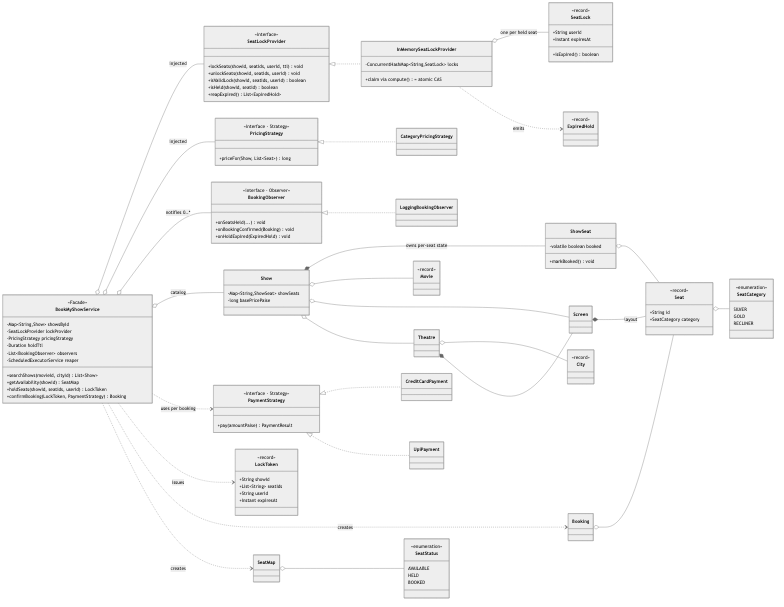
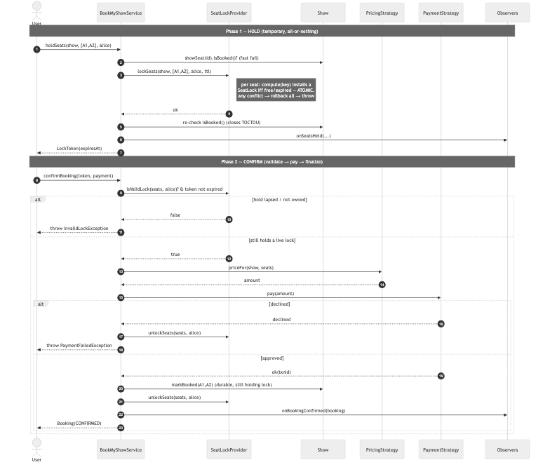
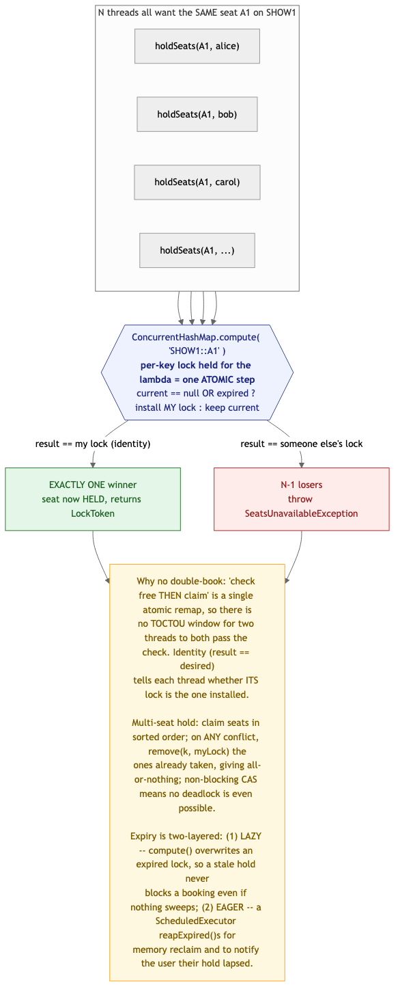
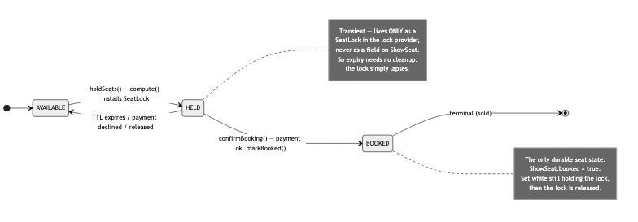

# BookMyShow / Movie Ticket Booking — Solution

A movie-ticket booking system: search shows by city, view a show's seat map, **hold**
seats while you pay, then **confirm** — with the one guarantee that makes this problem worth
asking: **no two users ever book the same seat.** The booking is deliberately **two-phase**
(hold → confirm) so a seat is only reserved for a bounded window and is auto-released if the
user abandons checkout. Concurrency lives behind a single **`SeatLockProvider`**; pricing and
payment are **Strategies**; user notifications are **Observers**; the whole flow sits behind a
**Facade** (`BookMyShowService`).

> Code lives in this folder under package
> `MachineCoding_LLD.LLD_Interview_Problems._07_Medium_BookMyShow` (subpackages
> [`model`](./model), [`lock`](./lock), [`pricing`](./pricing), [`payment`](./payment),
> [`observer`](./observer)). Run instructions are at the bottom.

---

## 1. Class model



**Reading the arrows:** ◆ filled diamond = **composition** (a `Show` *owns* its `ShowSeat`s; a
`Theatre` *owns* its `Screen`s; a `Screen` *owns* its `Seat` layout — they don't outlive it).
◇ hollow diamond = **aggregation** (the service is *injected with* a lock provider, a pricing
strategy, and observers; a `Show` *refers to* a `Movie`/`Screen`/`Theatre` it doesn't own).
▷ hollow triangle = **realization** (`InMemorySeatLockProvider` implements `SeatLockProvider`).
Dashed = **dependency / creates** (the service *creates* `LockToken`/`Booking`/`SeatMap`; the
provider *emits* `ExpiredHold`).

| Role | Class | Responsibility |
|------|-------|----------------|
| **Facade** | `BookMyShowService` | `searchShows` / `getAvailability` / `holdSeats` / `confirmBooking`; owns the catalog, the observer list, and the expiry reaper. Delegates the correctness guarantee downward. |
| **Concurrency boundary** | `SeatLockProvider` → `InMemorySeatLockProvider` | The *only* place seats are claimed. One `ConcurrentHashMap` keyed by `showId::seatId`; claim = an atomic `compute`. |
| **Value types** | `SeatLock`, `LockToken`, `ExpiredHold` (records) | A hold `(userId, expiresAt)`; the receipt a caller gets back; a lapsed hold surfaced to observers. |
| **Strategy (pricing)** | `PricingStrategy` → `CategoryPricingStrategy` | Base price × seat-category multiplier, in integer paise. |
| **Strategy (payment)** | `PaymentStrategy` → `CreditCardPayment`, `UpiPayment` | Passed *per booking* to `confirmBooking`. |
| **Observer** | `BookingObserver` → `LoggingBookingObserver` | `onSeatsHeld` / `onBookingConfirmed` / `onHoldExpired`. |
| **Domain** | `City`, `Movie`, `Theatre`, `Screen`, `Seat`, `Show`, `ShowSeat`, `Booking`, `SeatMap` | `Seat` is physical (part of a screen); `ShowSeat` is the per-show state; only `ShowSeat.booked` is durable. |

---

## 2. The two-phase booking flow



**Phase 1 — hold** claims the seats *atomically and all-or-nothing*, returns a time-boxed
`LockToken`, and never touches payment. **Phase 2 — confirm** re-validates that the caller still
owns a live hold (a token is not trusted on its own — it may have expired while the user typed
their card), prices the seats, charges, and only then flips the durable `booked` flag and
releases the locks. Payment failure releases the holds and throws; an expired hold at confirm
throws `InvalidLockException`. Splitting hold from confirm is what bounds reservation time and
makes abandonment self-healing.

---

## 3. Concurrency — how double-booking is actually prevented



The entire guarantee rests on one primitive: **`ConcurrentHashMap.compute(key, …)`**. The map
holds a per-key (per-seat) lock for the duration of the remapping lambda, so *"is this seat free?
if so, claim it"* is a **single atomic step** — there is no check-then-act (TOCTOU) window for
two threads to both pass the check and both book. Under a burst of threads on one seat, exactly
one thread's lambda installs its `SeatLock`; each thread then knows whether it won by an
**identity** check (`result == desired`).

- **All-or-nothing multi-seat holds.** Seats are claimed in **sorted order**; on any conflict we
  `remove(k, myLock)` the ones already taken and throw. Because the claim is non-blocking CAS
  (not a held OS lock), **deadlock is structurally impossible** — the sorted order only serves to
  keep two overlapping multi-seat requests from livelocking and to make rollback predictable.
  *(This is exactly where a pessimistic design using a blocking `ReentrantLock` per seat would
  need lock-ordering to avoid deadlock — see the trade-off table.)*
- **Expiry is two-layered, and the first is what guarantees correctness.**
  **(1) Lazy:** `compute` treats an expired lock as free and overwrites it, so a stale hold can
  never block a booking *even if the reaper never runs*. **(2) Eager:** a daemon
  `ScheduledExecutorService` calls `reapExpired()` to reclaim memory and fire `onHoldExpired` so
  the user is told their hold lapsed.
- **Closing the last gap (TOCTOU with a finished booking).** A seat is sold only by a thread that
  held its lock. So after a successful `lockSeats`, the service re-checks `isBooked()`: if it's
  now booked, that sale must have completed *before* we acquired the lock — we roll back and fail.
  After that check passes, no one else can book it (we hold the lock), so the window is closed.

The harness fires **64 threads at one seat** and asserts exactly **1** wins and **63** get
`SeatsUnavailableException`, then a **12-thread / 12-distinct-seat** burst asserts all succeed
(no false contention).

---

## 4. Seat lifecycle



The key modeling decision: **`HELD` is not stored on the seat.** A seat's only durable state is
`ShowSeat.booked`; "held" exists purely as a `SeatLock` in the provider. That split means an
expired hold needs **no cleanup** on the seat — the lock simply lapses — and availability is a
pure derivation: `booked ? BOOKED : (live lock ? HELD : AVAILABLE)`. `getAvailability` computes
exactly that, so the read path can never disagree with the lock map.

---

## 5. Design choices & trade-offs

| Decision | Why | Alternative |
|----------|-----|--------------|
| **Optimistic CAS via `compute`** for seat claims | Popular seats are contended but bookings are short; a non-blocking claim gives one atomic winner with no thread ever parked, and **can't deadlock**. | **Pessimistic** `ReentrantLock` per seat — correct, but multi-seat holds must acquire in a global order or they deadlock, and threads block under contention. |
| **`HELD` state kept only as a lock**, not on `ShowSeat` | Expiry needs zero cleanup; availability is a derivation that can't drift from the lock map. | A `status` enum on `ShowSeat` — now expiry must actively flip `HELD → AVAILABLE`, and the enum and the lock map can disagree. |
| **Two-phase hold → confirm** | Bounds how long a seat is reserved during payment and auto-releases on abandonment. | Book in one call — a slow/abandoned payment either blocks the seat forever or forces you to reverse a completed booking. |
| **`SeatLockProvider` as an interface** | The single-JVM `ConcurrentHashMap` swaps for a Redis `SET NX PX` / DB row lock with the *same contract* when you scale past one node. | Inline the map in the service — impossible to distribute later without rewriting the service. |
| **Integer paise** for all money | No floating-point drift when multipliers (1.5×, 2.5×) hit prices. | `double` rupees — rounding bugs in totals. |
| **Lazy + eager expiry** together | Lazy guarantees correctness with zero background work; eager adds memory reclaim + notifications. | Only a reaper — a booking racing a not-yet-swept expired hold would be wrongly rejected. |

### On design patterns
This problem reuses the existing catalog end to end — **Strategy** (pricing, payment),
**Observer** (notifications), **Facade** (the service) — with no new pattern required, unlike the
Elevator solution which had to add **Command**. The genuinely interesting part here isn't a GoF
pattern at all; it's the concurrency primitive (`compute` as CAS) behind the `SeatLockProvider`
seam, which is why that interface — not a pattern — is the center of the design.

---

## 6. Complexity

| Operation | Cost |
|-----------|------|
| `searchShows` | O(shows) linear scan (a real system indexes by `(movieId, cityId)`) |
| `getAvailability` | O(seats in show) — one map lookup per seat |
| `holdSeats(k seats)` | O(k log k) to sort + O(k) atomic `compute`s |
| `confirmBooking(k seats)` | O(k) validate + price + O(k) release |
| `reapExpired` | O(live holds) per sweep |
| Space | O(currently-held seats) in the lock map + O(seats) per show |

---

## 7. How to run

```bash
# from the repo's src/ directory (the single source root)
PKG=MachineCoding_LLD/LLD_Interview_Problems/_07_Medium_BookMyShow
javac -d out $(find $PKG -name '*.java')

BASE=MachineCoding_LLD.LLD_Interview_Problems._07_Medium_BookMyShow
java -cp out $BASE.Main             # search, availability grid, hold→pay→booked, double-book reject, hold expiry
java -cp out $BASE.BookMyShowTest   # PASS/FAIL harness incl. the 64-thread same-seat stress test
```

The harness (plain `main`, no JUnit — matching this repo) exits non-zero on failure and covers:
hold→confirm marks the seat booked; can't hold a sold or already-held seat; multi-seat holds are
all-or-nothing with rollback; holds expire and free the seat (lazily, with no reaper); confirm
with an expired token fails; a declined payment releases the seats; the **64-thread same-seat**
race (exactly one wins); and a **12-distinct-seat** burst (all succeed).

---

## 8. Extensions an interviewer might ask for

- **Distributed locks** — swap `InMemorySeatLockProvider` for a Redis `SET NX PX` implementation;
  the service is untouched. Discuss lock TTL vs. clock skew and fencing tokens.
- **Group / adjacent-seat booking** — a `SeatSelectionStrategy` that picks N contiguous seats in
  a row before holding, layered on top of the same hold primitive.
- **Payment as a real async step** — hold, redirect to a gateway, confirm on webhook; the hold TTL
  must exceed the gateway timeout, which is exactly why the TTL is a first-class knob.
- **Dynamic pricing** — a `SurgePricingStrategy` (weekend / demand / show-fill %); no other class
  changes, which is the payoff of pricing being a Strategy.
- **Overselling with a buffer** — deliberately allow K extra holds per show to offset abandonment,
  bounded in the provider; a real-world tweak that tests whether the candidate keeps the
  guarantee auditable.

> Pattern references: [DesignPatterns/_10_StrategyDesignPattern](../../DesignPatterns/_10_StrategyDesignPattern),
> [_11_ObserverDesignPattern](../../DesignPatterns/_11_ObserverDesignPattern) (pricing/payment &
> notifications). Related concurrency drill:
> [Rate Limiter token-bucket](../../Concurrency_and_Multithreading/_04_SolvedProblems/_06_RateLimiter/PROBLEM.md).
