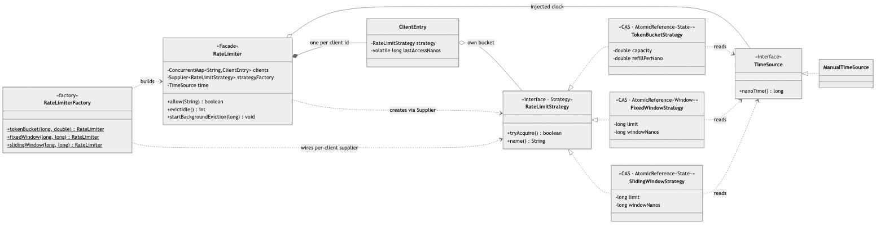
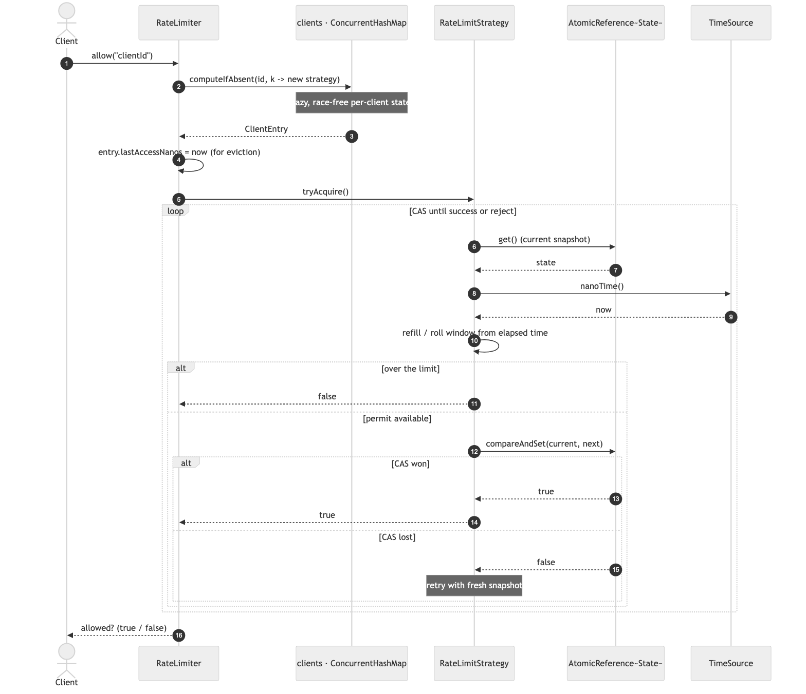
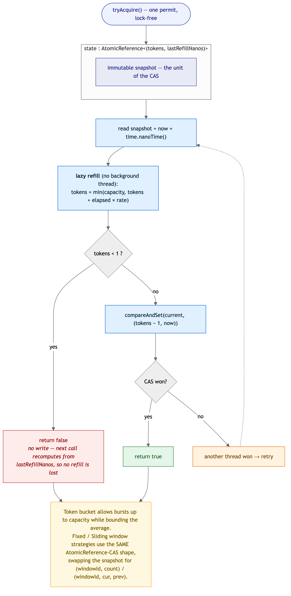
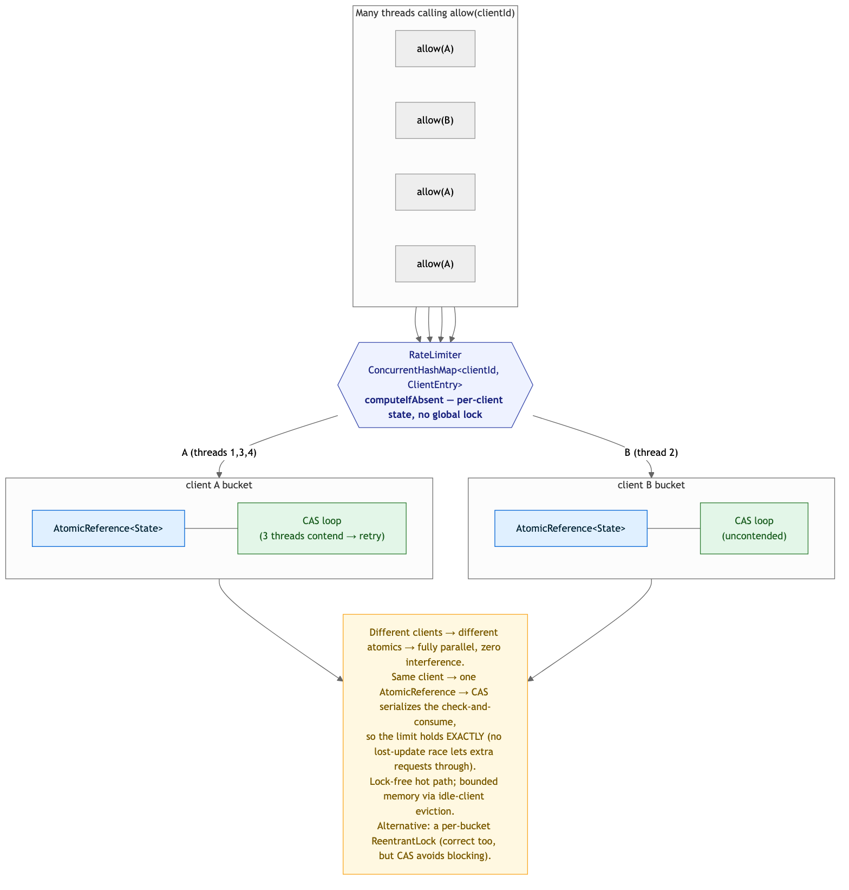

# Rate Limiter — Solution

A per-client rate limiter with a pluggable algorithm — **Token Bucket**, **Fixed Window**,
**Sliding Window** — behind one `allow(clientId)` call. The algorithm is a **Strategy**, limiters
are built by a **Factory**, and `RateLimiter` is a **Facade** over per-client state. The hard part
is the hot path: every `allow` must be **atomic under massive concurrency without a global lock**,
which here is a **lock-free CAS** over an immutable state snapshot.

> Code lives in this folder under package
> `MachineCoding_LLD.LLD_Interview_Problems._08_Medium_RateLimiter` (subpackages
> [`strategy`](./strategy), [`time`](./time)). Run instructions are at the bottom.

---

## 1. Class model



**Reading the arrows:** ◆ filled diamond = **composition** (`RateLimiter` *owns* its per-client
`ClientEntry`s). ◇ hollow diamond = **aggregation** (an entry *holds* a strategy; the limiter
*holds* an injected clock). ▷ hollow triangle = **realization**. Dashed = **dependency / creates**.

| Role | Class | Responsibility |
|------|-------|----------------|
| **Facade** | `RateLimiter` | `allow(clientId)`; owns the `ConcurrentHashMap` of per-client state and idle eviction. |
| **Strategy** | `RateLimitStrategy` → `TokenBucketStrategy`, `FixedWindowStrategy`, `SlidingWindowStrategy` | The algorithm; one **stateful instance per client**, `tryAcquire()` atomic. |
| **Factory** | `RateLimiterFactory` | `tokenBucket` / `fixedWindow` / `slidingWindow` — builds a limiter + per-client strategy supplier, validating config up front. |
| Clock seam | `TimeSource` → `ManualTimeSource` | Injected nanosecond clock — the key to deterministic time-based tests. |
| Per-client state | `ClientEntry` | A client's strategy + a last-access stamp for eviction. |

---

## 2. The request path — `allow`



`allow(clientId)` does three things: **find-or-create** this client's state with `computeIfAbsent`
(lazy and race-free), **stamp** its last-access time (for eviction only), then delegate to the
strategy's `tryAcquire()`. That call is a **CAS loop**: read the current immutable snapshot, refill
/ roll the window from elapsed time, and either reject (over the limit) or `compareAndSet` the new
snapshot in — retrying only if another thread beat us to it. No lock is taken on this path.

---

## 3. The algorithms



All three share the **same lock-free shape** — an `AtomicReference` to an immutable snapshot,
CAS-updated — differing only in what the snapshot holds and how it's rolled forward:

| Algorithm | Snapshot | Behaviour | Trade-off |
|-----------|----------|-----------|-----------|
| **Token Bucket** | `(tokens, lastRefillNanos)` | Refills continuously; allows **bursts up to capacity**, bounds the average. Time does the refilling — no background thread. | Best general default. Fractional tokens. |
| **Fixed Window** | `(windowId, count)` | ≤ `limit` per fixed slot; trivially exact **within** a window. | **Boundary burst**: up to `2 × limit` across two adjacent windows in a short span. |
| **Sliding Window** | `(windowId, curCount, prevCount)` | Weights the previous window by its remaining overlap: `est = cur + prev × (1 − elapsed/window)`; allow iff `est < limit`. | Smooths the boundary at O(1) memory; an *approximation* (not a per-request log). |

The `Main` walkthrough shows this concretely: fixed window lets **6** requests through in 200 ms
across a boundary; sliding window throttles the same burst to **1**.

> Why refill/roll needs no write on rejection: the next call recomputes purely from
> `lastRefillNanos` / `windowId` and the current time, so nothing is lost by not persisting a
> rejected attempt.

---

## 4. Concurrency — atomicity on the hot path is everything



Two levers keep this correct **and** fast under load:

- **Per-client isolation.** State lives in a `ConcurrentHashMap<clientId, ClientEntry>`, created
  with `computeIfAbsent`. Different clients touch different atomics → **fully parallel**, and there
  is **no global lock** — a global lock would serialize the whole service.
- **Lock-free per-client atomicity.** For one client, the check-and-consume is a **CAS** on a
  single `AtomicReference`. That makes "read limit, then increment" one atomic step, so a
  lost-update race can never let request #`limit+1` slip through. The stress test freezes the clock
  (no refill/window-advance possible) and fires **64 threads × 200 ops** at one client: with a
  limit of `L`, **exactly `L`** are allowed — not `L + races`.

**Bounded memory:** idle clients are evicted (`evictIdle`, optionally on a daemon
`ScheduledExecutorService` via `startBackgroundEviction`) so the map can't grow without limit as
new client ids appear.

**CAS vs lock:** a per-bucket `ReentrantLock` would also be correct and is simpler to reason about;
CAS wins by never blocking a thread on the hot path. Under pathological contention on a *single*
key, CAS retries can spin — striping that one key or falling back to a lock is the escape hatch.

---

## 5. Design choices & trade-offs

| Decision | Why | Alternative |
|----------|-----|-------------|
| **Strategy** for the algorithm | Token/Fixed/Sliding are swappable behind `tryAcquire`; a new one is one class. | `if (algo == …)` branches through the limiter. |
| One strategy **instance per client** | Each client needs independent state; the map holds them. | A stateless strategy + external state map — splits behaviour from its data. |
| **Lock-free CAS** on the hot path | Atomic check-and-consume with no blocking; scales with cores. | Per-bucket lock (correct, simpler, but blocks); one global lock (kills throughput). |
| Immutable **snapshot** as the CAS unit | Multi-field state (tokens+time, window+counts) updates atomically as one reference swap. | Two separate atomics — can't be updated together atomically. |
| **`TimeSource`** injected | Deterministic tests of refill/boundary without `Thread.sleep`; the frozen-clock exact-limit assertion. | `System.nanoTime()` inline — untestable timing. |
| **`computeIfAbsent`** for state | Lazy, race-free per-client creation. | `get`-then-`put` — a create race. |
| **Idle eviction** | Bounds memory as client ids churn. | Unbounded map — a slow leak. |
| **Fail-fast** config in the factory | A bad limit/capacity throws at build time, not on the first request. | Lazy validation inside the per-client strategy — surfaces late. |

### On design patterns
Every pattern this problem needs is already in the catalog, so — as with the LRU cache — I added
**no new pattern**: **Strategy** (`_10`, the algorithm), **Factory** (`_01`,
`RateLimiterFactory`), **Facade** (`_08`, `RateLimiter` fronting the strategy family). The
lock-free CAS loop is a concurrency technique, not a GoF pattern. Forcing a novel pattern here would
be exactly the over-engineering these solutions avoid.

---

## 6. Complexity

| Operation | Cost |
|-----------|------|
| `allow` (any algorithm) | **O(1)** amortized — a map lookup + a CAS (plus retries only under contention) |
| `evictIdle` | O(tracked clients) |
| Space | O(tracked clients) — one small snapshot per active client, bounded by eviction |

---

## 7. How to run

```bash
# from the repo's src/ directory (the single source root)
PKG=MachineCoding_LLD/LLD_Interview_Problems/_08_Medium_RateLimiter
javac -d out $(find $PKG -name '*.java')

BASE=MachineCoding_LLD.LLD_Interview_Problems._08_Medium_RateLimiter
java -cp out $BASE.Main             # token-bucket refill, fixed-window boundary, sliding smoothing
java -cp out $BASE.RateLimiterTest  # 13 assertions incl. two concurrency stress tests
```

The harness (plain `main`, no JUnit — matching this repo) exits non-zero on failure and covers: all
three algorithms (limit, refill, boundary behaviour), per-client isolation, idle eviction, config
validation, null handling, and the headline **exact-limit-under-contention** stress tests (frozen
clock → 64 threads must be allowed *exactly* the limit) for both fixed window and token bucket.

---

## 8. Extensions an interviewer might ask for

- **Distributed / multi-node** — move per-client state to Redis: an atomic Lua script (or
  `INCR`+`EXPIRE`) for fixed/sliding window, or a token-bucket script. The `RateLimitStrategy` seam
  means `RateLimiter` doesn't change — only the strategy's storage does.
- **Sliding-window log** — exact (not approximate) via a per-client timestamp deque, at O(limit)
  memory; another `RateLimitStrategy`.
- **Leaky bucket** — shape output to a constant drain rate (queue), vs token bucket's burst
  allowance; another strategy.
- **Tiered limits** — per-endpoint × per-user; compose limiters or key the map by `(user, route)`.

> Pattern references: [DesignPatterns/_10_StrategyDesignPattern](../../DesignPatterns/_10_StrategyDesignPattern),
> [_01_FactoryDesignPattern](../../DesignPatterns/_01_FactoryDesignPattern),
> [_08_Facade](../../DesignPatterns/_08_Facade).
