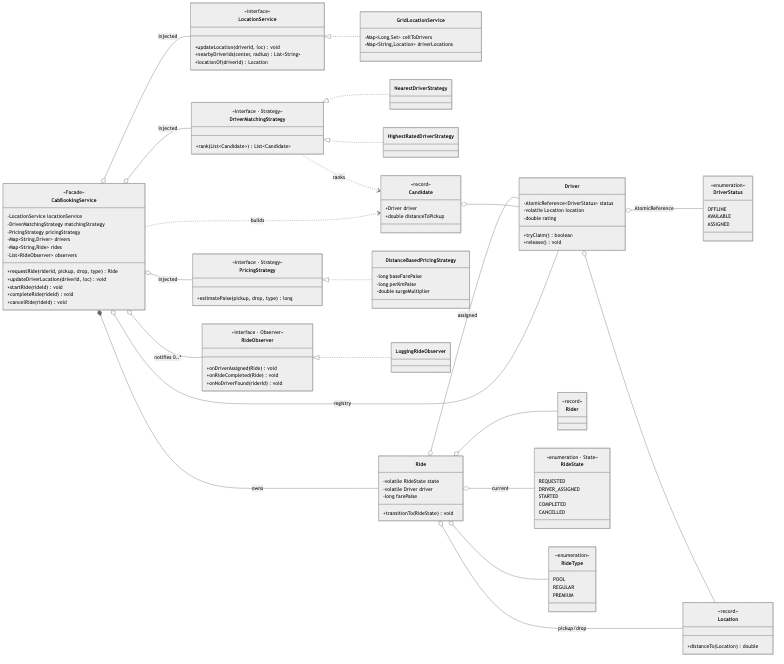
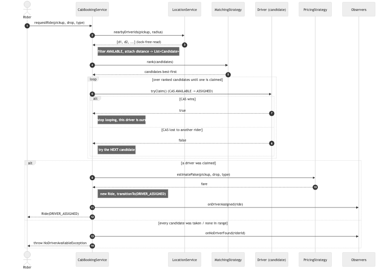
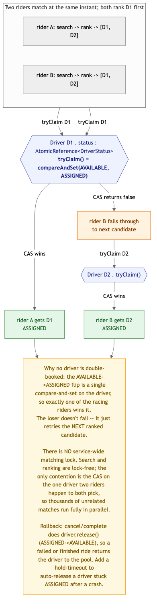
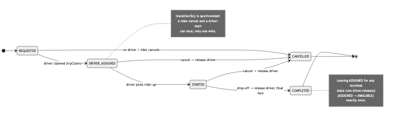

# Cab Booking System (Uber / Ola) — Solution

A ride-hailing backend: drivers publish live locations, a rider requests a ride, the system
finds nearby drivers, matches the best one, runs the ride through its lifecycle, and prices it —
with the guarantee that makes this problem *Hard*: **a driver is assigned to at most one ride at
a time, under heavy concurrency.** Nearby search is a **spatial index** behind a
`LocationService`; matching and pricing are **Strategies**; the ride lifecycle is a **State**
machine; notifications are **Observers**; a **Facade** (`CabBookingService`) wires it together.

> Code lives in this folder under package
> `MachineCoding_LLD.LLD_Interview_Problems._09_Hard_CabBookingSystem` (subpackages
> [`model`](./model), [`location`](./location), [`matching`](./matching), [`pricing`](./pricing),
> [`observer`](./observer)). Run instructions are at the bottom.

---

## 1. Class model



**Reading the arrows:** ◆ filled diamond = **composition** (`CabBookingService` *owns* its
`Ride`s). ◇ hollow diamond = **aggregation** (the service is *injected with* a location service,
a matching strategy, a pricing strategy, and observers; a `Ride` *refers to* its `Driver`,
`Rider`, `RideState`; a `Driver` *holds* an `AtomicReference<DriverStatus>` and a `Location`).
▷ hollow triangle = **realization**. Dashed = **dependency** (the service *builds* `Candidate`s;
a strategy *ranks* them).

| Role | Class | Responsibility |
|------|-------|----------------|
| **Facade** | `CabBookingService` | `requestRide` / lifecycle / `updateDriverLocation`; owns registries + rides, delegates the guarantee downward. |
| **Spatial index** | `LocationService` → `GridLocationService` | Uniform-grid buckets; radius search scans only the touched cells, not all drivers. |
| **Claim primitive** | `Driver` | `AtomicReference<DriverStatus>`; `tryClaim()` is the atomic AVAILABLE→ASSIGNED CAS. |
| **State** | `Ride` + `RideState` | Enum-encoded lifecycle; `transitionTo` is synchronized + validated. |
| **Strategy (matching)** | `DriverMatchingStrategy` → `NearestDriverStrategy`, `HighestRatedDriverStrategy` | Pure ranking of `Candidate`s — never claims. |
| **Strategy (pricing)** | `PricingStrategy` → `DistanceBasedPricingStrategy` | base + per-km × type-multiplier × surge, in paise. |
| **Observer** | `RideObserver` → `LoggingRideObserver` | Assigned / started / completed / cancelled / no-driver. |

---

## 2. The request path — `requestRide`



The hot path is deliberately three phases: **search lock-free → rank (pure policy) → claim,
retrying the next candidate on failure.** Search reads the concurrent spatial index without any
lock; ranking is a side-effect-free sort; only the final claim touches shared mutable state, and
it touches just *one* driver at a time via a compare-and-set. If the chosen driver was grabbed by
another rider a microsecond earlier, the CAS returns false and we simply try the next-best
candidate — the loser never fails spuriously as long as *some* driver is free.

---

## 3. Concurrency — atomic driver assignment



The entire no-double-booking guarantee rests on **`Driver.tryClaim()` =
`status.compareAndSet(AVAILABLE, ASSIGNED)`**. When two riders both rank the same driver first,
the CAS lets exactly one win the AVAILABLE→ASSIGNED transition; the other reads false and falls
through to its next candidate.

- **No service-wide matching lock.** Search and ranking are lock-free; the *only* point of
  contention is the CAS on a driver two riders happen to both pick. Thousands of unrelated matches
  proceed fully in parallel — the critical section is a single machine instruction, not a block.
- **Losers retry, they don't fail.** Because the claim loop walks the whole ranked list, a rider
  only gets `NoDriverAvailableException` when *every* in-range driver is genuinely taken.
- **Rollback / release.** `completeRide` and `cancelRide` call `Driver.release()`
  (ASSIGNED→AVAILABLE) so a finished or abandoned ride returns the driver to the pool; the
  ride-state machine guarantees that release runs exactly once per ride (terminal states can't be
  re-entered).
- **Location churn is safe.** Updates and searches hit concurrent maps; a search racing a driver's
  cell-move might momentarily miss or double-list them, but that only affects the *candidate list* —
  the authoritative gate is still the CAS, so no driver is ever double-assigned.

The harness fires **50 riders at 10 drivers** (all co-located) and asserts exactly **10** match,
**40** get `NoDriverAvailable`, and **every driver is claimed at most once** — and repeats it with
a thread spamming location updates throughout.

---

## 4. Ride lifecycle



`RideState` encodes the legal transitions; `Ride.transitionTo` is **synchronized** so a
rider-cancel and a driver-start racing on the same ride can't both win. Leaving `DRIVER_ASSIGNED`
/`STARTED` for a terminal state is exactly where `Driver.release()` fires — modeling the lifecycle
as a validated machine is what keeps "release the driver exactly once" from becoming scattered
if/else bookkeeping.

---

## 5. Design choices & trade-offs

| Decision | Why | Alternative |
|----------|-----|--------------|
| **Optimistic CAS claim** (`AtomicReference`) | The claim is the hottest shared write; a lock-free CAS gives one winner with no thread ever parked, and the loser retries the next driver. | A **per-driver `ReentrantLock`** or a global matching lock — correct but serializes matching and can leave a driver locked on a crash. |
| **Search → rank → claim, no global lock** | Keeps the critical section to one CAS; matching scales with cores, contending only on genuinely-shared drivers. | Lock the whole matcher per request — trivially correct, disastrously unscalable. |
| **Grid spatial index** behind an interface | O(drivers near the query) radius search; swappable for geohash/quadtree/Redis-GEO. | Linear scan of all drivers per request — O(N) and unscalable; or baking a quadtree into the service and losing substitutability. |
| **Enum-encoded ride State machine** | States here differ only in *which transitions are legal*, so an enum + allowed-set is the least machinery that enforces it. | **One class per state** (as in the Elevator solution's `state/`) — warranted only when states carry materially different *behaviour*; here it'd be ceremony. |
| **Matching strategy ranks but never claims** | Keeps policy a pure, testable function; the retry/claim loop (the tricky concurrent part) lives in one place. | Strategy returns a single chosen driver and claims it — now every strategy re-implements the retry loop and the concurrency is smeared across classes. |
| **Integer paise** for fares | No floating-point money drift under multipliers/surge. | `double` rupees — rounding bugs in totals. |
| **Synchronous observer notifications** | Deterministic and simple for this scope. | An `ExecutorService` dispatching notifications so matching never blocks on push/SMS I/O — the right move at scale (noted as an extension). |

### On design patterns
This problem reuses the catalog — **Strategy** (matching, pricing), **State** (ride lifecycle,
here in its lightweight enum form), **Observer** (notifications), **Facade** (the service). Like
BookMyShow, the genuinely hard part isn't a GoF pattern; it's the **atomic claim** primitive
behind `Driver` and the lock-free **search→rank→claim** shape of the matcher. The `LocationService`
seam (grid today, geohash tomorrow) is the other axis of extensibility.

---

## 6. Complexity

| Operation | Cost |
|-----------|------|
| `updateDriverLocation` | O(1) — two concurrent-map writes (+ a cell move) |
| `nearbyDriverIds` | O(cells in radius + drivers in them) — not O(all drivers) |
| `requestRide` | O(k log k) rank of k in-range candidates + O(k) claims worst case |
| `startRide` / `completeRide` / `cancelRide` | O(1) validated transition + O(1) release |
| Space | O(drivers) in the index + O(rides) |

---

## 7. How to run

```bash
# from the repo's src/ directory (the single source root)
PKG=MachineCoding_LLD/LLD_Interview_Problems/_09_Hard_CabBookingSystem
javac -d out $(find $PKG -name '*.java')

BASE=MachineCoding_LLD.LLD_Interview_Problems._09_Hard_CabBookingSystem
java -cp out $BASE.Main            # estimate, nearest match, fall-through, lifecycle, driver exhaustion
java -cp out $BASE.CabBookingTest  # PASS/FAIL harness incl. the 50-rider / 10-driver stress test
```

The harness (plain `main`, no JUnit — matching this repo) exits non-zero on failure and covers:
nearest-driver assignment; a second rider falling through to the next driver; complete releases +
relocates the driver; cancel rolls the driver back; illegal transitions throw; no-driver-in-range
throws; distance/type/surge pricing; the rating-based strategy; two riders concurrently getting
**distinct** drivers; the **50-rider / 10-driver** race (exactly 10 matched, no driver twice); and
that same guarantee **while location updates stream concurrently**.

---

## 8. Extensions an interviewer might ask for

- **Stuck-ASSIGNED timeout** — a reaper that auto-releases a driver stuck `ASSIGNED` after a
  crashed ride (the same lazy/eager idea as BookMyShow's hold expiry).
- **ETA-aware matching** — a `DriverMatchingStrategy` that ranks by predicted time-to-pickup
  (traffic), not raw distance; no service change.
- **Surge as a live signal** — swap the `PricingStrategy` per zone based on demand/supply ratio
  computed from the index.
- **Async notifications** — dispatch `RideObserver` calls on an `ExecutorService` so the matching
  thread never blocks on push/SMS.
- **Pooling (shared rides)** — a matcher that assigns a `POOL` ride to a driver already on a
  compatible route; the claim model generalizes to "seats on a driver" instead of a binary flag.
- **Distributed drivers** — move the index + claim to Redis (`GEOSEARCH` + a Lua CAS) so matching
  works across many app servers; the `LocationService` / `Driver.tryClaim` seams are exactly the
  swap points.

> Pattern references: [DesignPatterns/_10_StrategyDesignPattern](../../DesignPatterns/_10_StrategyDesignPattern),
> [_11_ObserverDesignPattern](../../DesignPatterns/_11_ObserverDesignPattern),
> [_12_State](../../DesignPatterns/_12_State). Full State-as-classes lifecycle:
> [Elevator `state/`](../_06_Medium_ElevatorSystem/state).
