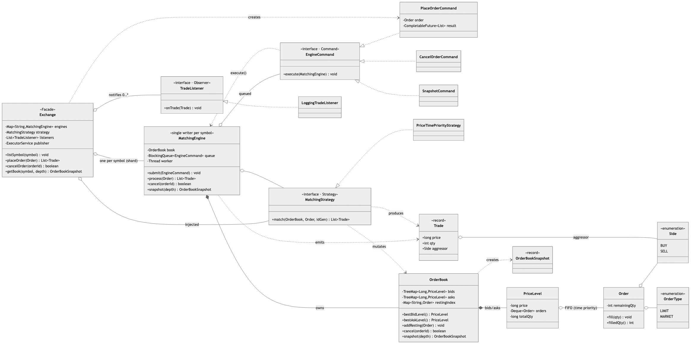
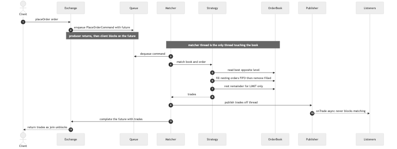
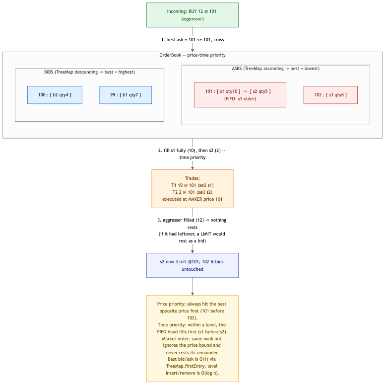
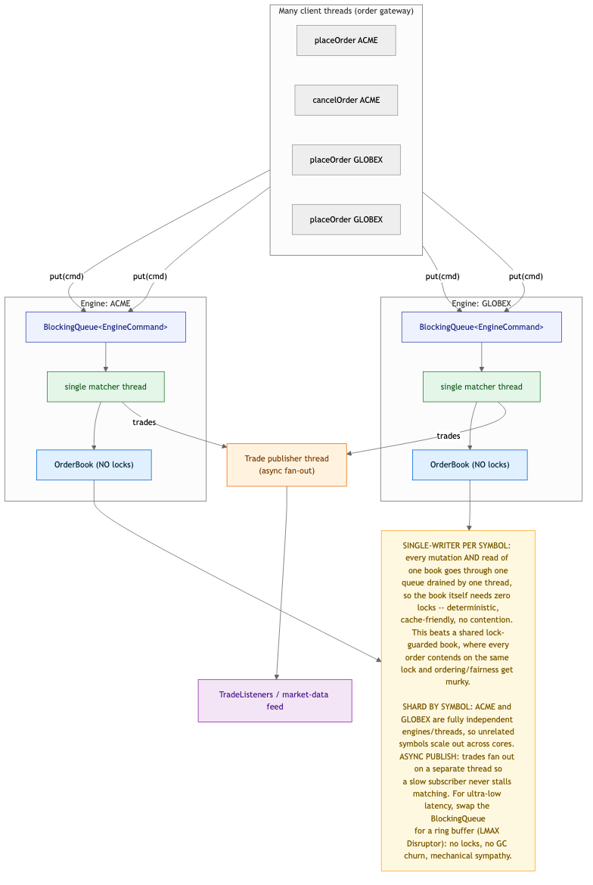

# Stock Exchange / Order Matching Engine — Solution

The core of an exchange: accept buy/sell orders for a symbol, keep a per-symbol **order book**,
and **match by price-time priority**, emitting trades. Supports limit + market orders, partial
fills, and cancels. The defining challenge is concurrency, and the answer is the industry
pattern: **one single-writer matching thread per symbol**, fed by a queue of order **Commands**,
mutating a lock-free book. Matching is a **Strategy**; trade publishing is an **Observer**; a
**Facade** (`Exchange`) shards engines by symbol and presents a synchronous API over the async core.

> Code lives in this folder under package
> `MachineCoding_LLD.LLD_Interview_Problems._10_Hard_StockExchange` (subpackages
> [`model`](./model), [`matching`](./matching), [`command`](./command), [`engine`](./engine),
> [`observer`](./observer)). Run instructions are at the bottom.

---

## 1. Class model



**Reading the arrows:** ◆ filled diamond = **composition** (a `MatchingEngine` *owns* its
`OrderBook`; an `OrderBook` *owns* its `PriceLevel`s). ◇ hollow diamond = **aggregation** (the
`Exchange` *holds* engines/strategy/listeners; a `PriceLevel` *holds* `Order`s in FIFO). ▷ hollow
triangle = **realization** (`EngineCommand`, `MatchingStrategy`, `TradeListener` implementations).
Dashed = **dependency** (a command *executes on* an engine; the strategy *mutates* the book and
*produces* trades).

| Role | Class | Responsibility |
|------|-------|----------------|
| **Facade** | `Exchange` | `placeOrder` / `cancelOrder` / `getBook`; shards engines by symbol; sync API over the async core. |
| **Single writer** | `MatchingEngine` | One queue + one thread per symbol; the only thread that touches the book. |
| **Command** | `EngineCommand` → `PlaceOrderCommand`, `CancelOrderCommand`, `SnapshotCommand` | An order action built on a client thread, carrying a `CompletableFuture`, executed later on the matcher thread. |
| **Strategy** | `MatchingStrategy` → `PriceTimePriorityStrategy` | The matching algorithm; walks book primitives, mutates, returns trades. |
| **Book** | `OrderBook`, `PriceLevel` | Two `TreeMap`s of price levels; each level a FIFO deque (= time priority). |
| **Data** | `Order`, `Trade`, `OrderBookSnapshot`, `Side`, `OrderType` | Integer-tick prices; `Order.remainingQty` mutated only by the matcher thread. |
| **Observer** | `TradeListener` → `LoggingTradeListener` | Trade feed, notified off-thread. |

---

## 2. The request path — `placeOrder`



`placeOrder` wraps the order in a `PlaceOrderCommand` carrying a `CompletableFuture`, drops it on
the symbol's queue, and **blocks on the future** — so callers get a plain synchronous
`List<Trade>` while the engine underneath stays a lock-free single-writer. The matcher thread
`take()`s the command, runs the `MatchingStrategy` against the book, publishes the resulting
trades **off-thread**, then completes the future — which unblocks the caller. Reads (`getBook`)
go through the *same* queue as a `SnapshotCommand`, so a snapshot is always taken between two
mutations, never mid-update.

---

## 3. Matching — price-time priority



Two rules, in order: **(1) price priority** — always trade against the best opposite price first
(lowest ask for a buy, highest bid for a sell); **(2) time priority** — within a price level, fill
the oldest resting order first, which is simply the head of that level's FIFO deque. A limit order
stops crossing when the best opposite price is worse than its limit and rests its remainder; a
market order ignores the price bound and never rests (its unfilled remainder is dropped). Every
fill executes at the **resting (maker) order's price**, so the aggressor gets price improvement.

- **Best bid/ask is O(1)** via `TreeMap.firstEntry` (bids in reverse order, asks natural).
- Level insert/remove is **O(log n)**; a fill at the head of a level is O(1).
- Cancel is O(1) lookup via a resting-order index, then O(level) removal from the deque.

---

## 4. Concurrency — single writer per symbol



The heart of the design. Many client threads **produce** `EngineCommand`s onto a symbol's
`BlockingQueue`; a **single matcher thread consumes** them and is the *only* thread that ever
touches that book. Everything follows from that:

- **The book needs zero locks.** All mutation *and* reads are serialized through one thread, so
  `TreeMap`/`HashMap`/`ArrayDeque` are used raw — no synchronization, deterministic ordering,
  cache-friendly. This is *why* single-writer beats a shared lock-guarded book, where every order
  contends on the same lock and price-time fairness gets murky under contention.
- **Shard by symbol.** Each symbol is an independent engine + thread, so unrelated symbols match
  fully in parallel across cores. Throughput scales with symbols, not with a global lock.
- **Async publish.** Trades fan out on a separate publisher thread, so a slow market-data
  subscriber never stalls matching.
- **Memory safety across the boundary.** The `Order`'s `remainingQty` is mutated only by the
  matcher thread; the client reads `filledQty()` only after `future.join()`, which establishes a
  happens-before edge — so no data race despite no locks on the order.

The harness floods one engine with **1600 orders from 16 threads** and asserts the invariants that
matter: **shares are conserved** (total buy-side filled == total sell-side filled), the **book is
never left crossed**, no order is overfilled, and the **async feed received exactly the executed
volume**.

---

## 5. Design choices & trade-offs

| Decision | Why | Alternative |
|----------|-----|--------------|
| **Single-writer thread per symbol** | Lock-free book, deterministic price-time, no contention; the real-exchange pattern. | A shared book behind a lock — every order serializes on one lock, and fairness/latency degrade under load. |
| **Command on a queue** | Decouples *who submits* (any client thread) from *who mutates* (the one matcher), and carries a future for a sync API. | Call into the engine directly with a lock — reintroduces the contention single-writer removes. |
| **Reads via a `SnapshotCommand`** | A snapshot taken on the writer thread is always consistent, with zero reader-side locking. | Read the live book from other threads — needs locking or risks a torn view. |
| **`TreeMap` of price levels + FIFO deque** | Best price in O(1), O(log n) level ops, and time priority falls straight out of the deque. | A single sorted list of orders — O(n) best-price and re-sorts; or a heap — no clean FIFO-within-price. |
| **Trade at maker price** | Standard exchange semantics; the aggressor gets price improvement. | Trade at the aggressor's price — mis-prices and breaks the maker/taker model. |
| **Integer-tick prices** | Exact money; no float drift in a system where every tick matters. | `double` prices — rounding errors, non-deterministic compares. |
| **Sync API over async core** (`CompletableFuture`) | Callers get a simple blocking call; the core stays single-writer. | Fully async callbacks — harder to use/test; or a blocking core — loses the single-writer benefits. |

### On design patterns
All three requested patterns earn their place: **Command** is the queued unit that makes
single-writer possible (build on one thread, execute on another — the same Command use as the
Elevator engine); **Strategy** isolates price-time matching so pro-rata could drop in; **Observer**
is the async trade feed. The genuinely hard, non-pattern idea is the **single-writer concurrency
model** itself.

---

## 6. Complexity

| Operation | Cost |
|-----------|------|
| `placeOrder` (no cross) | O(log n) to rest one level |
| `placeOrder` (crossing k resting orders) | O(k + log n) — k fills + level cleanup |
| best bid / best ask | O(1) (`TreeMap.firstEntry`) |
| `cancelOrder` | O(1) index lookup + O(level) deque removal |
| `getBook(depth)` | O(depth) |
| Space | O(resting orders) per symbol |

---

## 7. How to run

```bash
# from the repo's src/ directory (the single source root)
PKG=MachineCoding_LLD/LLD_Interview_Problems/_10_Hard_StockExchange
javac -d out $(find $PKG -name '*.java')

BASE=MachineCoding_LLD.LLD_Interview_Problems._10_Hard_StockExchange
java -cp out $BASE.Main               # rest, cross (price-time), partial fill, market sweep, cancel
java -cp out $BASE.StockExchangeTest  # PASS/FAIL harness incl. the 1600-order / 16-thread flood
```

The harness (plain `main`, no JUnit — matching this repo) exits non-zero on failure and covers:
resting with no match; a crossing buy filling best-price then FIFO; trade at the maker price;
partial fill resting its remainder; a market order sweeping levels and *not* resting; cancel
(and idempotent/unknown cancels); symbol sharding independence; and the **concurrent flood** —
conservation of shares, an uncrossed book, no overfills, and exact async-feed volume.

---

## 8. Extensions an interviewer might ask for

- **LMAX Disruptor / ring buffer** in place of the `BlockingQueue` — lock-free, no GC churn,
  batching, mechanical sympathy; the classic ultra-low-latency move. The single-writer shape is
  already exactly what the Disruptor wants.
- **More order types** — IOC (cancel remainder immediately), FOK (all-or-nothing), stop/stop-limit
  (triggered by last-trade price); each is a variation the `MatchingStrategy` or a pre-check owns.
- **Pro-rata matching** — a second `MatchingStrategy` used by some futures markets; same book,
  different fill split — the payoff of matching being a Strategy.
- **Persistence / replay** — the command queue is a natural event log; journal it for crash
  recovery and deterministic replay.
- **Backpressure** — a bounded queue with a rejection/throttle policy when a symbol's inflow
  exceeds its matcher's throughput.
- **Market-data depth feed** — extend `TradeListener` into an order-book-delta feed (L2/L3),
  published on the same async channel.

> Pattern references: [DesignPatterns/_13_Command](../../DesignPatterns/_13_Command),
> [_10_StrategyDesignPattern](../../DesignPatterns/_10_StrategyDesignPattern),
> [_11_ObserverDesignPattern](../../DesignPatterns/_11_ObserverDesignPattern). Related concurrency
> drills: [Producer–Consumer](../../Concurrency_and_Multithreading/_04_SolvedProblems/_02_ProducerConsumer/PROBLEM.md),
> [Bounded Blocking Queue](../../Concurrency_and_Multithreading/_04_SolvedProblems/_03_BoundedBlockingQueue/PROBLEM.md).
